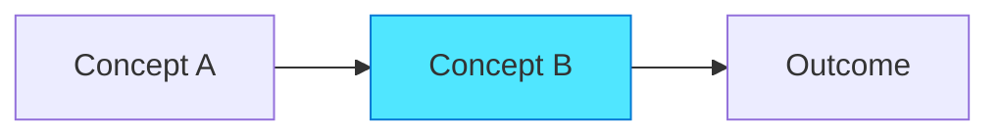

# Chapter Content Writing Guide

## Scope

This guide defines writing standards for **chapter content** - the primary learning format in the HVE AI Companion Guide. Follow these instructions when creating or editing chapter files in `docs/part*/`.

**Relationship to other guides:**
* **Markdown formatting:** Defer to `.github/instructions/markdown-styleguide.instructions.md` for technical syntax
* **General writing standards:** Defer to `.github/instructions/20251116-book-restructure-writing-guide.instructions.md` for voice, tone, and structure patterns
* **This guide:** Defines chapter-specific requirements, exercise patterns, and scaffolding

## Chapter Context

Chapters are the primary learning content in the 14-chapter three-part structure:
* **PART I: FOUNDATIONS** (Chapters 1-4) - Get readers productive with basic RPI
* **PART II: DEEP DIVE** (Chapters 5-11) - Develop proficiency with all modes and variations
* **PART III: APPLICATION** (Chapters 12-14) - Apply to roles and scale across teams

## Chapter Characteristics

**Purpose:** Progressive skill development with hands-on practice

**Target Audience:** Learners working through the book sequentially

**Depth Level:** Varies by part (Part I: Awareness/Understanding, Part II: Application/Integration, Part III: Innovation)

**Typical Length:** 3500-6500 words (15-30 pages)

## Required Structure

### Frontmatter

```yaml
---
title: Chapter [N]: [Chapter Title]
description: [One-sentence learning objective with key outcome]
author: HVE Core Team
date: YYYY-MM-DD
chapter: N
part: [I|II|III]
prerequisites:
  - chapter-[n-1]
  - chapter-[n-2] (if non-sequential)
keywords:
  - [primary concept 1]
  - [primary concept 2]
  - [key technique]
---
```

**Required fields:**
* `chapter`: Chapter number (1-14)
* `part`: Roman numeral for part (I, II, or III)
* `prerequisites`: List of prerequisite chapters with exact filenames

### Opening Section

```markdown
## Learning Objectives

By the end of this chapter, you will:

* [Specific skill/knowledge outcome 1]
* [Specific skill/knowledge outcome 2]
* [Specific skill/knowledge outcome 3]
* [Hands-on accomplishment]

## Prerequisites

This chapter assumes you have:

* ✅ Completed [Chapter N-1: Title](../partN/chapterN.md)
* ✅ [Specific skill or knowledge from earlier chapter]
* ✅ [Environment or setup requirement]

> [!TIP]
> **New to HVE?** If you're jumping directly to this chapter, review [prerequisite chapter](link) for essential context.
```

### Introduction Section

```markdown
## Introduction

[2-3 paragraphs providing context for this chapter]

[Paragraph 1: Why this topic matters, connection to previous chapter]

[Paragraph 2: What problem this solves or capability this unlocks]

[Paragraph 3: Preview of what reader will accomplish]
```

**Requirements:**
* Explicit connection to previous chapter (spiral curriculum)
* Clear statement of problem or capability
* Preview of hands-on accomplishments

### Core Concept Sections

```markdown
## [Core Concept Section 1]

[3-5 paragraphs explaining first major concept]

[Concept explanation with specific examples]

**Key principle:** [Highlighted important principle]

### [Subsection if needed]

[Additional detail or breakdown]

[Mermaid diagram if illustrating relationships or flow]



> [!NOTE]
> [Important distinction or caveat about this concept]

### Hands-On Exercise 1.1: [Exercise Name]

**Goal:** [What reader will accomplish in 5-10 minutes]

**Scenario:** [Brief context for the exercise]

**Steps:**

1. [Detailed step with context]
2. [Detailed step with context]
3. [Detailed step with expected outcome]

**Expected Result:**
```[language]
[Example output or result]
```

> [!TIP]
> [Tactical advice for completing exercise successfully]

**What You Learned:**
* [Key insight from exercise]
* [Connection to concept]
```

**Requirements:**
* 2-3 immediate application exercises per chapter
* Never exceed 2-3 pages of theory before hands-on exercise
* Each exercise 5-15 minutes
* "What You Learned" reflection after each exercise

### Real-World Example Section

```markdown
## Real-World Example: [Complete Scenario]

[Comprehensive walkthrough demonstrating all chapter concepts working together]

**Scenario:** [Realistic situation reader might encounter]

**Approach:**

[Step-by-step walkthrough with code/commands]

```[language]
[Complete working example]
```

**Analysis:**

[Explain what happened, why it worked, key decisions made]
```

**Requirements:**
* One complete scenario integrating all chapter concepts
* Real code/commands (not abstract placeholders)
* Analysis explaining why approach worked

### Common Pitfalls Section

```markdown
## Common Pitfalls and Solutions

### Pitfall 1: [Common mistake]

**Problem:** [What goes wrong]

**Why it happens:** [Root cause]

**Solution:** [How to avoid or fix]

[Repeat for 2-3 common issues]
```

**Requirements:**
* 2-4 common pitfalls
* Root cause explanation (not just symptom)
* Actionable solution

### Summary Section

```markdown
## Chapter Summary

You've learned:

* ✅ [Recap learning objective 1]
* ✅ [Recap learning objective 2]
* ✅ [Recap learning objective 3]

**Key Takeaways:**

* **[Concept 1]:** [One-sentence summary]
* **[Concept 2]:** [One-sentence summary]
* **[Concept 3]:** [One-sentence summary]
```

**Requirements:**
* Explicitly recap all learning objectives (with ✅ checkmarks)
* 3-5 key takeaways with bold concept names

### End-of-Chapter Exercise

```markdown
## End-of-Chapter Exercise: [Consolidation Challenge]

**Goal:** [Integrate 3-4 chapter concepts in single exercise]

**Challenge:** [Scenario requiring application of multiple techniques]

**Guidance:**

1. [High-level step without detailed instructions]
2. [High-level step]
3. [High-level step]

**Success Criteria:**
* [Measurable outcome 1]
* [Measurable outcome 2]

> [!TIP]
> [Hint for approaching the challenge if reader is stuck]

**Solution Approach:** (Expandable/hidden in Docsify)

<details>
<summary>Click to reveal solution approach</summary>

[Detailed walkthrough of solution]

```[language]
[Solution code/commands]
```

</details>
```

**Requirements:**
* One consolidation exercise integrating 3-4 concepts
* High-level guidance (not step-by-step)
* Measurable success criteria
* Solution hidden in expandable section

### What's Next Section

```markdown
## What's Next

**In [Chapter N+1: Title](../partN/chapterN+1.md):**
* [Preview of next chapter's focus]
* [How it builds on this chapter]

**Related Chapters:**
* **[Chapter X: Title](link)** - [Connection or alternative approach]
* **[Chapter Y: Title](link)** - [Advanced application]

**Additional Resources:**
* [Appendix X: Reference Material](../appendices/appendix-x.md)
* [External link if applicable]
```

**Requirements:**
* Preview of next chapter with explicit connection
* 2-3 related chapters with context
* Links to relevant appendices

### Footer

```markdown
---

<!-- markdownlint-disable MD036 -->
*🤖 Crafted with precision by ✨Copilot following brilliant human instruction,
then carefully refined by our team of discerning human reviewers.*
<!-- markdownlint-enable MD036 -->
```

## Voice and Tone

**Voice:** Second-person instructional ("you will learn", "your workflow")

**Tone:** Educational, encouraging, supportive

**Sentence Style:** Clear, structured, building complexity gradually

> [!IMPORTANT]
> **Do NOT include time savings, cost savings, productivity metrics, or duration estimates in chapter content.** Focus exclusively on technical depth, learning outcomes, and practical application. Avoid any references to "X minutes", "faster", "efficiency gains", or similar time-oriented language.

**Example Opening:**
```markdown
This chapter introduces the RPI framework—the systematic approach that transforms AI from unpredictable assistant to reliable development partner. You'll learn the three-phase method and apply it to your first complete workflow.
```

## Part I Prose Patterns

Part I chapters require maximum scaffolding with specific prose patterns that create a welcoming, supportive learning environment. These evidence-based patterns are derived from NN/g research showing 124% usability improvement with conversational techniques.

### Welcoming Openings

**Pattern:** Acknowledge reader's situation before presenting content.

**Purpose:** Creates immediate connection and psychological safety for learners.

**Structure:**
1. Recognize reader's likely experience or concern
2. Validate that concern or experience
3. Preview how chapter addresses it
4. Set supportive tone for what follows

**Opening variations by context:**

**Paradox framing (counterintuitive concepts):**
```markdown
You've heard the promises: AI pair programmers can deliver 60-88% time savings for software development tasks. GitHub Copilot, ChatGPT, and other AI assistants are transforming how code gets written. Your organization is eager to adopt these tools.

But here's something we've discovered through working with hundreds of development teams: **AI works best where it's least needed.** This isn't meant to discourage you ... quite the opposite. Understanding this pattern is the first step toward making AI work brilliantly for *your* team.
```

**Vulnerability addressing (assessments, honest self-evaluation):**
```markdown
You're about to do something that takes courage: honestly assess where your codebase stands. This isn't easy. Most of us want our codebases to be better than they are, and admitting gaps feels uncomfortable.

But here's the truth that makes this worth doing: **honest assessment is the fastest path to improvement**. Every gap you discover is an opportunity you've just identified. Every low score is a clear signal about where your effort will have the biggest impact.
```

**Character introduction (case studies):**
```markdown
Meet Sarah, a senior engineer at a mid-size SaaS company. She's talented, experienced, and excited about GitHub Copilot. Her team adopted it three months ago, and she's seen impressive code generation—when it works. Today, she's about to discover why "when it works" is the problem.
```

**Emotional arc opening (narrative momentum):**
```markdown
Sarah opened GitHub Copilot Chat with confidence. "I need a WebSocket server for real-time notifications," she prompted. Within minutes, Copilot generated a complete implementation. She reviewed the code—it looked clean, idiomatic, exactly what she would have written herself.

"This is exactly why we adopted Copilot," she thought, committing the code. "Two weeks? We might finish in one."
```

**Technical section opening (connecting prior learning):**
```markdown
Let's start with testing. If you're feeling nervous about this pillar, take a breath—you're not alone. Most codebases have less test coverage than their teams wish they had. The important thing is knowing your baseline, not achieving perfection.
```

**When to use which opening:**
* **Paradox framing:** Chapter introductions with counterintuitive insights
* **Vulnerability addressing:** Exercises requiring honesty or admitting gaps
* **Character introduction:** Case studies introducing personas
* **Emotional arc:** Narrative sequences showing transformation
* **Technical section:** Major section transitions building on previous content

**Example (original pattern from guide):**

❌ Not recommended: "This chapter covers the four engineering fundamentals required for effective AI assistance."

✅ Recommended: "Maybe you've heard the promises about AI-powered development—10x productivity, instant solutions, magic assistance. The reality is more nuanced. Before AI can truly accelerate your work, your codebase needs certain fundamentals in place. In this chapter, you'll discover what those fundamentals are and how to assess your current state."

### Narrative Bridges

**Pattern:** Connect sections with transitional prose rather than abrupt jumps.

**Purpose:** Maintains flow and helps readers understand how concepts relate.

**Structure:**
1. Acknowledge what was just covered
2. Preview what's coming next
3. Explain the connection between them

**Bridge variations by context:**

**Technical connection (between fundamentals):**
```markdown
You've seen how testing creates discoverable behavior specifications. But tests alone aren't enough. Even perfectly tested code can become unmaintainable when every file follows different conventions. That's where the second pillar comes in: linting and formatting.
```

**Case study insight (revelation moment):**
```markdown
Sarah realized something important: Copilot had generated *exactly* what it thought was correct based on the code it could see. But without tests to validate multi-server behavior, without documentation explaining the architecture, without Git history showing the event bus pattern, Copilot had no way to know what "correct" meant for *this* codebase.

"The AI isn't broken," Sarah thought. "Our fundamentals are."
```

**Discovery to mechanism explanation:**
```markdown
The paradox isn't mysterious—it's about **what AI can discover** in your codebase. Well-structured codebases provide discoverable behavior specifications, contracts, and context. Legacy codebases without fundamentals leave AI guessing.

**The revelation: AI is only as effective as your codebase is discoverable.**

This is why "legacy" age doesn't matter to AI. A 10-year-old codebase with comprehensive tests and clear documentation will outperform a 6-month-old codebase with neither.
```

**Emotional transition (after setback):**
```markdown
After the incident, Sarah made a proposal to her team: "Before we use AI for the next feature, let's fix our fundamentals. Three weeks of investment. Testing, linting, documentation, source control hygiene. Then we try again."

The team agreed. What they accomplished in those three weeks transformed how they worked with AI—and how AI worked for them.
```

**Example (original pattern from guide):**

❌ Not recommended: [Ends section on testing] [Starts new section on linting]

✅ Recommended: "With testing in place, you've given AI something to verify against. Now let's add the second pillar: linting. While tests catch logical errors, linting catches style issues and potential bugs before they reach testing."

### Empathy Statements

**Pattern:** Acknowledge difficulty of challenging concepts or tasks.

**Purpose:** Validates reader's experience and maintains psychological safety.

**Placement heuristics:**
* **Before vulnerability:** When asking readers to assess, admit gaps, or try something new
* **During frustration:** When exercise takes longer than expected or results disappoint
* **After difficult work:** When readers complete challenging assessments
* **Frequency limit:** Maximum 1 per 500 words to avoid patronizing tone

**Examples:**
* "If you're feeling nervous about this assessment, you're not alone. Honest evaluation takes courage."
* "This next step can feel tedious, but it reveals patterns you might otherwise miss."
* "You might recognize this feeling—AI seems to understand everything except what you actually need."
* "Let's start with testing. If you're feeling nervous about this pillar, take a breath—you're not alone. Most codebases have less test coverage than their teams wish they had."
* "This might feel discouraging, but here's the encouraging truth: you've just identified your highest-leverage improvement opportunity."

**When empathy becomes excessive:**
* Every paragraph includes emotional acknowledgment
* Focuses more on feelings than technical substance
* Creates dependency on constant reassurance
* Delays technical learning beyond reasonable setup

**Balance:** Empathy supports learning; learning is primary focus.

### Encouragement Language

**Pattern:** Celebrate progress and reinforce learning at transition points.

**Purpose:** Maintains motivation and acknowledges reader's effort.

**Frequency guidelines:**
* **After exercises:** 100% occurrence (always celebrate completion)
* **At phase transitions:** 75% occurrence (major milestones deserve recognition)
* **Before difficult sections:** 50% occurrence (pre-challenge encouragement when needed)
* **During active work:** Rare (avoid interrupting concentration)

**Examples:**
* "You've just completed your first RPI workflow. Take a moment to appreciate what you've learned."
* "Whatever score you discovered is your starting point. There's no judgment here—only opportunity."
* "You're doing great. This assessment gives you data to make strategic improvements."
* "This is where your journey transforms from hoping AI will help to *knowing* how to make it work."
* "Three months ago, she would have jumped straight into implementation. Now? She started with research. The difference was remarkable."

**Avoid patronizing tone:**
* Over-celebrating trivial actions ("Great job reading this paragraph!")
* Excessive exclamation marks (maintain professional, warm tone)
* Generic praise without specific achievement ("Good job!")
* Condescending language ("You tried your best!")

### Discovery Moments

**Pattern:** Frame insights as discoveries rather than prescriptions.

**Purpose:** Creates engagement and ownership of learning.

**Structure:**
1. Present scenario or question
2. Show code or example
3. Highlight the "aha" insight
4. Connect to broader concept

**Example:**

❌ Not recommended: "AI needs clear linting rules to generate consistent code."

✅ Recommended: "Look at what happens when AI has clear linting rules: [code example]. Notice how the code matches your team's style perfectly? That's not luck—AI uses your linting configuration as a specification. When you have strict linting, something magical happens: AI becomes your team's style guide enforcer."

### "You Might Recognize This" Connections

**Pattern:** Explicitly connect content to reader's likely experiences.

**Purpose:** Creates relatability and validates shared experiences.

**Placement:** When introducing common challenges, showing case studies, or explaining patterns.

**Examples:**
* "If you've used AI assistance before, you know this feeling: the suggestion looks perfect until you try to test it."
* "You might recognize this pattern from your own projects—great documentation but mysterious test failures."
* "This scenario probably sounds familiar: deadlines approaching, AI generating code faster than you can review it."

### Reflection Prompts

**Pattern:** Transform checklists into thinking opportunities.

**Purpose:** Encourages metacognition and deeper understanding.

**Structure:** Replace "Did you do X?" with "What did you discover about X?"

**Example:**

❌ Not recommended:
* [ ] Ran test suite
* [ ] Checked test coverage
* [ ] Reviewed results

✅ Recommended:
* What did you discover about your test coverage?
* Which areas surprised you (either well-tested or untested)?
* How does this baseline inform your priorities?

### Celebration Sections

**Pattern:** Mark completion of significant milestones with celebration.

**Purpose:** Reinforces achievement and builds confidence for next steps.

**Placement:** After completing exercises, assessments, or difficult sections.

**Structure:**
1. Celebrate completion
2. Acknowledge courage or effort
3. Summarize key discoveries
4. Preview next steps with optimism

**Example:**

```markdown
## You Did It

You've completed your first engineering readiness assessment. That took courage—honest self-evaluation always does. Whatever you discovered about your codebase is valuable information. You now have a baseline and a clear picture of where improvements will have the biggest impact.

In the next chapter, you'll set up your development environment with the tools that make AI assistance truly effective. You're building something real here.
```

### Emotional Journey Elements

**Pattern:** Include emotional beats in case studies and examples.

**Purpose:** Makes technical content relatable and memorable.

**Beats to Include:**
* **Initial optimism** - "They were excited to try AI assistance..."
* **Growing frustration** - "By day three, the debugging was taking longer than the original coding..."
* **Breakthrough moment** - "That's when they discovered..."
* **Relief and confidence** - "With testing in place, AI suggestions became reliable..."

**Balance:** Emotional beats serve the technical learning; avoid melodrama.

### Sentence Length in Part I

**Target:** 15-20 words per sentence average (per NN/g research)

**Rationale:**
* Part I readers are learning fundamentals
* Shorter sentences reduce cognitive load
* Technical concepts need deliberate pacing

**Application:**
* Break complex compound sentences
* Use transitions to maintain flow
* Vary length for rhythm (some 10-12 words, some 22-25 words)

### Reading Level in Part I

**Target:** 10-12th grade (Flesch-Kincaid)

**Rationale:**
* Accessible without oversimplification
* Technical terms explained on first use
* Reduces comprehension time

**Validation:**
* Test sections with readability tools
* Technical accuracy maintained
* Conversational without being casual

## Scaffolding by Part

### Part I Chapters (Foundations)

**Scaffolding Level:** Maximum guidance
* Detailed step-by-step instructions
* Frequent callouts (4-6 per chapter)
* Short theory sections (1-2 pages before exercise)
* Explicit connections to prior knowledge

**Exercise Style:**
* Highly structured with detailed steps
* Expected outputs shown explicitly
* Troubleshooting hints provided

### Part II Chapters (Deep Dive)

**Scaffolding Level:** Moderate guidance
* Mix of detailed and high-level instructions
* Strategic callouts (3-5 per chapter)
* Longer theory sections (2-3 pages before exercise)
* Assumes familiarity with Part I concepts

**Exercise Style:**
* Semi-structured with goals and steps
* Expected outcomes described
* Reader makes tactical decisions

### Part III Chapters (Application)

**Scaffolding Level:** Minimal guidance
* High-level guidance with principles
* Targeted callouts (2-4 per chapter)
* Theory integrated with practice
* Assumes mastery of Parts I-II

**Exercise Style:**
* Goal-oriented with success criteria
* Reader determines approach
* Multiple valid solutions

## Progressive Complexity Mechanisms

### 1. Spiral Reinforcement

Reference and build upon concepts from earlier chapters explicitly:

```markdown
In Chapter 3, you learned the core RPI pattern. This chapter extends that foundation with the D-RPI variation, adding a Discovery phase for unfamiliar codebases.
```

**Requirements:**
* Explicit backward references to earlier chapters
* Progressive deepening of core concepts
* Build new skills on established foundations

### 2. Theory-to-Practice Cycle

Never exceed 2-3 pages of theory before hands-on exercise:

```markdown
[Pages 1-2: Concept explanation]

### Hands-On Exercise 1.1: Apply Concept

[5-10 minute exercise]

[Pages 3-4: Next concept explanation]

### Hands-On Exercise 1.2: Apply Next Concept

[5-10 minute exercise]
```

### 3. Complexity Graduation

Early chapters highly guided, later chapters more independent:

**Chapter 1-4 pattern:**
```markdown
1. Here's the concept (detailed)
2. Here's how to do it (step-by-step)
3. Now do it yourself (guided exercise)
```

**Chapter 10-14 pattern:**
```markdown
1. Here's the principle (concise)
2. Here's when to apply it (scenarios)
3. Now solve this challenge (success criteria only)
```

## Exercise Design Patterns

### Immediate Application Exercise (1.1, 1.2, etc.)

**Purpose:** Practice single concept immediately after learning

**Structure:**
* Clear goal statement
* Detailed steps
* Expected result
* "What You Learned" reflection

<!-- <example-immediate-exercise> -->
```markdown
### Hands-On Exercise 2.1: Create Your First Research Document

**Goal:** Create a research document using Task Researcher mode to analyze a specific file in your codebase.

**Scenario:** You need to understand how authentication works in your application before implementing a new feature.

**Steps:**

1. Open GitHub Copilot Chat and switch to Task Researcher mode.
2. Enter this prompt: "Analyze the authentication flow in [path/to/auth/file.ts]. Document the authentication strategy, key functions, and security measures."
3. Review the research output and save it to `.copilot-tracking/research/auth-analysis.md`.

**Expected Result:**
```markdown
# Authentication Analysis

## Authentication Strategy
[Your output will describe JWT-based auth, OAuth flow, etc.]

## Key Functions
- `authenticateUser()`: Validates credentials
- `generateToken()`: Creates JWT tokens
...
```

> [!TIP]
> If Task Researcher provides generic guidance instead of specific code analysis, verify the file path is correct and the file contains authentication logic.

**What You Learned:**
* How to invoke Task Researcher mode for code analysis
* The structure of a research document
* How to save research artifacts for later reference
```
<!-- </example-immediate-exercise> -->

### Consolidation Exercise

**Purpose:** Integrate 3-4 concepts from the chapter

**Structure:**
* Clear goal integrating multiple concepts
* High-level guidance (not step-by-step)
* Success criteria
* Hidden solution approach

<!-- <example-consolidation-exercise> -->
```markdown
## End-of-Chapter Exercise: Complete RPI Workflow

**Goal:** Apply the complete RPI workflow to implement a new feature in your codebase: adding input validation to a form.

**Challenge:** Use Research → Plan → Implement phases with appropriate chat modes to add client-side and server-side validation to an existing form.

**Guidance:**

1. Research phase: Analyze existing form code, validation patterns, and error handling approaches in your codebase.
2. Plan phase: Create a three-document plan (details, implementation, validation) for adding validation.
3. Implement phase: Execute the plan with Agent mode, validating at each step.

**Success Criteria:**
* Research document identifies 2-3 existing validation patterns
* Plan includes both client-side and server-side validation
* Implementation includes tests validating the validation logic
* Form displays user-friendly error messages

> [!TIP]
> If you're stuck on the research phase, start with a single form file and expand to related files. Look for patterns like `validator`, `validate`, or `isValid` functions.

**Solution Approach:** (Expandable/hidden in Docsify)

<details>
<summary>Click to reveal solution approach</summary>

**Research Phase (15-20 minutes, Task Researcher mode):**

Prompt: "Analyze form validation patterns in [path/to/forms/]. Document client-side validation approach, server-side validation strategy, and error message display."

Expected artifacts:
* `.copilot-tracking/research/form-validation-patterns.md`

**Plan Phase (10-15 minutes, Task Planner mode):**

Prompt: "Create implementation plan for adding validation to [specific-form.tsx]. Include client-side checks (required fields, format), server-side checks (business rules), and error display."

Expected artifacts:
* `.copilot-tracking/plans/add-form-validation-plan-details.md`
* `.copilot-tracking/plans/add-form-validation-plan-implementation.md`
* `.copilot-tracking/plans/add-form-validation-plan-validation.md`

**Implement Phase (20-30 minutes, Agent mode):**

Execute plan step-by-step, validating with tests at each stage.

</details>
```
<!-- </example-consolidation-exercise> -->

### Contrast Demonstration Pattern

**Pattern:** Show without/with fundamental comparison to demonstrate impact.

**Purpose:** Makes abstract benefits concrete through side-by-side comparison.

**Structure:**
1. **Scenario setup**: Establish specific context
2. **Without fundamental**: Show problematic code/outcome
3. **With fundamental**: Show improved code/outcome
4. **Insight explanation**: Connect to broader discoverability concept

**When to use:** Demonstrating how each engineering fundamental impacts AI effectiveness, showing transformation from problem state to solution state.

**Example from Chapter 1 (Testing pillar):**

```markdown
### Discovery Moment: Catching AI Hallucinations

Let's see this pattern in action. You're refactoring authentication middleware, and AI generates code that looks absolutely perfect. Clean, modern, idiomatic. But there's a subtle bug you might not catch in code review.

**Without tests, you discover the problem in production:**

```javascript
// AI suggests refactoring (looks good)
async function authenticate(req, res, next) {
  const token = req.headers.authorization?.split(' ')[1];
  const user = await verifyToken(token); // AI changes signature
  req.user = user;
  next();
}

// Problem: verifyToken() actually returns {user, roles}
// AI's suggestion breaks role-based access control
// You discover this in production 🔥
```

Notice what happened? The original code expected `verifyToken()` to return an object with both `user` and `roles` properties. AI simplified it to just return `user`, breaking role-based access control.

**With tests, you catch this immediately:**

```javascript
// tests/middleware/auth.test.js
it('populates req.user with authenticated user', async () => {
  const req = { headers: { authorization: 'Bearer valid-token' }};
  await authenticate(req, res, next);
  expect(req.user).toHaveProperty('id');
  expect(req.user).toHaveProperty('roles'); // THIS TEST FAILS
});

// You catch AI's mistake before committing ✅
```

That failing test tells you immediately: "This refactoring changes behavior."
```

**Example from Chapter 1 (Linting pillar):**

```markdown
**Without linting, AI amplifies the chaos:**

```javascript
// File 1: Uses callbacks
function getUser(id,callback){
    User.findById(id,function(err,user){
        if(err)callback(err);
        callback(null,user);
    });
}

// File 2: Uses Promises
function getOrder(id) {
  return Order.findById(id)
    .then(order => order)
    .catch(err => { throw err; });
}

// AI suggests code matching different patterns depending on context
// Codebase becomes MORE inconsistent over time
```

**With linting, AI enforces consistency:**

```javascript
// .eslintrc.js
{
  rules: {
    'no-callback': 'error',
    'prefer-async-await': 'error'
  }
}

// All files now follow same pattern
async function getUser(id) {
  return await User.findById(id);
}

// AI learns ONE pattern, consistently suggests it
```
```

**Example from Chapter 1 (Documentation pillar):**

```markdown
**Without Documentation:**

```text
You: "Add retry logic to payment processing"
AI: [Suggests retrying ALL failures including validation errors - wrong!]
```

**With Documentation (inline comment explaining retry intent):**

```javascript
// Only retry transient errors (5xx, timeouts)
// Don't retry client errors (4xx) or validation failures
```

```text
You: "Add retry logic to payment processing"
AI: [Suggests retrying ONLY 5xx errors - correct! Learned from comment]
```
```

**Anti-pattern (abstract comparison):**

❌ Not recommended: "Testing helps AI generate better code. Without tests, code quality suffers. With tests, quality improves."

✅ Recommended: Show specific code example with concrete bug, demonstrate how test catches it, explain the mechanism.

### Time-Boxing Exercise Pattern

**Pattern:** Break larger exercises into timed phases with clear deliverables.

**Purpose:** Reduces cognitive load, prevents perfectionism, maintains forward momentum.

**Structure:**
1. **Total time estimate**: Set overall duration expectation
2. **Phase breakdown**: 3-5 phases with individual time boxes
3. **Phase deliverables**: Specific artifact to create in each phase
4. **Progress checkpoints**: Reflection points between phases

**When to use:** Exercises lasting 20+ minutes, particularly exercises requiring research, planning, and implementation phases.

**Example from Chapter 1 (Assessment exercise):**

```markdown
## Hands-On Exercise: Assess Your Codebase

**Total Time: 30-45 minutes**

This exercise walks you through assessing your codebase's engineering readiness for AI assistance. Work through each phase systematically—resist the urge to skip ahead.

### Phase 1: Initial Setup (5 minutes)

1. Create assessment document: `.copilot-tracking/assessments/engineering-readiness-assessment.md`
2. Copy the assessment template (provided below)
3. Choose one representative module or component to evaluate

**Deliverable:** Empty assessment document with template ready

### Phase 2: Testing Evaluation (10 minutes)

1. Count total test files in your codebase
2. Calculate approximate test coverage (if tools available)
3. Identify 3 critical paths and check if they have tests
4. Rate your testing level (0-5 scale from framework)

**Deliverable:** Completed testing section with level rating and evidence

### Phase 3: Linting Evaluation (8 minutes)

1. Check for linter configuration files (.eslintrc, .pylintrc, etc.)
2. Run linter on your codebase, note error/warning count
3. Verify linter runs in CI/CD pipeline
4. Rate your linting level (0-5 scale)

**Deliverable:** Completed linting section with level rating

### Phase 4: Documentation Review (10 minutes)

1. Review README.md completeness
2. Count inline comments in representative files
3. Check for ADRs or architecture documentation
4. Rate your documentation level (0-5 scale)

**Deliverable:** Completed documentation section with level rating

### Phase 5: Source Control Audit (7 minutes)

1. Review last 20 commit messages for clarity
2. Check if pull request process exists
3. Verify branch naming conventions
4. Rate your source control level (0-5 scale)

**Deliverable:** Completed source control section, final assessment score

**Reflection:**
* What surprised you about your assessment results?
* Which pillar represents your biggest opportunity for improvement?
* Which pillar is already strong and can be leveraged?
```

**Rationale:** Time-boxing prevents over-analysis, creates concrete progress markers, and helps learners pace themselves through complex multi-step work.

**Anti-pattern:**

❌ Not recommended: "Complete the assessment exercise. Evaluate each pillar thoroughly and document your findings."

✅ Recommended: Break into phases with time estimates, specific deliverables, and reflection points.

### Documentation Template Pattern

**Pattern:** Provide structured markdown template for exercise outputs.

**Purpose:** Reduces decision fatigue, ensures consistency, provides scaffolding for learners unfamiliar with documentation structure.

**Structure:**
1. **Template introduction**: Explain purpose and usage
2. **Section headings**: Pre-structured with markdown formatting
3. **Placeholder content**: Shows expected content type with examples
4. **Guidance comments**: Inline hints using markdown comments

**When to use:** Exercises requiring documentation artifacts (research documents, assessment reports, planning documents).

**Example from Chapter 1 (Assessment template):**

```markdown
**Assessment Template:**

Copy this template into your assessment document:

```markdown
# Engineering Readiness Assessment

**Date:** YYYY-MM-DD
**Codebase:** [Project Name]
**Assessor:** [Your Name]

## Testing (Level: _/5)

**Evidence:**
* Total test files: [count]
* Approximate coverage: [percentage]%
* Critical paths tested: [X/3]

**Examples:**
<!-- List 2-3 specific test files -->
* `tests/auth/authentication.test.js` - Comprehensive auth flow coverage
* `tests/api/users.test.js` - Basic CRUD operations

**Rating Justification:**
[Explain why you chose this level based on the rubric]

## Linting (Level: _/5)

**Evidence:**
* Linter configured: [Yes/No]
* Configuration file: [path or N/A]
* Current violations: [count]
* CI enforcement: [Yes/No]

**Rating Justification:**
[Explain why you chose this level]

<!-- Continue for other pillars -->

## Overall Score: _/20

**Key Insights:**
* [Strength 1]
* [Opportunity 1]
* [Priority improvement area]
```
```

**Example from Chapter 1 (Progress reflection template):**

```markdown
**What You Discovered:**

Use this reflection template to capture insights:

* **Biggest surprise:** [What caught you off guard about your assessment?]
* **Strongest pillar:** [Which fundamental is already solid?]
* **Weakest pillar:** [Which needs the most work?]
* **First action:** [What's the single highest-impact improvement you could make?]
```

**Rationale:** Templates reduce cognitive load of "what should I write" so learners can focus on "what did I discover."

**Anti-pattern:**

❌ Not recommended: "Document your findings in a markdown file."

✅ Recommended: Provide structured template with section headings, examples, and guidance comments.

## Callout Usage Patterns

**Frequency by Part:**
* Part I (Chapters 1-4): 4-6 callouts per chapter (heavy scaffolding)
* Part II (Chapters 5-11): 3-5 callouts per chapter (moderate guidance)
* Part III (Chapters 12-14): 2-4 callouts per chapter (targeted support)

**Placement Strategy:**
* **IMPORTANT/WARNING:** Prerequisites section, before exercises with risks
* **TIP:** Within exercises at decision points, after concept explanations
* **NOTE:** After core concepts for caveats, in summaries for emphasis

**Density by Section Type** (based on Chapter 1 analysis):

| Section Type | Target Density | Rationale |
|-------------|----------------|-----------|
| Introduction / Conceptual | 1 per 1000-1500 words | Light touch, establish concepts without overwhelming |
| Instructional / How-To | 1 per 700-1000 words | Moderate guidance at decision points |
| Exercise / Hands-On | 1 per 500-700 words | Heavy support during active practice |
| Case Study / Example | 1 per 2000-3000 words | Minimal interruption of narrative flow |

**When NOT to use callouts:**
* Never use callouts as substitute for clear prose
* Avoid callouts in the middle of code examples (place before or after)
* Don't stack multiple callouts consecutively (separate with prose)
* Skip callouts for information that belongs in main text flow

**Anti-pattern:**

❌ Too many callouts (overwhelming):
```markdown
> [!TIP]
> Configure linting before starting.

> [!NOTE]
> ESLint is the most popular JavaScript linter.

> [!WARNING]
> Misconfiguration can break builds.

> [!IMPORTANT]
> Test your configuration thoroughly.
```

✅ Appropriate callout usage (strategic):
```markdown
Configure your linting tools before starting development. ESLint is the most popular choice for JavaScript projects, offering extensive rule sets and plugin ecosystem.

> [!TIP]
> Start with recommended configuration (`eslint:recommended`) rather than building from scratch. You can customize rules as you discover team preferences.

Test your configuration by running the linter on existing code. This reveals which rules need adjustment before enforcing in CI.
```

<!-- <example-callout-placement> -->
```markdown
## Prerequisites

This chapter assumes you have:

* ✅ Completed Chapter 2: Environment Setup
* ✅ Installed GitHub Copilot with GPT-4 access
* ✅ Codebase with basic engineering fundamentals

> [!IMPORTANT]
> This chapter requires a codebase with existing tests. If your codebase has no tests, complete the self-assessment in Chapter 1: Engineering Ready first.

## Core Concept: Research Phase

[Concept explanation]

> [!NOTE]
> Research time varies by codebase complexity. A well-documented codebase with clear patterns may take 10-15 minutes. A poorly documented codebase may require 30-45 minutes of research.

### Hands-On Exercise 1.1: Your First Research Session

**Steps:**

1. [Step 1]
2. [Step 2]

> [!TIP]
> If Task Researcher returns generic advice instead of codebase-specific analysis, try narrowing your prompt to a single file or function first.
```
<!-- </example-callout-placement> -->

## Mermaid Diagram Standards

**When to Include:**
* Process flows (RPI phases, workflow steps)
* Concept relationships (how modes relate to phases)
* Decision trees (when to use which approach)

**When NOT to Include:**
* Simple lists (use bullets instead)
* Single-step processes (use prose)
* Data comparisons (use tables)

<!-- <example-chapter-mermaid> -->
```markdown
## The Research → Plan → Implement Pattern

The RPI framework structures AI-assisted development into three sequential phases:


Each phase has distinct goals, chat modes, and outputs. Quality gates between phases prevent premature implementation.
```
<!-- </example-chapter-mermaid> -->

## Quality Checklist

Before submitting chapter content, verify:

### Chapter-Specific Quality

- [ ] Learning objectives clearly stated (3-4 specific, measurable outcomes)
- [ ] Prerequisites explicitly listed with links to prior chapters
- [ ] Theory-to-practice cycle maintained (2-3 pages max before exercise)
- [ ] Immediate application exercises included (2-3 per chapter)
- [ ] End-of-chapter consolidation exercise integrates multiple concepts
- [ ] Complexity graduation appropriate for chapter position (Part I easier than Part III)
- [ ] Spiral reinforcement references and builds on earlier chapters
- [ ] Chapter summary recaps all learning objectives
- [ ] "What's Next" provides clear progression to next chapter
- [ ] Chapter frontmatter includes `chapter`, `part`, and `prerequisites` fields

### Structure

- [ ] YAML frontmatter complete (title, description, author, date, chapter, part, prerequisites, keywords)
- [ ] Heading hierarchy correct (H1 → H2 → H3, no skips)
- [ ] Standard footer present

### Voice and Tone

- [ ] Second-person instructional voice ("you", "your")
- [ ] Educational and encouraging tone
- [ ] Action-oriented verbs used consistently
- [ ] Specific examples (not abstract placeholders)

### Readability and Sentence Length

- [ ] Average sentence length 15-20 words (use Hemingway Editor or similar tool)
- [ ] Reading level 10-12th grade (Flesch-Kincaid)
- [ ] Sentence length variation for natural rhythm (some 10-12 words, some 22-25 words)
- [ ] No run-on sentences exceeding 35 words (unless technical accuracy requires it)

**Validation tools:**
* Hemingway Editor (hemingwayapp.com) - Free browser tool
* Readable.com - Browser extension
* Microsoft Word - Built-in Flesch-Kincaid score

**Exception:** Technical accuracy always takes precedence over readability targets. Complex technical concepts may require longer sentences with precise terminology.

### Evidence-Based

- [ ] Every metric cited with source
- [ ] Examples use real file paths or realistic scenarios
- [ ] Transparent about learning time and effort required
- [ ] Scaffolding appropriate for target Part (I/II/III)

### Navigation

- [ ] All internal links use correct relative paths
- [ ] "What's Next" includes next chapter and related chapters
- [ ] Prerequisites section links to required prior chapters
- [ ] Backward references to earlier concepts for spiral reinforcement

### Formatting

- [ ] Callouts use correct syntax and placement
- [ ] Mermaid diagrams use standard color palette
- [ ] Code blocks specify language
- [ ] Exercise structure follows patterns (Goal, Scenario, Steps, Expected Result, What You Learned)

## Anti-Patterns to Avoid

### 1. Theory Overload

❌ **Avoid:** 5+ pages of concept explanation before hands-on practice

✅ **Instead:** 2-3 pages → Exercise → 2-3 pages → Exercise (theory-to-practice cycle)

### 2. Vague Learning Objectives

❌ **Avoid:** "Understand RPI framework better"

✅ **Instead:** "Apply the three-phase RPI pattern to implement a new feature with systematic validation"

### 3. Abstract Exercises

❌ **Avoid:** "Practice using Task Researcher mode on a sample project"

✅ **Instead:** "Use Task Researcher mode to analyze authentication flow in `src/auth/authService.ts` and document the JWT token generation strategy"

### 4. Missing Scaffolding

❌ **Avoid:** Same level of guidance in Chapter 1 and Chapter 12

✅ **Instead:** Graduate from detailed step-by-step (Ch 1-4) to high-level guidance (Ch 10-14)

### 5. No Spiral Reinforcement

❌ **Avoid:** Introducing concepts without referencing earlier chapters

✅ **Instead:** "In Chapter 3, you learned Core RPI. This chapter adds the Discovery phase, creating the D-RPI variation for unfamiliar codebases."

### 6. Hidden Prerequisites

❌ **Avoid:** Assuming knowledge without stating prerequisites

✅ **Instead:** Explicit prerequisites section with checkboxes and links to source chapters

### 7. No Success Validation

❌ **Avoid:** Exercise ends with "Complete the implementation"

✅ **Instead:** "Success Criteria: Your validation displays error messages for empty fields, validates email format, and includes tests covering edge cases"

### 8. Isolated Chapters

❌ **Avoid:** No connection to previous or next chapters

✅ **Instead:** Introduction references prior chapter, "What's Next" previews next chapter, content builds on established foundations

## Standard Footer

```markdown
---

<!-- markdownlint-disable MD036 -->
*🤖 Crafted with precision by ✨Copilot following brilliant human instruction,
then carefully refined by our team of discerning human reviewers.*
<!-- markdownlint-enable MD036 -->
```
