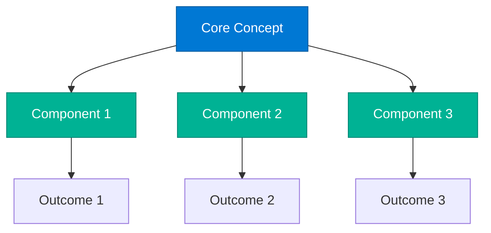
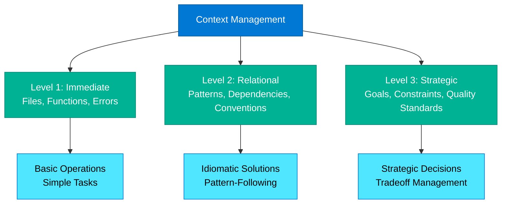

# Conceptual Guide Writing Guide

## Scope

This guide defines writing standards for **conceptual guides** - deep explanations establishing foundational understanding of core concepts, frameworks, or prerequisite knowledge. Follow these instructions when creating or editing conceptual README.md files (excluding the main `docs/README.md` landing page).

**Relationship to other guides:**
* **Markdown formatting:** Defer to `.github/instructions/markdown-styleguide.instructions.md` for technical syntax
* **General writing standards:** Defer to `.github/instructions/20251116-book-restructure-writing-guide.instructions.md` for voice and tone
* **This guide:** Defines conceptual guide-specific structure, self-assessment patterns, and memorable naming

## Conceptual Guide Characteristics

**Purpose:** Establish deep understanding of foundational concepts, frameworks, or complex systems

**Target Audience:** Readers seeking prerequisite knowledge or foundational context

**Depth Level:** Foundational/Prerequisite

**Typical Length:** 1200-2500 words

## Required Structure

### Frontmatter

```yaml
---
title: [Concept Name]
description: [One-sentence description of what concept enables or why it matters]
author: HVE Core Team
date: YYYY-MM-DD
keywords:
  - [concept name]
  - [related concept 1]
  - [related concept 2]
  - [application domain]
---
```

### Opening Section

```markdown
# [Concept Name]

**Reading Time:** [15-30] minutes

[2-3 paragraph hook establishing why this concept matters]

[Paragraph 1: Problem statement—what goes wrong without this understanding]

[Paragraph 2: Impact—real consequences or opportunity cost]

[Paragraph 3: What this guide provides—specific outcomes]

> [!IMPORTANT]
> [Stakes-raising callout: critical insight, common misconception, or prerequisite warning]
```

**Requirements:**
* Reading time estimate at top
* Hook with problem → impact → solution structure
* Early IMPORTANT or WARNING callout (within first screen)
* Problem statement relatable and concrete
* Impact measurable or vivid

### Core Concept with Memorable Name

```markdown
## The [Memorable Concept Name]

[3-5 paragraphs explaining the core concept]

[Build concept systematically: introduce → explain → illustrate → apply]

**Key principle:** [Highlighted foundational rule or insight]

The [Memorable Name] means: [Clear, actionable definition]

**In practice:**
* [Concrete example 1]
* [Concrete example 2]
* [Concrete example 3]
```

**Requirements:**
* Memorable concept name (e.g., "Zero-Context Rule", "Evidence Chain", "Quality Gate Pattern")
* Name should be quotable and self-explanatory
* Clear definition in bold or callout
* 3+ concrete examples demonstrating concept
* **Key principle** statement

<!-- <example-memorable-concept> -->
```markdown
## The Zero-Context Rule

AI models have no memory of your codebase, your previous conversations, or your project context unless you explicitly provide it. Every chat session starts from scratch.

This fundamental constraint shapes everything about effective AI-assisted development. The Zero-Context Rule explains why some developers experience AI "magic" while others struggle with irrelevant suggestions.

**Key principle:** Context is not inherited—it must be constructed deliberately.

The Zero-Context Rule means: You are responsible for building the context the AI needs before asking it to act.

**In practice:**
* Without context: "Add validation" → Generic form validation examples
* With context: "Add validation to UserRegistrationForm in src/auth/forms/UserRegistrationForm.tsx following the pattern in EmailValidator.ts" → Codebase-specific implementation
* Without context: "Fix the bug" → AI requests clarification
* With context: "The authentication flow fails when OAuth tokens expire. Analyze src/auth/OAuthService.ts and propose a token refresh strategy" → Targeted analysis
```
<!-- </example-memorable-concept> -->

### Hierarchical Breakdown

```markdown
## Understanding [Concept]: Three Levels

[Paragraph explaining the hierarchical breakdown approach]

### Level 1: [Foundation]

[Detailed explanation of foundational level]

[Concrete examples]

[Common patterns]

### Level 2: [Intermediate Understanding]

[Build on Level 1, add complexity]

[More sophisticated examples]

[Integration with other concepts]

### Level 3: [Advanced Application]

[Full mastery implications]

[Edge cases and tradeoffs]

[Strategic use]
```

**Requirements:**
* Break complex concept into 2-4 hierarchical levels
* Each level builds on previous
* Concrete examples at each level
* Avoid overloading single section

<!-- <example-hierarchical-breakdown> -->
```markdown
## Understanding Context Management: Three Levels

Effective context management operates at three distinct levels—each building on the previous to create comprehensive AI understanding.

### Level 1: Immediate Context (The What)

The specific files, functions, or code elements relevant to the current task. This is the minimum context needed for basic operations.

**Examples:**
* Single file: "Analyze src/auth/AuthService.ts"
* Specific function: "Review the authenticateUser() function in AuthService.ts"
* Error context: "This test is failing: test/auth/AuthService.test.ts:45"

**Common patterns:**
* File paths with line numbers
* Function signatures
* Error messages with stack traces

### Level 2: Relational Context (The Why)

The connections, patterns, and dependencies that explain how components relate. This level enables AI to understand implications and suggest idiomatic solutions.

**Examples:**
* Pattern context: "AuthService follows the Repository pattern—see UserRepository.ts for the standard approach"
* Dependency context: "AuthService depends on TokenManager.ts for JWT handling"
* Convention context: "All services use constructor injection—see services/BaseService.ts"

**Common patterns:**
* Cross-file relationships
* Architectural patterns
* Team conventions

### Level 3: Strategic Context (The How)

The project goals, constraints, and quality standards that guide decision-making. This level enables AI to make judgment calls and prioritize tradeoffs.

**Examples:**
* Quality requirements: "This is a security-critical service—all changes require tests covering edge cases"
* Performance constraints: "API response time must stay under 200ms—profile before implementing"
* Business context: "Feature flag oauth_v2 controls new auth flow—maintain backward compatibility"

**Common patterns:**
* Quality gates
* Performance requirements
* Business constraints
* Deployment considerations
```
<!-- </example-hierarchical-breakdown> -->

### Visual Representation

```markdown
## [Concept Name] Visualized

[Paragraph introducing the diagram]



[Paragraph explaining key elements and relationships in diagram]
```

**Requirements:**
* One primary Mermaid diagram illustrating concept architecture
* Diagram introduces no new information (reinforces text)
* Use Microsoft Fluent color palette
* Follow with explanatory paragraph connecting diagram to concept

### Practical Application

```markdown
## Applying [Concept Name]

[Paragraph bridging theory to practice]

### Scenario 1: [Common Use Case]

**Context:** [Realistic situation]

**Without [Concept]:** [What happens with naive approach]

**With [Concept]:** [How concept improves outcome]

**Result:** [Measurable benefit or key insight]

---

### Scenario 2: [Another Use Case]

[Repeat structure for 2-3 scenarios]
```

**Requirements:**
* 2-3 practical application scenarios
* Each scenario: Context → Without → With → Result
* Scenarios demonstrate concept value
* Include contrast (with vs without)
* Measurable results when possible

### Common Misconceptions

```markdown
## Common Misconceptions

[Paragraph explaining why misconceptions arise]

### Misconception 1: [Common Belief]

**The misconception:** [What people incorrectly believe]

**Why it's wrong:** [Explanation of error]

**The reality:** [Correct understanding]

**Example:** [Concrete illustration]

---

### Misconception 2: [Another Belief]

[Repeat structure for 3-4 misconceptions]
```

**Requirements:**
* 3-4 common misconceptions
* Each: Misconception → Why wrong → Reality → Example
* Address actual confusion points (not strawmen)
* Clear corrective explanation

### Self-Assessment

```markdown
## Self-Assessment: Do You Understand [Concept]?

[Paragraph explaining assessment purpose]

Evaluate your understanding:

* ✅ **Foundational Understanding**
  * [ ] Can define [Concept Name] in one sentence
  * [ ] Can explain why [Concept] matters (problem it solves)
  * [ ] Can identify when [Concept] applies vs when it doesn't

* ✅ **Practical Application**
  * [ ] Can apply [Concept] to a new scenario without guidance
  * [ ] Can recognize violations of [Concept] in code/examples
  * [ ] Can explain tradeoffs when [Concept] conflicts with other goals

* ✅ **Deep Mastery**
  * [ ] Can teach [Concept] to someone else clearly
  * [ ] Can identify edge cases and limitations
  * [ ] Can adapt [Concept] to unusual situations

**Scoring:**
* **9/9 checks:** Strong mastery—ready to apply and teach
* **6-8 checks:** Solid understanding—practice with real scenarios
* **3-5 checks:** Basic grasp—review practical application section
* **0-2 checks:** Review entire guide—concept not yet clear

> [!TIP]
> If you can't check items in "Foundational Understanding," review [section] before continuing.
```

**Requirements:**
* Three assessment tiers: Foundational, Practical, Deep Mastery
* 3 checkboxes per tier (9 total)
* Checkboxes with concrete, assessable criteria
* Scoring guide with action recommendations
* TIP callout with remediation guidance

### Related Concepts

```markdown
## Related Concepts

**Prerequisites:**
* [Concept 1](link) - [Why it's required]
* [Concept 2](link) - [Why it's required]

**Builds Into:**
* [Advanced Concept 1](link) - [How this concept enables it]
* [Advanced Concept 2](link) - [How this concept enables it]

**Related Topics:**
* [Parallel Concept 1](link) - [Relationship]
* [Parallel Concept 2](link) - [Relationship]

**Practical Applications:**
* [Workflow 1](link) - [How concept applies]
* [Workflow 2](link) - [How concept applies]
```

**Requirements:**
* Four categories: Prerequisites, Builds Into, Related Topics, Practical Applications
* 2-3 items per category
* Each item includes brief relationship statement
* Links to actual content (not placeholders)

### Footer

```markdown
---

<!-- markdownlint-disable MD036 -->
*🤖 Crafted with precision by ✨Copilot following brilliant human instruction,
then carefully refined by our team of discerning human reviewers.*
<!-- markdownlint-enable MD036 -->
```

## Voice and Tone

**Voice:** Second-person instructional ("you'll understand", "your approach")

**Tone:** Emphatic, metaphorical, authoritative, stakes-raising

**Sentence Style:** Vivid, memorable, declarative. Build tension then resolve.

**Example Opening:**
```markdown
# The Zero-Context Rule

**Reading Time:** 20 minutes

Every time you start a new chat session with GitHub Copilot, the AI knows nothing about your codebase. No previous conversations. No file history. No project context. You're starting from absolute zero.

This fundamental constraint costs developers hours of frustration and creates the "AI lottery" effect—some prompts produce brilliant results while identical prompts in new sessions fail completely.

Understanding the Zero-Context Rule transforms AI assistance from unpredictable magic into reliable engineering practice. This guide explains the constraint, why it exists, and how to work within it systematically.

> [!IMPORTANT]
> The Zero-Context Rule is not a limitation to overcome—it's a design feature. Working with it, not against it, unlocks AI's full potential.
```

## Memorable Naming Patterns

**Characteristics of good concept names:**
* Self-explanatory ("Zero-Context Rule" immediately suggests meaning)
* Quotable (easy to remember and reference)
* Evocative (creates mental model)
* Concise (2-4 words maximum)

**Pattern examples:**
* "[Key Property] Rule" - Zero-Context Rule, Evidence-First Rule
* "[Metaphor] Pattern" - Quality Gate Pattern, Evidence Chain Pattern
* "[Core Mechanism]" - Progressive Complexity, Spiral Reinforcement
* "The [Distinctive Feature]" - The RPI Cycle, The Discovery Phase

**Testing concept names:**
* Can you explain it in one sentence?
* Would someone remember it a week later?
* Does it distinguish this concept from similar ideas?

## Early Stakes-Raising Callouts

Place IMPORTANT or WARNING callout within first screen (before fold):

**Purpose:**
* Grab attention immediately
* Surface critical insight or misconception
* Establish stakes (why this matters)

**Patterns:**

<!-- <example-stakes-callout> -->
```markdown
> [!IMPORTANT]
> Without understanding context management, most AI interactions produce generic, unusable results. This isn't an AI limitation—it's a context construction failure.

> [!WARNING]
> Most developers skip context construction thinking it's optional. Then they blame "AI hallucinations" when the real issue is Zero-Context Rule violation.

> [!IMPORTANT]
> This concept is prerequisite for effective AI assistance. If you skip this guide, you'll struggle with every workflow in this book.
```
<!-- </example-stakes-callout> -->

**Requirements:**
* Place within first 3-5 paragraphs (before fold)
* Use IMPORTANT or WARNING (not NOTE/TIP)
* Surface stakes, misconception, or critical prerequisite
* One callout only (don't dilute impact)

## Self-Assessment Design

**Purpose:** Help readers validate understanding before proceeding

**Structure:**
* Three tiers: Foundational → Practical → Deep Mastery
* 3 checkboxes per tier (9 total)
* Concrete, assessable criteria (avoid "understand deeply")
* Scoring guide with clear action recommendations

**Checkbox criteria patterns:**
* Foundational: "Can define", "Can explain", "Can identify"
* Practical: "Can apply", "Can recognize", "Can adapt"
* Deep Mastery: "Can teach", "Can identify edge cases", "Can handle conflicts"

**Scoring guide patterns:**
* Define ranges (9/9, 6-8, 3-5, 0-2)
* Match action to score ("Strong mastery—ready to apply and teach")
* Provide remediation path ("Review [section]")

<!-- <example-self-assessment> -->
```markdown
## Self-Assessment: Do You Understand Context Management?

Use this checklist to validate your understanding before applying context management in real workflows.

Evaluate your understanding:

* ✅ **Foundational Understanding**
  * [ ] Can define the Zero-Context Rule in one sentence
  * [ ] Can explain why context management prevents AI hallucinations
  * [ ] Can identify the three levels of context (Immediate, Relational, Strategic)

* ✅ **Practical Application**
  * [ ] Can construct appropriate context for a new task without guidance
  * [ ] Can recognize insufficient context in example prompts
  * [ ] Can explain when Strategic context matters vs when Immediate context suffices

* ✅ **Deep Mastery**
  * [ ] Can teach context management to a teammate clearly
  * [ ] Can identify edge cases where standard context patterns fail
  * [ ] Can adapt context construction for unusual codebases or constraints

**Scoring:**
* **9/9 checks:** Strong mastery—ready to apply context management across all workflows
* **6-8 checks:** Solid understanding—practice with real codebases to solidify
* **3-5 checks:** Basic grasp—review "Hierarchical Breakdown" and "Practical Application" sections
* **0-2 checks:** Foundational gaps—review entire guide, focusing on "Core Concept" section

> [!TIP]
> If you can't check items in "Foundational Understanding," review the "Zero-Context Rule" section before continuing. Context management is prerequisite for every workflow in this guide.
```
<!-- </example-self-assessment> -->

## Mermaid Diagram Standards

**When to include:**
* Illustrating concept architecture or relationships
* Showing hierarchical structure
* Visualizing process flows

**Diagram characteristics:**
* 5-9 nodes (conceptual guides can be more complex than workflows)
* Use Microsoft Fluent color palette
* Group related nodes visually
* Include descriptive labels (avoid abbreviations)

**Color coding patterns:**
* Core concept: Blue (`#0078d4`)
* Components/elements: Teal (`#00b294`)
* Outcomes/results: Cyan (`#50e6ff`)
* Warnings/critical paths: Purple (`#8764b8`)

<!-- <example-conceptual-mermaid> -->
```markdown
## Context Management Visualized

The three levels of context form a hierarchy—each level building on the previous to create comprehensive AI understanding.



Each level enables different capabilities. Immediate context handles basic operations. Relational context enables pattern-following and idiomatic solutions. Strategic context allows AI to make informed tradeoffs and judgment calls.
```
<!-- </example-conceptual-mermaid> -->

## Quality Checklist

Before submitting conceptual guide content, verify:

### Structure

- [ ] YAML frontmatter complete (title, description, author, date, keywords)
- [ ] Reading time estimate provided
- [ ] Hook with problem → impact → solution (2-3 paragraphs)
- [ ] Early IMPORTANT/WARNING callout (within first screen)
- [ ] Core concept with memorable name clearly defined
- [ ] Hierarchical breakdown (2-4 levels) with examples at each level
- [ ] Mermaid diagram illustrating concept architecture
- [ ] Practical application section (2-3 scenarios with contrast)
- [ ] Common misconceptions section (3-4 misconceptions addressed)
- [ ] Self-assessment with 9 checkboxes across 3 tiers
- [ ] Related Concepts with Prerequisites, Builds Into, Related Topics, Practical Applications
- [ ] Standard footer present

### Voice and Tone

- [ ] Second-person instructional voice ("you'll")
- [ ] Emphatic, metaphorical, authoritative tone
- [ ] Vivid, memorable language
- [ ] Stakes established early (why this matters)
- [ ] Tension built then resolved

### Concept Development

- [ ] Memorable concept name that's self-explanatory and quotable
- [ ] Clear definition in bold or callout
- [ ] **Key principle** statement
- [ ] 3+ concrete examples demonstrating concept
- [ ] Hierarchical breakdown builds complexity gradually
- [ ] Visual representation reinforces (not introduces) concept

### Evidence-Based

- [ ] Problem statement relatable and concrete
- [ ] Impact measurable or vivid
- [ ] Practical scenarios show measurable benefits
- [ ] Self-assessment criteria concrete and assessable
- [ ] Common misconceptions address real confusion (not strawmen)

### Navigation

- [ ] All internal links use correct relative paths
- [ ] Related Concepts section provides clear pathways
- [ ] Prerequisites clearly identified
- [ ] Practical Applications link to workflows using concept

### Formatting

- [ ] Heading hierarchy correct (H1 → H2 → H3)
- [ ] Mermaid diagram uses standard color palette
- [ ] Self-assessment checkboxes properly formatted
- [ ] Minimal callouts (1-2, strategically placed)
- [ ] Bold used for concept names, key principles, emphasis

## Anti-Patterns to Avoid

### 1. Vague Concept Names

❌ **Avoid:** "Context Principles" or "The Context Thing"

✅ **Instead:** "The Zero-Context Rule" (self-explanatory, memorable)

### 2. Late Stakes-Raising

❌ **Avoid:** Burying the "why this matters" on page 3

✅ **Instead:** Problem → Impact → Stakes within first 3-5 paragraphs

### 3. Abstract Examples

❌ **Avoid:** "Use context to improve results"

✅ **Instead:** "Without context: 'Add validation' → generic examples. With context: 'Add validation to UserRegistrationForm.tsx following EmailValidator.ts pattern' → codebase-specific implementation"

### 4. Unmemorable Naming

❌ **Avoid:** "Context Management Strategies and Approaches"

✅ **Instead:** "The Zero-Context Rule" (short, quotable, evocative)

### 5. No Self-Validation

❌ **Avoid:** Guide ends without helping reader assess understanding

✅ **Instead:** Self-assessment with concrete checkboxes and scoring guidance

### 6. Theory Without Application

❌ **Avoid:** Pure concept explanation without practical scenarios

✅ **Instead:** 2-3 practical application scenarios with contrast (with vs without concept)

### 7. Strawman Misconceptions

❌ **Avoid:** "Some people think AI is magic" (nobody actually believes this)

✅ **Instead:** "Many developers believe context persists between chat sessions—it doesn't. Every session starts from zero."

### 8. Overwhelming Single Section

❌ **Avoid:** 2000-word section explaining everything at once

✅ **Instead:** Hierarchical breakdown (Level 1 → 2 → 3) with examples at each level

## Standard Footer

```markdown
---

<!-- markdownlint-disable MD036 -->
*🤖 Crafted with precision by ✨Copilot following brilliant human instruction,
then carefully refined by our team of discerning human reviewers.*
<!-- markdownlint-enable MD036 -->
```
