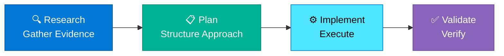

# Landing Page Writing Guide

## Scope

This guide defines writing standards for **landing pages** - entry point pages that orient readers, communicate value proposition, and provide multiple navigation pathways. Follow these instructions when creating or editing `docs/README.md` or other primary entry pages.

**Relationship to other guides:**
* **Markdown formatting:** Defer to `.github/instructions/markdown-styleguide.instructions.md` for technical syntax
* **General writing standards:** Defer to `.github/instructions/20251116-book-restructure-writing-guide.instructions.md` for voice and tone
* **This guide:** Defines landing page-specific structure, emoji usage, and orientation patterns

## Landing Page Characteristics

**Purpose:** Orient readers, communicate value proposition, provide multiple entry points

**Target Audience:** All readers (first impression, book overview)

**Depth Level:** Introductory

**Typical Length:** 800-1200 words

## Required Structure

### Frontmatter

```yaml
---
title: [Book/Section Title]
description: [One-sentence value proposition with key metric]
author: HVE Core Team
date: YYYY-MM-DD
keywords:
  - [primary topic]
  - [methodology/framework]
  - [key benefit 1]
  - [key benefit 2]
  - [additional relevant terms]
---
```

### Opening Section

```markdown
> [Epigraph quote encapsulating core value proposition]

## 🎯 What You'll Learn

[Transformation statement with primary value]

* **[Key outcome 1 with metric]**
* **[Key outcome 2 with metric]**
* **[Key outcome 3 with metric]**
* **[Key outcome 4 with metric]**

## 🚀 Quick Start

[Brief orientation paragraph]

**Three-step pathway:**

1. **[Step 1 Name]** - [Brief description]
2. **[Step 2 Name]** - [Brief description]
3. **[Step 3 Name]** - [Brief description]
```

**Requirements:**
* Epigraph quote (1-2 sentences max)
* "What You'll Learn" with 4-5 specific outcomes
* Each outcome includes metric or measurable result
* Quick Start with 3 steps

### Core Content Sections

```markdown
## [🔄 Major Section 1]

[2-3 paragraph overview]

[Optional: Mermaid diagram for complex concepts]

[Table or structured list of key components]

[Learn more link]

---

## [🤖 Major Section 2]

[Repeat structure]

---

[Continue for 4-6 major sections]
```

**Requirements:**
* 4-6 major content sections
* Each section starts with emoji + section name
* 2-3 paragraph overview per section
* Visual organization (tables, diagrams, or structured lists)
* "Learn more" links to detailed content

### Navigation Sections

```markdown
## Choose Your Path

[Brief guidance paragraph]

**[👔 Role 1: Title]**
* [Path description with link]
* [Primary benefit]

**[👔 Role 2: Title]**
* [Path description with link]
* [Primary benefit]

[Repeat for 3-5 roles]

---

## 📚 What's Inside

[Content organization explanation]

**[Section Name]**
* [Key subsection 1](link)
* [Key subsection 2](link)
* [Key subsection 3](link)

[Repeat for major sections]
```

**Requirements:**
* "Choose Your Path" for role-based navigation
* 3-5 role-specific pathways
* "What's Inside" section structure overview
* Links to all major sections

### Meta Sections

```markdown
## About This Guide

[2-3 paragraphs about guide philosophy, approach, and unique aspects]

---

## 🤝 Site Features

[Bulleted list of unique site capabilities]

* **[Feature 1]:** [Description]
* **[Feature 2]:** [Description]
* **[Feature 3]:** [Description]

---

## Need Help?

**Questions or feedback?**
* [Link to discussions/issues]
* [Link to contribution guide]

**Found an issue?**
* [Link to issue tracker]
```

**Requirements:**
* About section explaining guide philosophy
* Site features highlighting unique capabilities
* Help section with clear pathways for support

### Footer

```markdown
---

<!-- markdownlint-disable MD036 -->
*🤖 Crafted with precision by ✨Copilot following brilliant human instruction,
then carefully refined by our team of discerning human reviewers.*
<!-- markdownlint-enable MD036 -->
```

## Voice and Tone

**Voice:** Second-person, action-oriented ("you'll learn", "your workflow")

**Tone:** Confident, enthusiastic, outcome-focused

**Sentence Style:** Short, punchy, bulleted. High energy.

> [!IMPORTANT]
> **Do NOT include time savings, cost savings, or productivity metrics in landing pages.** Focus on learning journey, technical capabilities, and navigation. Avoid phrases like "X% faster", "saves Y hours", or similar time-oriented claims.

**Example Opening:**
```markdown
> "Transform development velocity with systematic AI assistance—evidence-based workflows that deliver measurable results."

## 🎯 What You'll Learn

Transform your development workflow with systematic AI assistance:

* **Evidence-based development** preventing AI hallucinations
* **Chat mode mastery** for Discovery, Research, Planning, and Implementation
* **Role-specific applications** for Engineers, TPMs, BPMs, and Leaders
* **Systematic workflows** delivering consistent, measurable results
```

## Emoji Standards

**Required Emoji Palette:**
* 🎯 Goals, outcomes, "What You'll Learn"
* 🚀 Getting started, quick start, action steps
* 🔄 RPI framework, methodology, processes
* 🤖 Chat modes, AI tools, automation
* 👔 Roles, teams, organizational patterns
* 🛠️ Tools, implementation, technical details
* 📚 Reference materials, data, documentation
* 🤝 Community, collaboration, contributions

**Usage Requirements:**
* Use in H2 section headings (## 🎯 Section Name)
* Use in "Choose Your Path" role headers
* Use in site features and navigation lists
* Maintain consistency with established patterns

<!-- <example-emoji-usage> -->
```markdown
## 🎯 What You'll Learn

## 🚀 Quick Start

## 🔄 RPI Framework

## 🤖 Chat Modes

## 👔 Role-Specific Guidance

## 🛠️ Tools and Setup

## 📚 Reference Materials

## 🤝 Community and Support
```
<!-- </example-emoji-usage> -->

## Visual Elements

### Mermaid Diagrams

Include 1-2 diagrams illustrating core concepts:

<!-- <example-landing-mermaid> -->
```markdown
## 🔄 The RPI Framework

Research → Plan → Implement: The systematic approach to AI-assisted development.



This evidence-based approach prevents AI hallucinations and delivers consistent results across documented workflows.
```
<!-- </example-landing-mermaid> -->

**Requirements:**
* Use Microsoft Fluent color palette
* Include emoji in node labels when appropriate
* Keep diagrams simple (4-6 nodes max)
* Follow with brief explanatory text

### Tables

Use tables for feature comparisons or content organization:

<!-- <example-landing-table> -->
```markdown
## 🤖 Chat Modes Overview

| Mode | RPI Phase | Primary Purpose |
|------|-----------|----------------|
| **Ask Mode** | Research | Quick reconnaissance, initial discovery |
| **Task Researcher** | Research | Deep codebase analysis, evidence gathering |
| **Task Planner** | Plan | Structured implementation planning |
| **Edit Mode** | Implement | Precise code modifications |
| **Agent Mode** | Implement | Autonomous multi-file implementation |
| **ADR Creator** | Documentation | Architectural decision records |

[Learn more about Chat Modes →](chat-modes/about.md)
```
<!-- </example-landing-table> -->

**Requirements:**
* Use comparison tables for feature matrices
* Include metrics where applicable
* Add "Learn more" link after table

## Multiple Entry Points

### Role-Based Navigation

Provide clear pathways for different reader types:

<!-- <example-role-navigation> -->
```markdown
## Choose Your Path

Different roles benefit from different starting points and focus areas:

**👔 Software Engineers**
* Start with [Engineering Fundamentals](engineering-fundamentals/README.md) to assess codebase readiness
* Focus on [Chat Modes](chat-modes/about.md) and [Workflows](workflows/about.md) for hands-on application
* Goal: Master AI-assisted development for individual productivity

**👔 Technical Program Managers**
* Start with [RPI Framework Overview](rpi-framework/about.md) to understand methodology
* Focus on [Role Guidance](roles/about.md) and [Workflows](workflows/about.md)
* Goal: Measure impact and guide team adoption

**👔 Business Program Managers**
* Start with [About This Guide](#about-this-guide) for context
* Focus on [Organizational Patterns](roles/about.md) and [Scaling Teams](roles/scaling-teams.md)
* Goal: Drive organizational AI transformation

**👔 Engineering Leaders**
* Start with [Engineering Fundamentals](engineering-fundamentals/README.md) for assessment framework
* Focus on [Team Patterns](roles/about.md) and [Executive Reporting](workflows/executive-reporting.md)
* Goal: Lead evidence-based AI adoption across engineering organization
```
<!-- </example-role-navigation> -->

### Quick Start Pathways

Provide 3-step pathway:

<!-- <example-quick-start> -->
```markdown
## 🚀 Quick Start

Three pathways to get started based on your goal:

**Path 1: Immediate Application**
1. **[Setup Your Environment](hve-core/setup.md)** - Install tools and configure
2. **[Your First RPI Workflow](workflows/first-rpi.md)** - Complete a simple task
3. **[Understanding Chat Modes](chat-modes/about.md)** - Learn mode-specific strengths

**Path 2: Foundation First**
1. **[Engineering Fundamentals Assessment](engineering-fundamentals/README.md)** - Evaluate codebase readiness
2. **[RPI Framework Deep Dive](rpi-framework/core-rpi.md)** - Master the methodology
3. **[Complete Workflow Example](workflows/merge-conflict-resolution.md)** - See full RPI cycle

**Path 3: Leadership Perspective**
1. **[About This Guide](#about-this-guide)** - Understand philosophy and approach
2. **[Technical Approach Overview](reference/approach-overview.md)** - Review methodology foundations
3. **[Scaling AI Practices](roles/scaling-teams.md)** - Plan organizational adoption
```
<!-- </example-quick-start> -->

**Requirements:**
* 3 pathways for different goals/roles
* Each pathway has 3 steps
* Links to specific starting content

## Specificity Requirements

**Always use precise descriptions:**
* ✅ "14 chapters across 3 parts"
* ✅ "Evidence-based workflows"
* ✅ "Systematic approach"
* ❌ "significant improvements"
* ❌ "better results"
* ❌ "comprehensive guide"

**Every claim requires evidence:**
* Metrics → Link to measurement methodology
* Patterns → Link to detailed documentation
* Benefits → Link to examples or case studies

**Transparent about scope:**
```markdown
## What's Included

✅ **Included:**
* 14 chapters covering RPI methodology and chat modes
* 8+ complete workflow examples with time measurements
* Role-specific guidance for Engineers, TPMs, BPMs, Leaders
* hve-core project templates and automation

❌ **Not Included:**
* General GitHub Copilot tutorials (see official docs)
* Programming language primers
* Basic Git workflows
* Generic AI prompting techniques
```

## Callout Usage

**Minimal callouts on landing pages** - avoid interrupting flow

**Use only when essential:**

<!-- <example-landing-callout> -->
```markdown
## 🚀 Quick Start

> [!IMPORTANT]
> This guide assumes basic GitHub Copilot familiarity. If you're new to Copilot, complete the [official Getting Started guide](https://docs.github.com/copilot) first.

[Quick start pathways...]
```
<!-- </example-landing-callout> -->

**Frequency:** 0-1 callouts per landing page

## Quality Checklist

Before submitting landing page content, verify:

### Structure

- [ ] YAML frontmatter complete (title, description, author, date, keywords)
- [ ] Epigraph quote present and impactful
- [ ] "What You'll Learn" with 4-5 specific outcomes + metrics
- [ ] Quick Start with 3-step pathway
- [ ] 4-6 major content sections with emoji headers
- [ ] "Choose Your Path" role-based navigation
- [ ] "What's Inside" content structure overview
- [ ] About section explaining guide philosophy
- [ ] Site features section
- [ ] Help/support section
- [ ] Standard footer present

### Voice and Tone

- [ ] Second-person instructional voice ("you'll")
- [ ] Confident, enthusiastic, outcome-focused tone
- [ ] Short, punchy sentences
- [ ] Action-oriented verbs (Transform, Master, Build)
- [ ] Specific metrics (not generic claims)

### Evidence-Based

- [ ] Every metric cited with source
- [ ] Benefits linked to supporting evidence
- [ ] Transparent about scope (what's included/excluded)

### Navigation

- [ ] Multiple entry points (role-based, goal-based, sequential)
- [ ] All internal links use correct relative paths
- [ ] "Learn more" links after each major section
- [ ] Role pathways link to appropriate starting content

### Formatting

- [ ] Emoji usage consistent with standards
- [ ] Mermaid diagram(s) use standard color palette
- [ ] Tables properly formatted with headers
- [ ] Minimal callouts (0-1)
- [ ] Visual hierarchy clear (headings, bullets, emphasis)

## Anti-Patterns to Avoid

### 1. Bury the Lede

❌ **Avoid:**
```markdown
# HVE AI Companion Guide

This guide was created to help developers. It contains information about
various topics. The guide is organized into sections. You can read it
from start to finish or jump to specific topics.

[3 more paragraphs before stating value]
```

✅ **Instead:**
```markdown
# HVE AI Companion Guide

> "Transform development velocity with systematic AI assistance—evidence-based workflows that deliver measurable results."

## 🎯 What You'll Learn

Transform your development workflow with systematic AI assistance:

* **Evidence-based development** preventing AI hallucinations
* **Chat mode mastery** for Discovery, Research, Planning, Implementation
* **Systematic workflows** delivering consistent results
* **Role-specific applications** for Engineers, TPMs, BPMs, Leaders
```

### 2. Generic Claims

❌ **Avoid:** "Learn to use AI more effectively"

✅ **Instead:** "Master the RPI framework: systematic workflows delivering consistent, evidence-based results"

### 3. No Navigation Pathways

❌ **Avoid:** "Read the guide to learn more"

✅ **Instead:** "Choose Your Path" section with role-specific starting points

### 4. Inconsistent Emoji

❌ **Avoid:** Using random emoji (💻, 🎉, 👨‍💻) without pattern

✅ **Instead:** Use standard palette (🎯, 🚀, 🔄, 🤖, 👔, 🛠️, 📚, 🤝)

### 5. Overwhelming First Impression

❌ **Avoid:** Wall of text, no visual hierarchy, no clear entry points

✅ **Instead:** Short paragraphs, emoji headers, tables/diagrams, multiple pathways

### 6. Missing Metrics

❌ **Avoid:** "Significant improvements" or "much faster"

✅ **Instead:** Specific, measurable outcomes with link to validation methodology

### 7. No Role-Based Guidance

❌ **Avoid:** "Everyone starts here"

✅ **Instead:** "Choose Your Path" with 3-5 role-specific entry points

### 8. Abstract Examples

❌ **Avoid:** "Use this for various workflows"

✅ **Instead:** "Merge conflict resolution: systematic evidence gathering and structured validation"

## Standard Footer

```markdown
---

<!-- markdownlint-disable MD036 -->
*🤖 Crafted with precision by ✨Copilot following brilliant human instruction,
then carefully refined by our team of discerning human reviewers.*
<!-- markdownlint-enable MD036 -->
```
