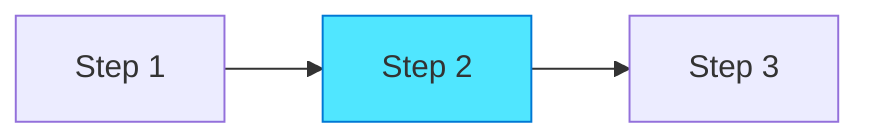
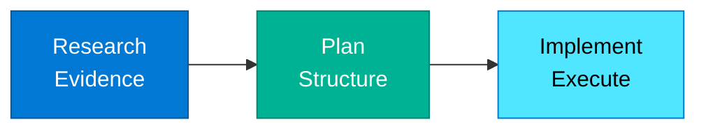

# Section Introduction Writing Guide

## Scope

This guide defines writing standards for **section introduction pages** - orientation pages for major content collections that help readers understand structure, choose starting points, and navigate relationships. Follow these instructions when creating or editing `about.md` files throughout the documentation.

**Relationship to other guides:**
* **Markdown formatting:** Defer to `.github/instructions/markdown-styleguide.instructions.md` for technical syntax
* **General writing standards:** Defer to `.github/instructions/20251116-book-restructure-writing-guide.instructions.md` for voice and tone
* **This guide:** Defines section introduction-specific structure, taxonomy tables, and conditional navigation

## Section Introduction Characteristics

**Purpose:** Orient readers within major content sections, map relationships between subsections, provide conditional navigation

**Target Audience:** Readers navigating to specific sections (not sequential readers)

**Depth Level:** Navigational

**Typical Length:** 600-1000 words

## Required Structure

### Frontmatter

```yaml
---
title: [Section Name]
description: [One-sentence description of section scope and purpose]
author: HVE Core Team
date: YYYY-MM-DD
keywords:
  - [primary topic]
  - [content type 1]
  - [content type 2]
  - [additional relevant terms]
---
```

### Opening Section

```markdown
# [Section Name]

[Single paragraph introducing section purpose and scope]

## What's in This Section

[Brief orientation paragraph]

* **[Subsection 1 Name]** - [One-sentence description]
* **[Subsection 2 Name]** - [One-sentence description]
* **[Subsection 3 Name]** - [One-sentence description]
* **[Subsection 4 Name]** - [One-sentence description]

[Additional context paragraph if needed]
```

**Requirements:**
* Single opening paragraph establishing section purpose
* "What's in This Section" bulleted overview (4-8 subsections)
* Each bullet: bold subsection name + brief description
* Keep descriptions concise (one sentence max)

### Conditional Navigation

```markdown
## Start Here

**If you're new to [topic]:**
1. Begin with [Introductory Content](link) to [outcome]
2. Then explore [Next Step Content](link) to [outcome]
3. Finally review [Advanced Content](link) to [outcome]

**If you're experienced with [prerequisite knowledge]:**
* Jump directly to [Advanced Content](link) for [specific application]
* Review [Reference Material](link) for [quick lookup]
* Explore [Specialized Topic](link) if [specific condition]

**Looking for something specific?**
* [Specific Use Case 1](link) - [When to use]
* [Specific Use Case 2](link) - [When to use]
* [Specific Use Case 3](link) - [When to use]
```

**Requirements:**
* Bifurcated guidance: "new to X" vs "experienced with X"
* New readers: Numbered sequential pathway (3 steps)
* Experienced readers: Bulleted options with conditions
* "Looking for something specific?" with 3-5 targeted pathways
* Each pathway includes outcome/benefit statement

### Content Taxonomy Table

```markdown
## Content Overview

[Brief paragraph explaining how content is organized]

| Content Type | Topics Covered | Depth Level |
|--------------|----------------|-------------|
| [Type 1] | [2-3 word summary] | [Introductory/Intermediate/Advanced] |
| [Type 2] | [2-3 word summary] | [Depth level] |
| [Type 3] | [2-3 word summary] | [Depth level] |
| [Type 4] | [2-3 word summary] | [Depth level] |
```

**Requirements:**
* Table with 5-8 rows (content items)
* Columns: Content Type, Topics Covered, Depth Level
* Depth levels: Introductory, Intermediate, Advanced, Reference

<!-- <example-taxonomy-table> -->
```markdown
## Content Overview

This section organizes RPI framework variations by complexity and use case.

| Workflow Pattern | Primary Use Case | Depth Level |
|------------------|------------------|-------------|
| Core RPI | Standard feature development | Introductory |
| D-RPI | Unfamiliar codebase exploration | Intermediate |
| Mini-RPI | Quick bug fixes, small changes | Intermediate |
| Collaborative RPI | Team-based implementation | Advanced |
| Validation-Heavy RPI | Critical systems, compliance | Advanced |
| Cross-Repository RPI | Multi-codebase changes | Advanced |
```
<!-- </example-taxonomy-table> -->

### Detailed Subsection Overviews

```markdown
## Detailed Content Guide

### [Subsection 1 Name]

**Purpose:** [What this subsection accomplishes]

**When to use:**
* [Scenario 1]
* [Scenario 2]
* [Scenario 3]

**Key strengths:**
* [Strength 1 with specific benefit]
* [Strength 2 with specific benefit]

**Limitations:**
* [Limitation 1 with workaround if applicable]
* [Limitation 2 with workaround if applicable]

**Typical workflow:**


[Learn more: Subsection 1 Name →](subsection1.md)

---

### [Subsection 2 Name]

[Repeat structure for each major subsection]
```

**Requirements:**
* One detailed overview per major subsection (4-8 subsections)
* Consistent structure: Purpose, When to use, Key strengths, Limitations, Typical workflow
* "When to use" with 2-4 specific scenarios
* Key strengths with measurable benefits when possible
* Limitations transparent with workarounds
* Optional: Simple Mermaid diagram (3-5 nodes)
* "Learn more" link with arrow (→) to detailed content

<!-- <example-subsection-overview> -->
```markdown
### Core RPI Pattern

**Purpose:** Standard three-phase workflow for feature development in familiar codebases with solid engineering fundamentals.

**When to use:**
* Implementing new features in well-understood codebases
* Working with established patterns and conventions
* Team members familiar with codebase structure
* Clear requirements with defined success criteria

**Key strengths:**
* **Fastest RPI variation:** 45-75 minutes for typical features
* **Simplest workflow:** Three clear phases with standard outputs
* **Best for learning:** Establishes core RPI habits and patterns

**Limitations:**
* Assumes codebase familiarity—use D-RPI for unfamiliar codebases
* Requires solid engineering fundamentals (tests, conventions, documentation)
* Not optimized for quick fixes—use Mini-RPI for small changes

**Typical workflow:**


[Learn more: Core RPI Pattern →](core-rpi.md)
```
<!-- </example-subsection-overview> -->

### Comparison Table (Optional)

When subsections are alternatives or variations:

```markdown
## Choosing the Right Approach

[Brief paragraph explaining comparison]

| Feature/Criteria | [Option 1] | [Option 2] | [Option 3] |
|------------------|-----------|-----------|-----------|
| **Best for** | [Scenario] | [Scenario] | [Scenario] |
| **Time investment** | [X-Y min] | [X-Y min] | [X-Y min] |
| **Complexity** | [Low/Medium/High] | [Low/Medium/High] | [Low/Medium/High] |
| **Prerequisites** | [Requirements] | [Requirements] | [Requirements] |
| **Key strength** | [Primary benefit] | [Primary benefit] | [Primary benefit] |
| **When to avoid** | [Antipattern] | [Antipattern] | [Antipattern] |

**Decision guide:**
* **[Condition 1]** → Use [Option X]
* **[Condition 2]** → Use [Option Y]
* **[Condition 3]** → Use [Option Z]
```

**Requirements:**
* Use comparison table when section contains variations/alternatives
* Rows: Best for, Time investment, Complexity, Prerequisites, Key strength, When to avoid
* Decision guide with 3-5 conditional recommendations

### Related Content Section

```markdown
## Related Content

**Prerequisites:**
* [Required knowledge 1](../section/content.md) - [Why it's required]
* [Required knowledge 2](../section/content.md) - [Why it's required]

**Next Steps:**
* [Natural progression 1](../section/content.md) - [How it builds]
* [Natural progression 2](../section/content.md) - [How it builds]

**Related Topics:**
* [Related concept 1](../section/content.md) - [Connection]
* [Related concept 2](../section/content.md) - [Connection]
```

**Requirements:**
* Three categories: Prerequisites, Next Steps, Related Topics
* 2-3 items per category
* Each item includes brief context (why/how/connection)

### Footer

```markdown
---

<!-- markdownlint-disable MD036 -->
*🤖 Crafted with precision by ✨Copilot following brilliant human instruction,
then carefully refined by our team of discerning human reviewers.*
<!-- markdownlint-enable MD036 -->
```

## Voice and Tone

**Voice:** Second-person instructional ("you'll explore", "your workflow")

**Tone:** Helpful, navigational, guiding

**Sentence Style:** Clear signposting, explicit pathways, conditional guidance

**Example Opening:**
```markdown
# RPI Framework

This section documents the Research → Plan → Implement framework and its variations—the systematic approaches that make AI assistance predictable and measurable.

## What's in This Section

* **Core RPI Pattern** - Standard three-phase workflow for familiar codebases
* **D-RPI (Discovery)** - Extended four-phase pattern for unfamiliar codebases
* **Mini-RPI** - Streamlined pattern for quick fixes and small changes
* **Validation-Heavy RPI** - Enhanced verification for critical systems
* **Collaborative RPI** - Team-based implementation patterns
* **Cross-Repository RPI** - Multi-codebase coordination workflows
```

## Conditional Navigation Patterns

**Bifurcated pathways:** Always provide guidance for both new and experienced readers

**New reader pathway characteristics:**
* Sequential (1 → 2 → 3)
* Building complexity gradually
* Foundation-first approach
* Links to introductory content

**Experienced reader pathway characteristics:**
* Selective (choose based on need)
* Jump-to-advanced options
* Reference-oriented
* Conditional guidance ("if you need X, see Y")

<!-- <example-conditional-navigation> -->
```markdown
## Start Here

**If you're new to RPI workflows:**
1. Begin with [Core RPI Pattern](core-rpi.md) to master the fundamental three-phase approach
2. Then explore [Mini-RPI](mini-rpi.md) to learn the streamlined variation for small changes
3. Finally review [D-RPI](d-rpi.md) to understand the Discovery extension for unfamiliar codebases

**If you're experienced with basic RPI:**
* Jump directly to [Validation-Heavy RPI](validation-rpi.md) for critical systems requiring enhanced verification
* Review [Collaborative RPI](collaborative-rpi.md) for team-based implementation patterns
* Explore [Cross-Repository RPI](cross-repo-rpi.md) if working across multiple codebases

**Looking for something specific?**
* [Quick bug fixes](mini-rpi.md) - Streamlined 20-35 minute workflow for small changes
* [Unfamiliar codebase](d-rpi.md) - Discovery phase for brownfield projects
* [Critical systems](validation-rpi.md) - Enhanced validation for compliance-heavy environments
* [Team coordination](collaborative-rpi.md) - Multi-developer workflow patterns
```
<!-- </example-conditional-navigation> -->

## Detailed Subsection Format

**Required structure for each subsection:**

1. **Purpose:** Single-sentence statement of what this accomplishes
2. **When to use:** 2-4 bullet points with specific scenarios
3. **Key strengths:** 2-3 strengths with measurable benefits
4. **Limitations:** 1-3 limitations with workarounds or alternatives
5. **Typical workflow:** Optional Mermaid diagram (keep simple: 3-5 nodes)
6. **Learn more link:** With arrow (→) to detailed content

**Purpose statement patterns:**
* "Standard [X] for [scenario] in [context]"
* "[Action] that [outcome] when [condition]"
* "[Workflow/Pattern] for [specific use case] with [key characteristic]"

**When to use patterns:**
* Start with specific scenarios, not abstract concepts
* Include conditions: "when X", "if Y", "with Z"
* Focus on reader's situation, not content features

**Key strengths patterns:**
* Lead with measurable benefit when available
* Use bold for strength name, prose for benefit
* Compare to alternatives when helpful ("faster than X", "simpler than Y")

**Limitations patterns:**
* State limitation clearly without hedging
* Include workaround: "use [alternative] when [condition]"
* Be transparent about tradeoffs

## Taxonomy Table Guidelines

**Purpose:** Provide at-a-glance overview of content organization

**Column definitions:**
* **Content Type/Name:** The subsection or document name
* **Topics Covered:** 2-4 words summarizing key topics
* **Depth Level:** Introductory, Intermediate, Advanced, Reference
* **Typical Time:** Range estimate (e.g., "15-25 min")

**Depth level definitions:**
* **Introductory:** Assumes no prior knowledge, foundational concepts
* **Intermediate:** Assumes basic knowledge, applies concepts
* **Advanced:** Assumes mastery of basics, handles edge cases
* **Reference:** Quick lookup, no narrative structure

## Comparison Tables

Use when subsections are variations or alternatives that readers choose between.

**Required rows:**
* **Best for:** Specific scenario/use case
* **Time investment:** Realistic time estimate
* **Complexity:** Low/Medium/High with brief context
* **Prerequisites:** Required knowledge/setup
* **Key strength:** Primary benefit
* **When to avoid:** Antipattern or limitation

**Decision guide format:**
* Bulleted conditional statements
* Pattern: "**[Condition]** → Use [Option]"
* 3-5 decision rules covering common scenarios

<!-- <example-comparison-table> -->
```markdown
## Choosing the Right RPI Variation

Different scenarios call for different RPI variations—this table helps you decide.

| Feature/Criteria | Core RPI | D-RPI | Mini-RPI |
|------------------|----------|-------|----------|
| **Best for** | Familiar codebases | Unfamiliar codebases | Quick fixes |
| **Time investment** | 45-75 min | 60-90 min | 20-35 min |
| **Complexity** | Low (3 phases) | Medium (4 phases) | Low (streamlined) |
| **Prerequisites** | Codebase familiarity | None (includes Discovery) | Strong codebase familiarity |
| **Key strength** | Fastest variation | No brownfield friction | Minimal overhead |
| **When to avoid** | Unfamiliar codebase | Well-understood code | Complex features |

**Decision guide:**
* **New to this codebase** → Use D-RPI (Discovery phase maps terrain)
* **Implementing feature in familiar code** → Use Core RPI (fastest path)
* **Fixing quick bug** → Use Mini-RPI (streamlined workflow)
* **Critical system requiring extensive validation** → Use Validation-Heavy RPI
* **Coordinating with team** → Use Collaborative RPI
```
<!-- </example-comparison-table> -->

## Mermaid Diagram Standards

**When to include:**
* Illustrating typical workflow (sequential steps)
* Showing relationships between subsections
* Visualizing decision flows

**When NOT to include:**
* Simple lists (use bullets)
* Complex multi-path diagrams (too detailed for overview)
* Every subsection (use selectively for clarity)

**Diagram characteristics:**
* 3-5 nodes maximum (keep simple)
* Use Microsoft Fluent color palette
* Label nodes clearly (avoid abbreviations)
* Include in "Typical workflow" section of detailed overviews

<!-- <example-section-mermaid> -->
```markdown
### Core RPI Pattern

**Typical workflow:**

```
<!-- </example-section-mermaid> -->

## Quality Checklist

Before submitting section introduction content, verify:

### Structure

- [ ] YAML frontmatter complete (title, description, author, date, keywords)
- [ ] Opening paragraph establishes section purpose
- [ ] "What's in This Section" bulleted overview (4-8 items)
- [ ] "Start Here" with bifurcated new/experienced pathways
- [ ] Content taxonomy table with 5-8 rows
- [ ] Detailed overview for each major subsection
- [ ] Each overview includes: Purpose, When to use, Key strengths, Limitations, Learn more link
- [ ] Related Content section with Prerequisites, Next Steps, Related Topics
- [ ] Standard footer present

### Voice and Tone

- [ ] Second-person instructional voice ("you'll")
- [ ] Helpful, navigational, guiding tone
- [ ] Clear signposting ("If you're new...", "If you're experienced...")
- [ ] Conditional guidance based on reader situation
- [ ] Specific scenarios in "When to use" sections

### Navigation

- [ ] Multiple pathways (new/experienced/specific needs)
- [ ] Sequential pathway for new readers (1 → 2 → 3)
- [ ] Selective pathways for experienced readers (conditional)
- [ ] "Looking for something specific?" with 3-5 targeted options
- [ ] All internal links use correct relative paths
- [ ] "Learn more" links with arrows (→) after each subsection

### Content Organization

- [ ] Taxonomy table includes all major subsections
- [ ] Depth levels accurate (Introductory/Intermediate/Advanced/Reference)
- [ ] Comparison table included if subsections are alternatives
- [ ] Decision guide provided for choosing between options

### Evidence-Based

- [ ] Strengths include measurable benefits when available
- [ ] Limitations stated transparently
- [ ] Workarounds provided for limitations
- [ ] Prerequisites clearly identified

### Formatting

- [ ] Heading hierarchy correct (H1 → H2 → H3)
- [ ] Mermaid diagrams simple (3-5 nodes) and use standard palette
- [ ] Tables properly formatted with consistent columns
- [ ] Minimal callouts (0-2 per section)
- [ ] Bold used consistently for subsection names, key terms

## Anti-Patterns to Avoid

### 1. Single Entry Point

❌ **Avoid:** "Start with section 1 and read sequentially"

✅ **Instead:** Bifurcated pathways for new vs experienced readers plus specific-need options

### 2. Abstract "When to Use"

❌ **Avoid:** "Use this when you need advanced capabilities"

✅ **Instead:** "Use this when implementing features in unfamiliar codebases without existing documentation"

### 3. Missing Limitations

❌ **Avoid:** Only listing strengths without limitations

✅ **Instead:** Transparent limitations with workarounds: "Not optimized for quick fixes—use Mini-RPI for changes under 30 minutes"

### 4. Generic Descriptions

❌ **Avoid:** "This section covers important topics"

✅ **Instead:** "This section documents six RPI variations optimized for specific scenarios: familiar vs unfamiliar codebases, feature work vs quick fixes, individual vs team workflows"

### 5. No Decision Guidance

❌ **Avoid:** Listing options without guidance for choosing

✅ **Instead:** Comparison table + decision guide: "**New to this codebase** → Use D-RPI"

### 6. Over-Complex Diagrams

❌ **Avoid:** 10-node Mermaid diagrams with multiple decision branches

✅ **Instead:** Simple 3-5 node linear or tree diagrams

### 7. Vague Scope Description

❌ **Avoid:** "Quick introduction" or "comprehensive guide" without specifics

✅ **Instead:** Specific content scope: "covers 3 RPI variations" or "documents 5 workflow patterns"

### 8. Missing Subsection Overviews

❌ **Avoid:** Just listing subsections with one-line descriptions

✅ **Instead:** Detailed overview for each with Purpose, When to use, Key strengths, Limitations, Learn more link

## Standard Footer

```markdown
---

<!-- markdownlint-disable MD036 -->
*🤖 Crafted with precision by ✨Copilot following brilliant human instruction,
then carefully refined by our team of discerning human reviewers.*
<!-- markdownlint-enable MD036 -->
```
