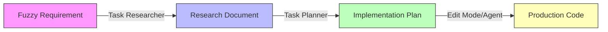

> Master the Research → Plan → Implement (RPI) framework for AI-assisted development with hve-core and GitHub Copilot.

## 🎯 What You'll Learn

Transform your development workflow with systematic AI assistance:

* **60-88% time reduction**[^1] across engineering workflows
* **Evidence-based development** preventing AI hallucinations
* **Chat mode mastery** for Discovery, Research, Planning, and Implementation
* **Role-specific applications** for Engineers, TPMs, BPMs, and Leaders

## 🚀 Quick Start

New to HVE and RPI? Start here:

1. **[Engineering Fundamentals](part-i/chapter1-engineering-ready/)** - Is your codebase AI-ready? *(5-7 min)*
2. **[Core RPI Framework](part-i/chapter3-rpi-fundamentals/)** - Learn Research → Plan → Implement *(6-8 min)*
3. **[Your First RPI Workflow](part-i/chapter4-first-workflow/)** - Hands-on tutorial *(15-20 min)*

## 🔄 The RPI Framework

**Research → Plan → Implement** is the foundation of all HVE practices:

* **Research Phase:** Task Researcher mode - Deep, evidence-based discovery
* **Plan Phase:** Task Planner mode - Three-document planning system
* **Implement Phase:** Edit Mode/Agent - Controlled or autonomous execution

**[Explore RPI Framework →](part-i/chapter3-rpi-fundamentals/)**

## 🤖 GitHub Copilot Chat Modes

Master the right mode for each RPI phase:

| Mode | Best For | Time Savings | Learn More |
|------|----------|--------------|------------|
| **Ask Mode** | Quick discovery, landscape reconnaissance | 5-10 min sessions | [Ask Mode Guide](part-ii/chapter5-ask-mode/) |
| **Task Researcher** | Deep research, evidence gathering | 60-70% reduction | [Task Researcher Guide](part-ii/chapter6-task-researcher/) |
| **Task Planner** | Implementation planning | 60-70% reduction | [Task Planner Guide](part-ii/chapter7-task-planner/) |
| **Edit Mode** | Controlled refactoring | 75-88% reduction | [Edit Mode Guide](part-ii/chapter8-edit-mode/) |
| **Agent Mode** | Autonomous execution | 60-88% reduction[^1] | [Agent Mode Guide](part-ii/chapter9-agent-mode/) |

**[Chat Modes Deep Dive →](part-ii/)**

## 🎯 Popular Workflows

Real-world applications with documented time savings:

* **[Merge Conflict Resolution](part-ii/chapter11-advanced-workflows/)** - 2-4 hours → 50-60 minutes *(75-83% faster)*
* **[Performance Review Automation](part-ii/chapter11-advanced-workflows/)** - 10 hours → 3 hours *(70% faster)*
* **[Executive Briefing Generation](part-ii/chapter11-advanced-workflows/)** - 6-9 hours → 70 minutes *(80-88% faster)*
* **[Engineering Fundamentals Audit](part-ii/chapter11-advanced-workflows/)** - 4-6 hours → 30 minutes *(87-92% faster)*

**[All Workflows →](part-ii/chapter11-advanced-workflows/)**

## 👔 Choose Your Path

Jump to role-specific guides:

* **[Development Teams](part-iv/chapter15-dev-team-roles/)** - Scaling HVE workflows across TPM, DevOps, and Software Engineer roles
* **[Technical Program Managers](part-iv/chapter16-program-managers/)** - Briefings, audits, technical depth
* **[Business Program Managers](part-iv/chapter16-program-managers/)** - Customer briefings, M365 Copilot
* **[Engineering Leaders](part-iv/chapter17-organizational-scaling/)** - Automated reporting, team scaling

## 📖 About This Guide

This guide builds on the **#SeasonOfHVE** blog series, bringing together 17 posts into a structured learning resource. Content covers:

* Engineering fundamentals as AI prerequisite
* RPI framework and variations (D-RPI, 1→3→All, Agent+Ask)
* Chat mode deep dives with evidence-based examples
* Real-world workflows with time reduction metrics
* Role-specific applications across engineering roles

**Built by:** Microsoft Edge AI team  
**License:** [MIT](https://github.com/WilliamBerryiii/hve-ai-companion-guide/blob/main/LICENSE)

---

## Features of This Site

* 🌙 **Dark/Light Mode** - Toggle in the top-right corner
* 📋 **Copy-to-Clipboard** - Click the copy button on any code block
* 📊 **Interactive Diagrams** - Mermaid and DrawIO diagram support
* 📖 **Book-Style Navigation** - Previous/Next buttons for sequential reading
* 🔍 **Full-Text Search** - Search box in the sidebar

## Need Help?

* **GitHub Repository**: [microsoft/hve-core](https://github.com/microsoft/hve-core)
* **Issues & Discussions**: [GitHub Issues](https://github.com/WilliamBerryiii/hve-ai-companion-guide/issues)

---

[^1]: Time reduction ranges reflect variation across different workflow types, task complexity, developer experience, and baseline practices. Based on documented HVE workflows and GitHub Copilot research studies (2023-2024) measuring specific engineering tasks. Metrics include code generation, documentation, testing, refactoring, and program management activities. Individual results vary significantly. These represent observed time reductions in controlled scenarios, not guaranteed outcomes.

---

*This documentation is powered by [Docsify](https://docsify.js.org/) and styled with Microsoft Fluent UI brand colors.*

---

<!-- markdownlint-disable MD036 -->
*🤖 Crafted with precision by ✨Copilot following brilliant human instruction,
then carefully refined by our team of discerning human reviewers.*
<!-- markdownlint-enable MD036 -->
