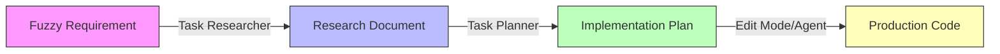

## 🎯 What You'll Learn

Transform your development workflow with systematic AI assistance:

* **Evidence-based development** preventing AI hallucinations
* **Chat mode proficiency** for Discovery, Research, Planning, and Implementation
* **Structured workflows** delivering consistent, validated results
* **Role-specific applications** for Engineers, TPMs, BPMs, and Leaders

## 🚀 Quick Start

New to HVE and RPI? Start here:

1. **[Engineering Fundamentals](part-i/chapter1-engineering-ready/)** - Is your codebase AI-ready? *(5-7 min)*
2. **[Core RPI Framework](part-i/chapter3-rpi-fundamentals/)** - Learn Research → Plan → Implement *(6-8 min)*
3. **[Your First RPI Workflow](part-i/chapter4-first-workflow/)** - Hands-on tutorial *(15-20 min)*

## 🔄 The RPI Framework

**Research → Plan → Implement** is the foundation of all HVE practices:

* **Research Phase:** Task Researcher mode - Deep, evidence-based discovery
* **Plan Phase:** Task Planner mode - Three-document planning system
* **Implement Phase:** Edit Mode/Agent - Controlled or autonomous execution

**[Explore RPI Framework →](part-i/chapter3-rpi-fundamentals/)**

## 🤖 GitHub Copilot Chat Modes

Learn the right mode for each RPI phase:

| Mode                | Best For                                  | RPI Phase       | Learn More                                                              |
|---------------------|-------------------------------------------|-----------------|-------------------------------------------------------------------------|
| **Ask Mode**        | Quick discovery, landscape reconnaissance | Research        | [Ask Mode Guide](part-ii/chapter5-discovery-research-modes/)            |
| **Task Researcher** | Deep research, evidence gathering         | Research        | [Task Researcher Guide](part-ii/chapter6-planning-architecture-modes/)  |
| **Task Planner**    | Implementation planning                   | Plan            | [Task Planner Guide](part-ii/chapter7-implementation-modes/)            |
| **Edit Mode**       | Controlled refactoring                    | Implement       | [Edit Mode Guide](part-ii/chapter8-implementation-modes/)               |
| **Agent Mode**      | Autonomous execution                      | Implement       | [Agent Mode Guide](part-ii/chapter9-agent-mode/)                        |

**[Chat Modes Deep Dive →](part-ii/)**

## 🎯 Popular Workflows

Real-world applications of the RPI framework:

* **[Merge Conflict Resolution](part-ii/chapter11-advanced-workflows/)** - Systematic evidence gathering for complex conflicts
* **[Performance Review Automation](part-ii/chapter11-advanced-workflows/)** - Structured data extraction and synthesis
* **[Executive Briefing Generation](part-ii/chapter11-advanced-workflows/)** - Multi-source research with validated outputs
* **[Engineering Fundamentals Audit](part-ii/chapter11-advanced-workflows/)** - Comprehensive codebase assessment patterns

**[All Workflows →](part-ii/chapter11-advanced-workflows/)**

## 🎓 Learning Path

This guide is structured as a progressive learning journey:

### Part I: Engineering Foundations (Chapters 1-4)

Essential prerequisites and your first RPI workflow

* [Chapter 1: Are You Engineering-Ready?](part-i/chapter1-engineering-ready/)
* [Chapter 2: Setting Up Your Environment](part-i/chapter2-setup-environment/)
* [Chapter 3: The RPI Method](part-i/chapter3-rpi-fundamentals/)
* [Chapter 4: Your First Complete Workflow](part-i/chapter4-first-workflow/)

### Part II: Deep Dive into Practice (Chapters 5-11)

Learn each GitHub Copilot chat mode and advanced workflow patterns

* [Chapter 5: Discovery and Research Modes](part-ii/chapter5-discovery-research-modes/)
* [Chapter 6: Planning and Architecture Modes](part-ii/chapter6-planning-architecture-modes/)
* [Chapter 7: Implementation Modes](part-ii/chapter7-implementation-modes/)
* [Chapter 8: Edit Mode and Precision Implementation](part-ii/chapter8-implementation-modes/)
* [Chapter 9: Agent Mode and Autonomous Execution](part-ii/chapter9-agent-mode/)
* [Chapter 10: ADR Creator Mode](part-ii/chapter10-adr-creator/)
* [Chapter 11: Advanced Workflows and Complex Scenarios](part-ii/chapter11-advanced-workflows/)

### Part III: Advanced Prompting Patterns (Chapters 12-16)

Custom agents, workflow orchestration, and meta-prompting

* [Chapter 12: Prompt Files and Instructions Basics](part-iii/chapter12-prompt-files-basics/)
* [Chapter 13: Advanced Instruction Patterns](part-iii/chapter13-instruction-patterns/)
* [Chapter 14: Custom Agents and Workflow Orchestration](part-iii/chapter14-custom-agents/)
* [Chapter 15: Meta-Prompting and Self-Improving Systems](part-iii/chapter15-meta-prompting/)
* [Chapter 16: Advanced Architecture and Integration](part-iii/chapter16-advanced-architecture/)

### Part IV: Organizational Scaling (Chapters 15-17)

Apply HVE patterns across roles and scale to enterprise teams

* [Chapter 15: For Development Teams](part-iv/chapter15-dev-team-roles/)
* [Chapter 16: For Program Managers](part-iv/chapter16-program-managers/)
* [Chapter 17: For Leaders and Scaling Organizations](part-iv/chapter17-organizational-scaling/)

## 📖 About This Guide

This guide builds on the **#SeasonOfHVE** blog series, bringing together content into a structured learning resource. Content covers:

* Engineering fundamentals as AI prerequisite
* RPI framework and variations (D-RPI, 1→3→All, Agent+Ask)
* Chat mode deep dives with evidence-based examples
* Advanced prompting patterns with custom agents and meta-prompting
* Real-world workflows with time reduction metrics
* Role-specific applications across engineering roles

**Built by:** Microsoft Edge AI team  
**License:** [MIT](https://github.com/WilliamBerryiii/hve-ai-companion-guide/blob/main/LICENSE)

---

## Features of This Site

* 🌙 **Dark/Light Mode** - Toggle in the top-right corner
* 📋 **Copy-to-Clipboard** - Click the copy button on any code block
* 📊 **Interactive Diagrams** - Mermaid and DrawIO diagram support
* 📖 **Book-Style Navigation** - Previous/Next buttons for sequential reading
* 🔍 **Full-Text Search** - Search box in the sidebar

## Need Help?

* **HVE Core Repository**: [microsoft/hve-core](https://github.com/microsoft/hve-core) - The foundation tooling for HVE practices
* **Edge AI Repository**: [microsoft/edge-ai](https://github.com/microsoft/edge-ai) - Edge AI team resources and examples
* **This Guide Repository**: [WilliamBerryiii/hve-ai-companion-guide](https://github.com/WilliamBerryiii/hve-ai-companion-guide)
* **Issues & Discussions**: [GitHub Issues](https://github.com/WilliamBerryiii/hve-ai-companion-guide/issues)

---

*This documentation is powered by [Docsify](https://docsify.js.org/) and styled with Microsoft Fluent UI brand colors.*

---

<!-- markdownlint-disable MD036 -->
*🤖 Crafted with precision by ✨Copilot following brilliant human instruction,
then carefully refined by our team of discerning human reviewers.*
<!-- markdownlint-enable MD036 -->
