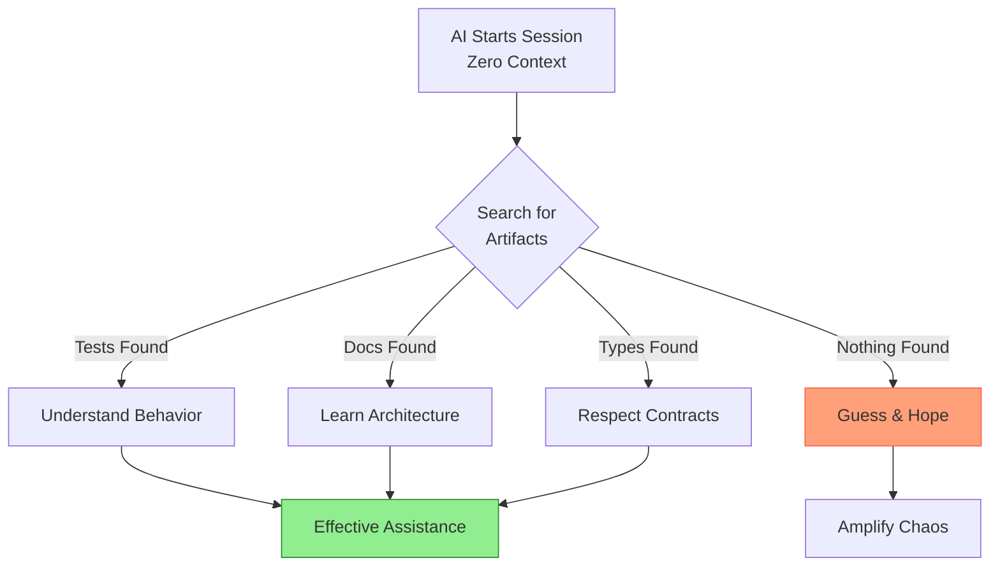

## The AI Effectiveness Paradox

You've heard the promises: AI pair programmers can deliver 60-88% time savings for software development tasks. GitHub Copilot, ChatGPT, and other AI assistants are transforming how code gets written. Your organization is eager to adopt these tools.

But here's a pattern commonly observed in AI adoption across development teams: **AI works best where it's least needed.** This isn't meant to discourage you ... quite the opposite. Understanding this pattern is the first step toward making AI work brilliantly for *your* team.

**The Paradox:**

* ✅ **Well-structured codebase**: Comprehensive tests, clear documentation, consistent style → AI delivers significant time savings
* ⚠️ **Average codebase**: Partial tests, inconsistent patterns, minimal docs → AI delivers moderate time savings
* ❌ **Under-developed codebase**: No tests, no docs, inconsistent everything → AI creates more problems than it solves

You might recognize your own codebase somewhere in this spectrum. That's perfectly normal as most codebases fall in the middle range. The good news? This isn't a flaw in AI, it's a feature you can leverage.

AI assistants amplify your existing codebase quality. Give AI a solid foundation, and it accelerates development. Give it chaos, and it amplifies the chaos. Once you understand this pattern, you can use it strategically.

### Why the Paradox Exists: The Discoverability Mechanism

The paradox isn't mysterious—it's about **what AI can discover** in your codebase:

**Well-structured codebase (discoverable):**

* AI searches for tests → finds comprehensive suite → understands expected behavior
* AI reads type definitions → sees explicit contracts → respects interfaces
* AI discovers ADRs → learns architectural decisions → maintains consistency
* AI examines git history → identifies evolution patterns → suggests similar changes

**Legacy codebase without fundamentals (not discoverable):**

* AI searches for tests → finds none → guesses at behavior
* AI looks for types → sees `any` everywhere → cannot validate
* AI seeks decision context → finds nothing → repeats past mistakes
* AI analyzes patterns → discovers inconsistency → picks randomly

**The revelation: AI is only as effective as your codebase is discoverable.**

This is why "legacy" doesn't matter to AI. A 10-year-old codebase with comprehensive tests and clear documentation will outperform a 6-month-old codebase with neither. AI doesn't care about the age of your project, it cares about what's actually there.

## Why This Matters to You

Before investing time learning AI-assisted development techniques (Chapters 2-14), you need to know: **Is your codebase ready?**

This chapter answers that question with a practical assessment framework. By the end, you'll have:

* **Scored assessment** of your codebase (1-20 point scale)
* **Identified gaps** blocking AI effectiveness
* **Prioritized roadmap** for strategic improvement
* **Clear decision** whether to proceed with AI adoption or address fundamentals first

**What makes this chapter different:** You'll audit a real codebase (yours or one you choose), not abstract theory. "Good enough" gets defined with specific scores, and the assessment reveals *your* specific gaps.

This is where your journey transforms from hoping AI will help to *knowing* how to make it work.

> [!TIP]
> **Path Guidance: If you already have a well-maintained codebase**
>
> If your codebase already has:
>
> * Automated tests with CI/CD integration
> * Enforced linting and formatting
> * Comprehensive documentation (README, ADRs, inline comments)
> * Clean Git history with PR reviews
>
> You can **skim this chapter** (10 minutes) to confirm your readiness and proceed directly to Chapter 2. Use the assessment in Section 4 as a quick verification checklist.

---

**Next:** [The Four Pillars of AI-Ready Codebases](02-four-pillars.md)

---

<!-- markdownlint-disable MD036 -->
*🤖 Crafted with precision by ✨Copilot following brilliant human instruction,
then carefully refined by our team of discerning human reviewers.*
<!-- markdownlint-enable MD036 -->
