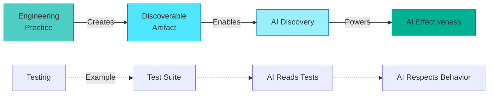
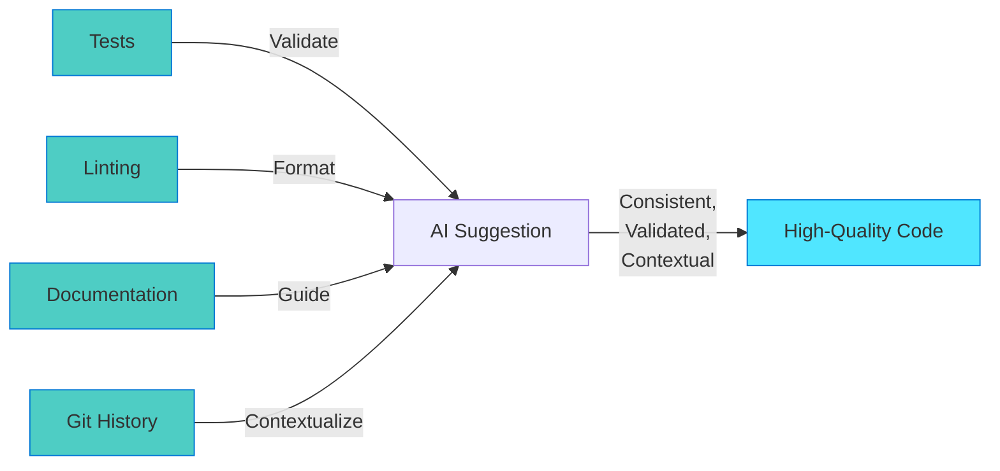

Before AI can help you write code, it needs to understand your codebase. But AI can't ask random questions, listen to the tribal knowledge at the watercooler, or interpret vague intentions. It can only work with **what's discoverable** ... the artifacts your engineering practices create.

Engineering fundamentals transform your codebase from opaque to discoverable. Each pillar creates artifacts AI can find and use:

| Pillar             | Creates Discoverable Artifact      | How AI Uses It                                               |
|--------------------|------------------------------------|--------------------------------------------------------------|
| **Testing**        | Executable behavior specifications | Reads test assertions as truth about what code should do     |
| **Linting**        | Enforced consistency patterns      | Follows configuration rules as specifications for code style |
| **Documentation**  | Decision context and rationale     | Discovers README/ADRs to understand architectural intent     |
| **Source Control** | Evolution and pattern history      | Analyzes commit patterns to suggest consistent changes       |

**The transformation:** Each fundamental doesn't just improve code quality for humans—it creates machine-readable artifacts that power AI effectiveness.

This chapter explores how each pillar creates discoverability and what "good enough" looks like for effective AI assistance.



> [!IMPORTANT]
> **AI is a pattern amplifier, not a pattern creator.** It cannot impose order on chaos. Your engineering fundamentals create the discoverable artifacts that become AI's training data for your specific project.

## Pillar 1: Comprehensive Testing

Tests are what catch breaking changes before production. But here's what makes testing so powerful with AI: it's not just about catching mistakes. When you have tests in place, something magical happens—your AI suggestions come with built-in validation.

Think of tests as the guardrails that let you experiment boldly. AI generates a refactoring? Run the tests. Tests pass? The refactoring preserved behavior. Tests fail? You caught the hallucination before it reached users. This transforms AI from "helpful but risky" to "reliable partner."

**What AI learns from your tests:**

* **Expected behavior**: Tests show how functions should work in real scenarios
* **Edge cases**: Tests reveal boundary conditions AI should respect
* **Usage patterns**: Tests demonstrate correct API usage
* **Breaking changes**: Tests prevent AI from suggesting changes that alter behavior

**What "comprehensive" actually means:**

You don't need 100% code coverage. That's unrealistic and unnecessary. You need *strategic* testing that covers critical paths:

* Unit tests for complex business logic (authentication, calculations, data transformations)
* Integration tests for key user workflows (signup → login → core feature)
* End-to-end tests for critical paths (payment processing, data export)

### Discovery Moment: Catching AI Hallucinations

Let's see this pattern in action. You're refactoring authentication middleware, and AI generates code that looks absolutely perfect. Clean, modern, idiomatic. But there's a subtle bug you might not catch in code review.

**Your original code:**

```javascript
// Original: verifyToken returns {user, roles} object
async function authenticate(req, res, next) {
  const token = req.headers.authorization?.split(' ')[1];
  const result = await verifyToken(token);
  req.user = result.user;
  req.roles = result.roles;  // Role-based access control depends on this
  next();
}
```

**AI suggests a "cleaner" refactoring:**

```javascript
// AI's suggestion (looks cleaner, but breaks RBAC)
async function authenticate(req, res, next) {
  const token = req.headers.authorization?.split(' ')[1];
  const user = await verifyToken(token);  // AI assumes verifyToken returns user directly
  req.user = user;
  next();
}
// Problem: req.roles is never set
// Role-based access control silently fails 🔥
```

The code compiles. It looks cleaner. But AI assumed `verifyToken()` returns a user object directly, when it actually returns `{user, roles}`. Without tests, you discover this when users report they can't access features they should have permission for.

**With tests, you catch this immediately:**

```javascript
// tests/middleware/auth.test.js
it('populates req.user and req.roles from token', async () => {
  const req = { headers: { authorization: 'Bearer valid-token' }};
  const res = {};
  const next = jest.fn();
  
  await authenticate(req, res, next);
  
  expect(req.user).toHaveProperty('id');
  expect(req.roles).toContain('admin');  // THIS TEST FAILS - req.roles is undefined
});

// You catch AI's mistake before committing ✅
```

That failing test tells you immediately: "This refactoring broke role-based access control." You can reject the AI suggestion or ask AI to preserve the original structure. Either way, the bug never leaves your machine.

> **Discovery Moment: Tests Create Discoverable Behavior Specifications**
>
> Notice what just happened: the test **discovered** that AI's refactoring broke expected behavior. When you ran the test suite, it served as executable documentation of what your authentication middleware should do. The tests became a specification you could verify AI's suggestion against.
>
> **What just happened?** This is discoverability in action. Your test suite created machine-readable proof of expected behavior—`req.roles` must be set after authentication. AI's suggestion violated that specification, and the tests caught it immediately. Without tests, AI's "cleaner" refactoring would have shipped to production.
>
> Tests aren't just documentation for humans—they're discoverable truth about behavior that catches AI hallucinations before they reach users.

### Testing Spectrum

| Level                  | Description              | AI Effectiveness       |
|------------------------|--------------------------|------------------------|
| 0 - No Tests           | No automated tests       | ❌ Very risky           |
| 1 - Smoke Tests        | Few critical path tests  | ⚠️ Some validation     |
| 2 - Core Coverage      | Tests for business logic | ✅ Moderate confidence  |
| 3 - Strategic Coverage | Unit + integration tests | ✅ Good confidence      |
| 4 - Comprehensive      | High coverage + CI       | ✅✅ High confidence     |
| 5 - TDD Practice       | Test-first development   | ✅✅✅ Maximum confidence |

> [!NOTE]
> **Target for AI-readiness: Level 3-4**
>
> You don't necessarily need TDD or 90% coverage. Level 3 (strategic coverage of critical paths) is sufficient for effective AI-assisted development.

With testing in place, you've given AI something to verify against. Now let's add the second pillar that makes AI suggestions not just correct, but *consistent*.

## Pillar 2: Automated Linting and Formatting

While tests catch logical errors, linting catches style issues and potential bugs before they reach testing. But here's what makes linting especially powerful for AI: your linter configuration becomes a *specification* that AI reads and follows.

Think about your codebase's style inconsistencies. Maybe some files use callbacks, others use promises, and a few use async/await. Each pattern works, but the inconsistency creates cognitive load. You're constantly switching mental models as you move between files. When AI learns from this codebase, it picks up these inconsistencies and amplifies them, suggesting callbacks in some contexts, promises in others, making your codebase *more* inconsistent over time.

Now picture what happens when you have strict linting. Your ESLint config says "prefer async/await." AI reads that configuration like a specification. It doesn't guess your style preferences. It knows them. Every suggestion automatically follows your team's conventions. Your linter becomes AI's style guide enforcer.

**What AI learns from your linting rules:**

* **Code style preferences**: Indentation, quotes, semicolons, naming conventions
* **Architectural patterns**: How to structure imports, where to place files
* **Error handling**: Required try/catch, error types to use
* **Best practices**: Security rules, performance patterns, framework conventions

**What "automated" actually means:**

Manual style enforcement through code review doesn't work for AI. You need automated tools that:

* Run on every save (linters like ESLint, Pylint, RuboCop)
* Format automatically (Prettier, Black, gofmt)
* Block commits with violations (pre-commit hooks)
* Fail CI builds on style issues

### Discovery Moment: From Chaos to Consistency

Let's watch this pattern in action. You have a typical mid-sized codebase where different developers wrote code at different times using different styles. All three approaches work, but they create mental overhead.

**Without linting, AI amplifies the chaos:**

```javascript
// File 1: Uses callbacks
function getUser(id,callback){
    User.findById(id,function(err,user){
        if(err)callback(err);
        callback(null,user);
    });
}

// File 2: Uses Promises
function getOrder(id) {
  return Order.findById(id)
    .then(order => order)
    .catch(err => {
      throw err;
    });
}

// File 3: Uses async/await
async function getProduct(id) {
  try {
    const product = await Product.findById(id);
    return product;
  } catch (error) {
    throw error;
  }
}

// AI suggests code matching different patterns depending on which file it sees
// Codebase becomes MORE inconsistent over time
```

Notice what happens? AI sees three valid patterns and learns all three. When you ask for a new database function, AI might suggest any of these styles depending on context. Your codebase becomes *more* inconsistent with every AI-generated function.

**With linting, AI enforces consistency:**

```javascript
// eslint.config.js (flat config)
export default [
  {
    rules: {
      'no-restricted-syntax': [
        'error',
        {
          selector: 'CallExpression[callee.property.name="then"]',
          message: 'Use async/await instead of .then()'
        }
      ],
      'require-await': 'error'
    }
  }
];

// All files now follow same pattern
async function getUser(id) {
  try {
    return await User.findById(id);
  } catch (error) {
    throw error;
  }
}

async function getOrder(id) {
  try {
    return await Order.findById(id);
  } catch (error) {
    throw error;
  }
}

// AI learns ONE pattern, consistently suggests it
// Codebase stays consistent, cognitive load decreases
```

That ESLint configuration is doing something powerful: it's telling AI exactly which patterns to use. AI uses linting rules to guide suggestions and tends to follow them consistently. Your codebase becomes *more* consistent over time instead of less.

> **Discovery in Action: Linting Creates Discoverable Style Specifications**
>
> Look at what happened: AI didn't pick a random async pattern. It **discovered** your linting rules and followed them exactly. Your ESLint configuration became a specification AI read and obeyed. Every AI suggestion automatically matched your team's conventions.
>
> **What just happened?** This is discoverability in action. Your linting configuration created machine-readable rules defining "correct code" for your project. AI discovered that config file and used it as a specification. Without linting enforcement, AI would have learned from your inconsistent code and amplified the chaos.
>
> Linting rules aren't just guardrails for humans—they're discoverable specifications AI uses to generate consistent code.

### Common Linting Tools by Language

| Language              | Linter           | Formatter          | Config Example                |
|-----------------------|------------------|--------------------|-------------------------------|
| JavaScript/TypeScript | ESLint           | Prettier           | `eslint.config.js`            |
| Python                | Pylint, Flake8   | Black              | `.pylintrc`, `pyproject.toml` |
| Ruby                  | RuboCop          | RuboCop            | `.rubocop.yml`                |
| Go                    | golangci-lint    | gofmt              | `.golangci.yml`               |
| Java                  | Checkstyle       | google-java-format | `checkstyle.xml`              |
| C#                    | Roslyn Analyzers | dotnet format      | `.editorconfig`               |

> [!TIP]
> **Start with opinionated formatters**
>
> Don't spend hours configuring linter rules. Use opinionated defaults:
>
> * JavaScript: Prettier + ESLint recommended config
> * Python: Black (no configuration needed)
> * Go: gofmt (built-in)
>
> Enforcement > Perfect rules

You've got tests validating behavior and linting enforcing consistency. Now let's add the third pillar that transforms AI from code generator to context-aware partner.

## Pillar 3: Clear Documentation

Think of AI as a new team member joining your project. How would that person learn your codebase? They'd read the README to understand the architecture. They'd look for comments explaining non-obvious decisions. They'd search for examples showing how components connect.

AI learns the exact same way. But here's what makes documentation especially powerful: AI can read your entire documentation in seconds and apply that context to every suggestion. That README explaining your authentication flow? AI references it when generating auth-related code. Those inline comments about retry logic? AI respects them when refactoring.

Without documentation, AI operates like a developer who never asks questions. It sees the code, guesses the intent, and hopes for the best. The results look plausible but often miss crucial context. With documentation, AI operates like a developer who studied the project thoroughly before writing a single line.

**What AI learns from your documentation:**

* **Project architecture**: How components fit together, what depends on what
* **Design decisions**: Why you chose specific approaches over alternatives
* **Domain knowledge**: Business rules, constraints, edge cases
* **Usage patterns**: Examples showing correct API usage, configuration, workflows

**What "clear" actually means:**

You don't need generated JSDoc comments for every function. That's busywork that adds noise without clarity. You need *strategic* documentation in four key places:

* **README.md**: Project purpose, architecture overview, setup instructions
* **Inline comments**: Complex logic, non-obvious decisions, "why not" explanations
* **Architecture Decision Records (ADRs)**: Major technical choices with rationale
* **API documentation**: Public interfaces, expected inputs/outputs, error handling

### Documentation Hierarchy (Priority Order)

#### 1. README.md (Essential - 15 min to create)

````markdown
# Project Name

## What This Project Does
[One paragraph explaining purpose]

## Architecture
[High-level component overview]

## Getting Started
```bash
npm install
npm test
npm start
```

## Project Structure

```text
src/
  api/        # REST API endpoints
  services/   # Business logic
  models/     # Data models
  utils/      # Shared utilities
```

## Key Concepts

* Authentication uses JWT tokens (see docs/auth.md)
* Database uses Sequelize ORM with PostgreSQL
* All API responses follow JSON:API format
````

#### 2. Inline Comments (Strategic - add as you code)

```javascript
// ✅ Good: Explains WHY, not WHAT
// Retry logic because payment gateway has intermittent 503 errors
// See: https://docs.payment-api.com/errors#retries
async function processPayment(order) {
  return await retry(() => paymentGateway.charge(order), {
    maxAttempts: 3,
    backoff: 'exponential'
  });
}

// ❌ Bad: States the obvious
// Process payment
async function processPayment(order) {
  // Call payment gateway
  return await paymentGateway.charge(order);
}
```

#### 3. Architecture Decision Records (For major decisions)

```markdown
# ADR-003: Use PostgreSQL Instead of MongoDB

## Status
Accepted

## Context
Need to choose database for multi-tenant SaaS application. 
Requirements: ACID transactions, complex queries, JSON support.

## Decision
Use PostgreSQL 14+ with JSONB columns for flexible schemas.

## Consequences
* Positive: Strong consistency, proven scalability, full SQL
* Negative: Slightly more complex setup than MongoDB
* Risk mitigation: Use ORM (Sequelize) to abstract DB details

## Alternatives Considered
* MongoDB: Rejected due to weak consistency guarantees for multi-tenancy
* MySQL: Rejected due to inferior JSON support vs PostgreSQL
```

### Example: How Documentation Reduces AI Hallucination

*Scenario:* Adding feature to payment processing module

**Without Documentation:**

```text
You: "Add retry logic to payment processing"
```

```javascript
// AI suggests retrying ALL failures (wrong!)
async function processPayment(order) {
  return await retry(() => paymentGateway.charge(order), {
    maxAttempts: 3,
    retryOn: (error) => true  // Retries validation errors too!
  });
}
```

**With Documentation (inline comment explaining retry intent):**

```javascript
// Only retry transient errors (5xx, timeouts)
// Don't retry client errors (4xx) or validation failures
async function processPayment(order) {
  // existing implementation
}
```

```text
You: "Add retry logic to payment processing"
```

```javascript
// AI learns from comment and suggests correct retry logic
async function processPayment(order) {
  return await retry(() => paymentGateway.charge(order), {
    maxAttempts: 3,
    retryOn: (error) => error.status >= 500 || error.code === 'ETIMEDOUT'
  });
}
```

> **The Discoverability Pattern: Documentation Creates Discoverable Context**
>
> Notice what just happened: AI used your documented intent to generate accurate retry logic. Documentation significantly reduces hallucination risk by providing clear context AI can reference. Your inline comment became a specification AI read and followed. The comment explained constraints AI couldn't infer from code alone.
>
> **What just happened?** This is discoverability in action. Your documentation created machine-readable context explaining architectural decisions. AI discovered that context and used it to generate code that respects your design intent. Without documentation, AI would have implemented a plausible solution that violates your carefully reasoned constraints.
>
> Documentation isn't just onboarding material for humans—it's discoverable context AI uses to maintain architectural consistency.

<!-- -->

> [!IMPORTANT]
> **Documentation is AI's context window into your project**
>
> AI can't read your mind, but it CAN read your docs. Well-documented code teaches AI your intent, conventions, and constraints.

Tests validate behavior, linting enforces style, documentation explains context. The fourth pillar completes the foundation by showing AI how your codebase evolves over time.

## Pillar 4: Source Control Hygiene

Picture this: You're asking AI to help refactor a complex module. AI can see the current code, but what if you could also show AI *why* the code looks this way? What patterns did past pull requests follow? What decisions got discussed in code reviews? Which changes were accepted versus rejected?

That's what clean source control gives you. Your Git history becomes a teaching dataset showing AI how code evolves in your project. Good commit messages explain not just *what* changed, but *why*. Pull request reviews signal which patterns your team accepts and which get rejected. Branch names show how features get organized.

When AI tools are configured to access your Git history (like advanced IDE integrations or workspace context providers), they don't just generate code that compiles. They generate code that follows your team's evolution patterns. They learn from thousands of micro-decisions captured in commits and reviews.

**What AI learns from your source control:**

* **Evolution patterns**: How features typically get built (small commits vs big rewrites)
* **Change scope**: What belongs in one commit, what needs splitting
* **Code review standards**: What your team considers "good enough" versus needs revision
* **Technical decisions**: Why code changed (performance fix, security patch, feature addition)

**What "hygiene" actually means:**

You don't need a perfect linear history with rebase-only workflows. That's overkill. You need *meaningful, traceable* history that teaches AI your patterns:

* Descriptive commit messages that explain changes
* Logical commits (not "WIP", "fix", "more stuff")
* Pull request reviews before merging to main
* Branch naming conventions showing feature organization

### Discovery Moment: What Git History Teaches AI

Let's compare two teams working on the same authentication feature. Both teams write working code, but their Git histories tell very different stories.

**Team A's commit history (vague and unhelpful):**

```text
* a3b2c1d - "fix" (2 hours ago)
* 9x8y7z6 - "more stuff" (3 hours ago)
* 5w4v3u2 - "WIP" (1 day ago)
* 1q2w3e4 - "updates" (2 days ago)
```

What can AI learn from this history? Almost nothing. Which commit added the feature? Which fixed a bug? What was the bug? Why did the code change? When AI generates commit messages after learning from this codebase, it writes equally vague messages like "fix stuff" or "updates."

**Team B's commit history (clear and informative):**

```text
* a3b2c1d - "fix: handle null user in auth middleware (closes #123)" (2 hours ago)
* 9x8y7z6 - "feat: add JWT refresh token support" (3 hours ago)
* 5w4v3u2 - "refactor: extract token validation to separate function" (1 day ago)
* 1q2w3e4 - "docs: document JWT authentication flow in README" (2 days ago)
```

Now AI can learn powerful patterns. It sees that:

* Features get prefixed with `feat:`
* Bug fixes get prefixed with `fix:` and reference issues
* Refactorings are clearly labeled and scoped
* Documentation updates happen alongside code changes

When AI generates commit messages after learning from this codebase, it follows the same clear patterns. More importantly, when AI suggests code changes, it can reference past commits to understand why code looks the way it does.

### Conventional Commits Format

```text
<type>(<scope>): <description>

[optional body explaining WHY]

[optional footer with issue references]
```

**Common types:**

* `feat`: New feature
* `fix`: Bug fix
* `refactor`: Code restructuring (no behavior change)
* `docs`: Documentation changes
* `test`: Test additions/changes
* `chore`: Maintenance (dependencies, config)

### Example Pull Request Template

```markdown
## Changes
* Added JWT refresh token endpoint
* Updated authentication middleware to verify refresh tokens
* Added tests for token refresh flow

## Why
Users were getting logged out frequently (15min token expiry).
Refresh tokens allow 7-day sessions with 15min access tokens (better security + UX).

## Testing
* Unit tests: `npm test -- auth.test.js`
* Manual test: Login → wait 20min → refresh → verify continued access

## Checklist
- [x] Tests added/updated
- [x] Documentation updated
- [x] Linting passes
- [x] No breaking changes
```

### Example: How Source Control Helps AI

*Scenario:* AI suggests refactoring authentication code

When AI tools have access to Git history through workspace context (like GitHub Copilot's workspace indexing), they can discover evolution patterns:

```text
Recent commits for src/auth/middleware.js:

* fix: authentication middleware race condition (#234)
* refactor: separate token validation and user loading  
* test: add integration tests for token refresh flow
```

**What AI learns from this history:**

1. This file recently had race condition issues—suggest thread-safe patterns
2. Token validation and user loading are now separate concerns—respect that boundary
3. Changes include issue references and corresponding tests—follow the same pattern

**AI's suggestion incorporates this context:**

* Respects separation of concerns established in past refactoring
* Flags potential race conditions based on file history
* Suggests adding tests (consistent with team's commit patterns)

> **Discovery Moment: Git History Creates Discoverable Evolution Patterns**
>
> Notice what just happened: With access to Git history, AI didn't suggest changes in a vacuum. It **discovered** your evolution patterns through commit messages and past changes. Your Git history became a timeline showing how the codebase grows. Past refactorings taught AI your team's approach to change.
>
> **What just happened?** This is discoverability in action. Your Git history created machine-readable patterns showing how code evolves in your project. AI discovered those patterns and used them to suggest changes consistent with your team's practices. Without clear commit messages, AI would have no context about why code exists—just what currently exists.
>
> Git history isn't just audit trail for compliance—it's discoverable evolution patterns AI uses to maintain consistency over time.

<!-- -->

> [!NOTE]
> **Git history is your codebase's documentation over time**
>
> Good commit messages are documentation of WHY code changed. AI uses this to understand evolution and suggest changes consistent with past patterns.

## The Four Pillars Working Together

Each pillar individually helps AI effectiveness. But they're multiplicatively powerful together:

**Synergy Example:**



**Without All Four Pillars:**

* AI suggests code → No tests catch errors → No linting enforces style → No docs explain intent → Git history shows chaos → Code quality degrades

**With All Four Pillars:**

* AI suggests code → Tests validate correctness → Linting enforces consistency → Docs guide toward intent → Git history shows quality patterns → Code quality improves

> [!IMPORTANT]
> **You don't need perfection in all four pillars.**
>
> Target: Level 3-4 in each pillar (see assessment in Section 4). This is "good enough" for effective AI-assisted development while remaining achievable.

---

**Previous:** [Introduction: The AI Effectiveness Paradox](01-introduction.md)

**Next:** [Case Study: The Real Cost of Skipping Fundamentals](03-case-study.md)

---

<!-- markdownlint-disable MD036 -->
*🤖 Crafted with precision by ✨Copilot following brilliant human instruction,
then carefully refined by our team of discerning human reviewers.*
<!-- markdownlint-enable MD036 -->
