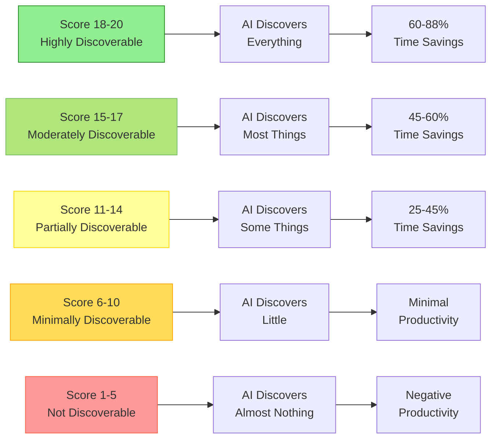

You're about to do something that takes courage: honestly assess where your codebase stands. This isn't easy. Most of us want our codebases to be better than they are, and admitting gaps feels uncomfortable.

But here's the truth that makes this worth doing: **honest assessment is the fastest path to improvement**. Every gap you discover is an opportunity you've just identified. Every low score is a clear signal about where your effort will have the biggest impact.

This assessment is for *you*, not for judgment. Whatever you discover about your codebase is valuable information. There's no failing score here: only starting points.

## How the Assessment Works

* Rate your codebase on a 5-point scale for each pillar
* Sum scores across all four pillars (maximum: 20 points)
* Interpret your total score using readiness tiers
* Identify gaps and create your improvement roadmap

> [!IMPORTANT]
> **Your honesty is your advantage**
>
> If you're feeling nervous about this assessment, you're not alone. Most codebases don't have the fundamentals they wish they had. But here's what matters: inflating your scores doesn't change reality. It just delays discovering what's blocking AI effectiveness.
>
> Be brave. Be truthful. Whatever you discover gives you clarity about the path forward.

## What This Assessment Really Measures: Discoverability

This assessment doesn't measure code quality for humans—it measures **how discoverable your codebase is to AI**. Each score reflects what AI can discover and use when working with your code.

### Your score = your codebase's discoverability level

### Score Levels and What They Mean

| Score Range | Discoverability Level   | What AI Can Discover                                                        | Productivity Impact              |
|-------------|-------------------------|-----------------------------------------------------------------------------|----------------------------------|
| **18-20**   | Highly Discoverable     | All behavior specs, all contracts, all context, all patterns                | 60-88% time savings              |
| **15-17**   | Moderately Discoverable | Most behavior specs, most contracts, key context, consistent patterns       | 45-60% time savings              |
| **11-14**   | Partially Discoverable  | Some behavior specs, some contracts, limited context, inconsistent patterns | 25-45% time savings              |
| **6-10**    | Minimally Discoverable  | Few specs, weak contracts, minimal context, unclear patterns                | Minimal or negative productivity |
| **1-5**     | Not Discoverable        | AI finds almost nothing to work with. AI must guess at everything           | High risk of AI-created problems |

### Discoverability Progression



**The encouraging truth:** Every pillar you improve increases discoverability and unlocks more AI effectiveness. Your current score isn't a judgment—it's your starting point for strategic improvement.

---

## Pillar 1: Testing Assessment (5-point scale)

Let's start with testing. If you're feeling nervous about this pillar, take a breath. You're not alone. Most codebases have less test coverage than their teams wish they had. The important thing is knowing your baseline, not achieving perfection.

### Score 1 - No Automated Tests

If your codebase has no test files, or tests that haven't run successfully in months, you're starting at score 1. This might feel discouraging, but here's the encouraging truth: you've just identified your highest-leverage improvement opportunity.

**Characteristics:**

* No test files in repository
* OR: Test files exist but don't run (broken dependencies, outdated)
* Manual testing only
* **AI Risk**: ⚠️⚠️⚠️ Very high - no validation of AI suggestions
* **Good News**: Even adding a dozen strategic tests can dramatically improve AI effectiveness

### Score 2 - Minimal Tests (5-15% coverage)

* Some unit tests for a few critical functions
* Tests not run regularly (no CI)
* Many core features untested
* **AI Risk**: ⚠️⚠️ High - limited validation

### Score 3 - Basic Coverage (15-30%)

* Unit tests for core business logic
* Some integration tests for critical paths
* Tests run manually before major releases
* **AI Risk**: ⚠️ Moderate - some validation but gaps remain

### Score 4 - Strategic Coverage (30-60%)

* Comprehensive unit tests for business logic
* Integration tests for key user workflows
* Tests run automatically in CI/CD pipeline
* Tests fail build if they don't pass
* **AI Risk**: ✅ Low - good validation coverage

### Score 5 - Comprehensive Coverage (60%+ or TDD)

* High test coverage across codebase
* Unit + integration + end-to-end tests
* TDD practiced (tests written first)
* CI/CD with mandatory passing tests
* **AI Risk**: ✅✅ Very low - excellent validation

### How to Check Your Score

```bash
# For JavaScript/TypeScript (Jest)
npm test -- --coverage

# For Python (pytest)
pytest --cov=src --cov-report=term

# For Ruby (SimpleCov)
COVERAGE=true bundle exec rspec

# For Go
go test -cover ./...

# Look for: Overall coverage percentage
```

**Your Testing Score**: _____ / 5

---

## Pillar 2: Linting & Formatting Assessment (5-point scale)

Now let's look at code consistency. This pillar is often the quickest to improve: installing and configuring a linter can take less than an hour, but many teams skip it because it feels like "just style."

Here's why it matters for AI: your linter configuration becomes a *specification* that AI reads and follows. Without it, AI has to guess which of your team's many patterns to use.

### Score 1 - No Linting or Formatting Tools

If you have no linter or formatter installed, and your code style varies significantly across files, you're at score 1. The good news? This is the fastest pillar to improve.

**Characteristics:**

* No linter or formatter installed
* Code style inconsistent across files
* Style discussions in every PR
* **AI Risk**: ⚠️⚠️⚠️ Very high - AI mimics inconsistency
* **Good News**: Linting setup typically takes 1-2 hours and yields immediate AI benefits

### Score 2 - Tools Installed, Not Enforced

* Linter/formatter installed (`eslint`, `prettier`, `pylint`, etc.)
* Configuration file exists
* BUT: Not run automatically
* Many existing violations
* **AI Risk**: ⚠️⚠️ High - tools ignored means patterns unclear

> [!NOTE]
> Time savings percentages represent observed ranges across various projects and should be considered estimates. Actual results vary based on codebase complexity, team experience, and feature types.

### Score 3 - Manual Enforcement

* Tools installed and configured
* Developers run tools manually before commit
* Code reviews check for style violations
* BUT: No automation (relies on human memory)
* **AI Risk**: ⚠️ Moderate - some consistency but not guaranteed

### Score 4 - Automated CI Checks

* Tools run automatically in CI/CD pipeline
* Pull requests fail if linting violations exist
* BUT: No pre-commit hooks (violations found late)
* **AI Risk**: ✅ Low - consistency enforced eventually

### Score 5 - Pre-commit Hooks + CI Enforcement

* Pre-commit hooks prevent commits with violations
* CI/CD also validates as safety net
* Auto-formatting on save (IDE integration)
* Zero linting warnings in codebase
* **AI Risk**: ✅✅ Very low - consistency guaranteed

### How to Check Your Linting Score

```bash
# Check if tools installed
ls -la | grep -E "eslint|prettier|pylint|rubocop|checkstyle"

# Check if pre-commit hooks exist
ls -la .git/hooks/pre-commit
# OR
cat .husky/pre-commit  # If using Husky

# Check CI for linting steps
cat .github/workflows/*.yml | grep -E "lint|format"

# Run linter to see violation count
npm run lint              # JavaScript
flake8 .                  # Python
rubocop                   # Ruby
golangci-lint run         # Go
```

**Your Linting Score**: _____ / 5

---

## Pillar 3: Documentation Assessment (5-point scale)

Documentation often feels like the thing you'll get to "when there's time." If your README is outdated and your code lacks explanatory comments, you're not alone. This is one of the most commonly neglected pillars.

But here's what makes documentation worth prioritizing: it's how you teach AI about your codebase's decisions, patterns, and context. Without it, AI has to guess.

### Score 1 - Minimal or No Documentation

If your README is more than a year old (or missing entirely), and new developers struggle to understand the codebase, you're at score 1. This feels overwhelming to fix, but remember: you don't need to document everything, just the essential context.

**Characteristics:**

* No README or very outdated (>1 year)
* No inline comments explaining complex logic
* No architecture documentation
* New developers struggle to onboard
* **AI Risk**: ⚠️⚠️⚠️ Very high - AI has no context
* **Good News**: Start with a single comprehensive README—even this helps significantly

### Score 2 - Basic README Exists

* README with basic setup instructions
* Minimal inline comments (mostly obvious statements)
* No architectural documentation
* **AI Risk**: ⚠️⚠️ High - insufficient context

### Score 3 - README + Some Inline Comments

* README with setup, basic architecture overview
* Inline comments for some complex functions
* No ADRs or decision documentation
* **AI Risk**: ⚠️ Moderate - some context but gaps

### Score 4 - README + ADRs + Strategic Comments

* Comprehensive README (setup, architecture, key concepts)
* Architecture Decision Records for major choices
* Inline comments for complex business logic
* **AI Risk**: ✅ Low - good context for AI

### Score 5 - Comprehensive Documentation

* Detailed README with examples
* Complete ADR collection
* Inline comments explaining non-obvious decisions
* API documentation for public interfaces
* Onboarding guides
* **AI Risk**: ✅✅ Very low - excellent context

### How to Check Your Documentation Score

```bash
# Check README quality
wc -l README.md  # Lines (target: 100+)
cat README.md | grep -E "Architecture|Setup|Getting Started"

# Check for ADRs
ls -la docs/adr/ || ls -la docs/decisions/

# Check inline comment density (rough heuristic)
# For JavaScript/TypeScript:
git ls-files "*.js" "*.ts" | xargs grep "^\ *//" | wc -l

# Check if comments explain WHY (look for keywords)
git ls-files "*.js" "*.ts" | xargs grep -i "because\|reason\|workaround\|hack"
```

**Documentation Quality Checklist:**

* [ ] README exists and is up-to-date (<6 months old)
* [ ] README has "Getting Started" section
* [ ] README explains project architecture
* [ ] At least 3 ADRs documented (if project >1 year old)
* [ ] Complex functions have explanatory comments
* [ ] API endpoints documented (if API project)

**Your Documentation Score**: _____ / 5

---

## Pillar 4: Source Control Hygiene Assessment (5-point scale)

Your Git history is a teaching dataset for AI, showing how your codebase evolves and why changes happen. If your commit messages are vague ("fix", "update"), AI misses crucial learning opportunities.

The encouraging news: improving Git hygiene is mostly about establishing habits and lightweight processes, not technical complexity.

### Score 1 - Irregular or Chaotic History

If your commits are infrequent with messages like "fix stuff" or "updates", you're at score 1. This might feel like the least important pillar, but your Git history is often the only record of *why* code exists the way it does.

**Characteristics:**

* Infrequent commits (days of work per commit)
* Commit messages: "fix", "update", "changes"
* No branch strategy (commits directly to main)
* **AI Risk**: ⚠️⚠️⚠️ Very high - no quality signals
* **Good News**: Conventional commits take seconds to learn and immediately improve AI context

### Score 2 - Regular Commits, Poor Messages

* Commits daily or more frequent
* BUT: Messages still vague ("update feature X")
* Feature branches used occasionally
* **AI Risk**: ⚠️⚠️ High - little context from history

### Score 3 - Descriptive Messages, No Standards

* Commit messages describe what changed
* Feature branches standard practice
* BUT: No consistent format or conventions
* **AI Risk**: ⚠️ Moderate - some context but inconsistent

### Score 4 - Conventional Commits + PR Reviews

* Conventional commit format (`feat:`, `fix:`, `refactor:`)
* Mandatory PR reviews before merge
* Branch naming conventions
* Issue references in commits
* **AI Risk**: ✅ Low - good quality signals

### Score 5 - Full Git Workflow + Quality Gates

* Conventional commits enforced (commitlint)
* PR template with checklist
* Required reviews + CI checks pass before merge
* Clean, traceable history
* **AI Risk**: ✅✅ Very low - excellent quality signals

### How to Check Your Source Control Score

```bash
# Check recent commit message quality
git log --oneline -20

# Check for conventional commit patterns
git log --oneline -50 | grep -E "^[a-f0-9]+ (feat|fix|refactor|docs|test|chore):"

# Check if PR template exists
ls -la .github/PULL_REQUEST_TEMPLATE.md

# Check branch protection rules (GitHub)
# Navigate to: Settings → Branches → Branch protection rules

# Check commitlint configuration
ls -la commitlint.config.js .commitlintrc.*
```

**Git Quality Checklist:**

* [ ] Last 10 commits have meaningful messages
* [ ] Commits follow type prefix convention (feat, fix, etc.)
* [ ] Feature branches used (not committing to main)
* [ ] Pull request reviews are standard practice
* [ ] PR template exists with checklist
* [ ] Branch protection enabled on main

**Your Source Control Score**: _____ / 5

---

## Calculating Your Total AI-Readiness Score

**Add up your scores from all four pillars:**

* Testing: _____ / 5
* Linting: _____ / 5
* Documentation: _____ / 5
* Source Control: _____ / 5
* **TOTAL**: _____ / 20

## Interpreting Your Score

### 18-20 points: 🌟 Excellent - AI-Ready

**Congratulations!** Your codebase has the fundamentals that make AI assistance truly effective. Whatever work you've done to establish these practices is about to pay dividends.

* Your codebase has strong fundamentals across all four pillars
* AI tools can deliver significant productivity gains
* You're positioned to get the most value from AI assistance
* **Action**: Proceed immediately to Chapter 2 (setup)
* **Focus**: Optimize AI tool usage for maximum effectiveness
* **Celebration**: Take a moment to appreciate the foundation you've built

### 15-17 points: ✅ Good - Mostly Ready

* Solid foundation with minor gaps
* AI tools can typically deliver 45-60% time savings
* **Action**: Proceed to Chapter 2, but prioritize filling gaps
* **Focus**: Address 1-2 lowest-scoring pillars in parallel with learning

### 11-14 points: ⚠️ Adequate - Proceed with Caution

* Basic fundamentals in place but significant gaps
* AI tools can typically deliver 25-45% time savings
* **Action**: Choose one of:
  1. Proceed to Ch 2 but expect frustration (learn in parallel with improvement)
  2. Spend 1-2 weeks improving fundamentals first (recommended)
* **Focus**: Address ALL pillars scoring <3

### 6-10 points: 🛑 Needs Work - High Risk

You've identified significant gaps in your fundamentals. This feels discouraging, but here's the empowering part: you now have clarity about *exactly* where to focus your improvement efforts. Many teams start here.

* Weak fundamentals can significantly limit AI effectiveness
* AI tools may deliver minimal productivity gains or potentially create new problems
* **But**: Your baseline assessment gives you a clear improvement roadmap
* **Action**: Spend 2-4 weeks improving fundamentals BEFORE AI adoption
* **Focus**: Address every pillar scoring <3, prioritize testing and linting
* **Encouragement**: You're not starting from nothing—you have a clear path forward

### 1-5 points: ❌ Not Ready - Start with Fundamentals First

Your assessment revealed that your codebase needs foundational work before AI assistance will help. This isn't failure—it's valuable information that saves you from frustrating AI adoption experiences.

* Codebase needs basic engineering practices established first
* AI tools will likely create more problems than they solve at this stage
* **But**: You've done the hard part: honest assessment. You now have clarity
* **Action**: Focus on fundamentals first; revisit AI adoption in 4-8 weeks
* **Focus**: Build fundamentals systematically (see sequence below)
* **Encouragement**: Every team starts somewhere. You're building something lasting
* **Sequence**:
  1. Week 1-2: Add linting + enforce in CI
  2. Week 3-4: Add basic test coverage (goal: 20%)
  3. Week 5-6: Write comprehensive README + document architecture
  4. Week 7-8: Establish Git workflow + PR reviews
* **Then**: Re-assess and proceed to Chapter 2

> [!TIP]
> **The "Good Enough" Target: 12-15 points**
>
> You don't need perfection (20 points) to benefit from AI. A score of 12-15 represents "strategic readiness": good enough to start while continuing improvement.
>
> Perfectionism is the enemy of progress. If you're at 12+, start learning AI techniques (Ch 2+) while gradually improving fundamentals.

---

**Previous:** [Case Study: The Real Cost of Skipping Fundamentals](03-case-study.md)

**Next:** [Exercise: Audit Your Codebase](05-exercise.md)

---

<!-- markdownlint-disable MD036 -->
*🤖 Crafted with precision by ✨Copilot following brilliant human instruction,
then carefully refined by our team of discerning human reviewers.*
<!-- markdownlint-enable MD036 -->
