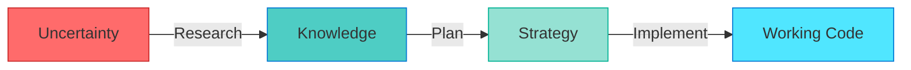

In the previous section, you saw how AI hallucination can derail what seems like a straightforward task. Now let's explore the methodology that prevents those scenarios.

**RPI is a type transformation workflow**—you systematically convert uncertainty into knowledge, knowledge into plans, and plans into working code. Each phase improves the quality of your inputs to AI, which directly improves the quality of outputs you receive.

## The core concept

Think of AI as a transformer, not an oracle. The quality of what you get out depends entirely on the quality of what you put in. Poor inputs produce poor outputs. High-quality inputs produce high-quality outputs.



The diagram above shows the high-level flow. Let's break down what actually happens in each phase.

**Understanding type transformation:**

* **Type 1 (Uncertainty)**: "We need authentication" → Vague requirement with many possible solutions
* **Type 2 (Knowledge)**: "Use Passport.js with Azure AD strategy v4.3.5" → Specific approach backed by evidence
* **Type 3 (Strategy)**: "Install passport@0.6.0, configure Azure tenant ID, implement middleware at src/auth" → Actionable steps with clear outcomes
* **Type 4 (Working Code)**: Verified, tested authentication implementation running in production

Each transformation step reduces ambiguity and increases specificity. You can't skip steps—trying to jump from uncertainty directly to working code is what causes hallucination.

## The three phases explained

### Research phase

**Purpose**: Convert uncertainty into verified knowledge

**Typical duration**: 10-30% of total effort (varies by task novelty)

**Output**: Research documents with evidence, sources, and examples

**Chat Mode**: Use Copilot Chat for quick exploration, or Task Researcher (hve-core) mode for comprehensive investigation

**What happens in research:**

* Investigate existing patterns in your codebase
* Explore official documentation and best practices
* Gather code examples from authoritative sources
* Document findings with source citations
* Identify multiple viable approaches
* Verify version numbers and compatibility

**Example research questions:**

* "How is authentication currently implemented in this codebase?"
* "What are the recommended Azure AD integration patterns for Express?"
* "What testing strategies work best for auth middleware?"
* "Which dependencies are already available in package.json?"

Learn more about Ask Mode in [Chapter 5](../../part-ii/chapter5-discovery-research-modes/). Deep dive into Task Researcher capabilities in [Chapter 5, Section 3](../../part-ii/chapter5-discovery-research-modes/).

> [!TIP]
> Invest more time in research when working with unfamiliar technologies, integrating complex systems, or dealing with security-critical features. The cost of hallucination increases dramatically in these scenarios.

### Plan phase

**Purpose**: Convert knowledge into actionable strategy

**Typical duration**: 15-25% of total effort

**Output**: Three-document plan (task details, implementation steps, change tracking template)

**Chat Mode**: Task Planner (hve-core)—access via the agent picker dropdown

**What happens in planning:**

* Review research findings systematically
* Select specific approach with evidence-based rationale
* Break work into discrete, testable steps
* Identify files to create, modify, or remove
* Define success criteria for each step
* Anticipate potential issues and mitigation strategies
* Create verification checklist

**Example planning outputs:**

* "Step 1: Install passport@0.6.0 and passport-azure-ad@4.3.5 (per research finding #3)"
* "Step 2: Create src/auth/azure-config.ts with tenant configuration (template from research doc section 2.4)"
* "Step 3: Implement auth middleware in src/middleware/authenticate.ts (following pattern from src/middleware/logging.ts)"
* "Step 4: Add unit tests in tests/auth/authenticate.test.ts (mirroring test structure from tests/middleware/)"

Each step references specific research findings, existing codebase patterns, or verified examples. This traceability is what reduces hallucination during implementation.

Learn Task Planner workflows in [Chapter 6](../../part-ii/chapter6-planning-architecture-modes/).

> [!TIP]
> RPI is iterative, not linear. If you discover during planning that research assumptions were incomplete, loop back and update your research. If implementation reveals gaps in your plan, revise the plan. This iteration is expected and healthy—better to catch issues early than compound hallucination.

### Implement phase

**Purpose**: Execute plan with AI assistance and continuous validation

**Typical duration**: 50-70% of total effort

**Output**: Working, tested code integrated into codebase

**Implementation approach**: Use Copilot Edits (native multi-file editing feature) for step-by-step controlled implementation, or Agent Mode (hve-core) for autonomous execution with oversight

**What happens in implementation:**

* Execute plan steps sequentially
* Use AI to generate code following research patterns
* Validate outputs against research findings after each step
* Run linters and type checkers immediately
* Execute tests after each meaningful change
* Iterate based on test results and validation
* Document deviations from plan with rationale
* Verify complete functionality before marking done

**Example implementation tasks:**

* Generate auth middleware using exact pattern from research doc section 2.3
* Write unit tests mirroring test structure documented in research
* Integrate middleware into app.ts following codebase conventions from research
* Validate configuration against Azure AD requirements from official docs cited in research
* Run full test suite and verify no regressions

Explore Copilot Edits and Agent Mode in [Chapter 7](../../part-ii/chapter7-implementation-modes/).

## Why RPI reduces hallucination risk

Understanding why RPI works helps you apply it effectively across different scenarios.

### Without RPI (direct implementation)

```text
User: "Add Azure AD authentication to Express app"
AI: [Generates code with hallucinated APIs, wrong versions, untested patterns]
User: [Spends hours debugging why nothing works]
```

You might recognize this frustrating cycle from your own experience. Hours disappear into debugging sessions that shouldn't have been necessary.

**What went wrong:**

* AI has no evidence about actual APIs, versions, or codebase patterns
* AI fills knowledge gaps with plausible-sounding but incorrect information
* No validation checkpoints catch hallucination early
* Debugging requires untangling compounded errors across multiple files

### With RPI

```text
Research Phase:
User (Task Researcher): "Research Azure AD authentication for Express"
AI: [Creates research doc citing official Microsoft docs, working examples, version numbers]
User: [Reviews research, validates sources, confirms approach]

Plan Phase:
User (Task Planner): "Create implementation plan from research"
AI: [Generates step-by-step plan using verified information from research]
User: [Reviews plan, confirms each step references research evidence]

Implement Phase:
User (via Copilot Edits): "Implement step 1 of plan: install dependencies"
AI: [Generates code following exact plan based on research]
User: [Runs tests, validates against research examples, proceeds to step 2]
```

**Why this works:**

* ✅ **Evidence-based**: Every AI suggestion grounded in verified research
* ✅ **Verifiable**: Can check AI outputs against research documents
* ✅ **Incremental**: Small steps with validation between each
* ✅ **Traceable**: Clear audit trail from research → plan → code
* ✅ **Recoverable**: Hallucination caught early before it compounds

> [!IMPORTANT]
> RPI doesn't eliminate hallucination—it contains and detects it. By grounding AI outputs in evidence and validating incrementally, you catch hallucinations quickly before they cascade into complex debugging sessions.

## Quick start: Your first RPI workflow

If this seems like a lot of process, don't worry. The structure becomes second nature quickly, and the time invested pays back immediately in reduced debugging and rework.

Ready to try RPI? Follow this checklist for immediate application:

**1. Choose a small task** (often 30-90 minutes total)

* Refactor a single function
* Add one new feature to existing code
* Update dependencies and adjust breaking changes
* Write tests for uncovered code

**2. Research phase** (10-15 minutes)

* Open Task Researcher chat mode
* Ask: "Research [specific task] in this codebase"
* Review generated research document
* Verify sources and examples cited
* Confirm approach makes sense

**3. Plan phase** (10-15 minutes)

* Open Task Planner chat mode (access via agent picker dropdown—see [Chapter 2, Section 4](../../part-i/chapter2-setup-environment/04-chat-modes-configuration.md))
* Attach research document
* Ask: "Create implementation plan from this research"
* Review plan steps and validation criteria
* Confirm each step references research findings

**4. Implement phase** (40-60 minutes)

* Open Copilot Edits
* Attach plan document
* Execute steps one at a time
* Run tests after each step
* Validate against research examples
* Mark steps complete as you progress

### Step 5: Reflect on process

* What worked well?
* Where did you catch hallucination?
* How did research quality affect implementation speed?
* What would you do differently next time?

You've just learned the complete RPI structure. Even understanding this framework puts you ahead of developers who approach AI assistance without systematic methodology.

You'll practice this workflow in Section 7's hands-on exercise. For now, understanding the structure prepares you for deeper concepts in the following sections.

You've learned the three RPI phases. Next, we'll explore the mental model that makes them effective—thinking of AI as a type transformer that converts your inputs into structured outputs.

---

**Navigation:**

* **Previous:** [Section 1 - Introduction](./01-introduction.md)
* **Next:** [Section 3 - The Type Transformation Mindset](./03-type-transformation-mindset.md)

<!-- markdownlint-disable MD036 -->
*🤖 Crafted with precision by ✨Copilot following brilliant human instruction,
then carefully refined by our team of discerning human reviewers.*
<!-- markdownlint-enable MD036 -->
