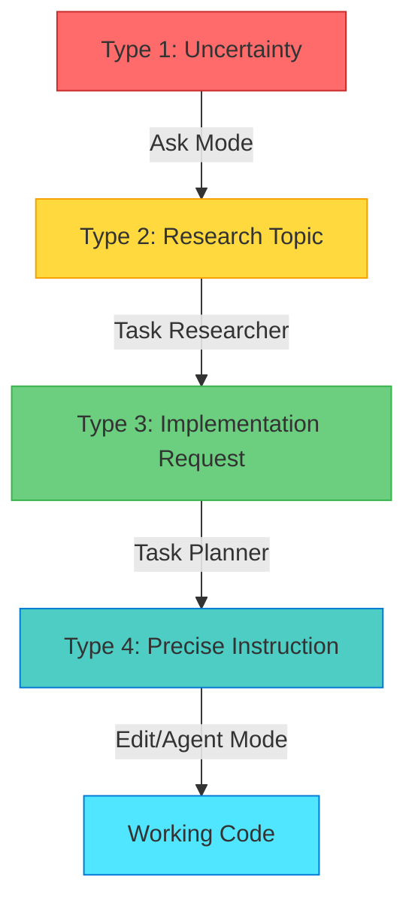

Now that you understand the RPI phases, let's explore the mental model that makes them effective.

The most effective AI-assisted developers don't think of AI as an oracle that magically produces correct answers. They think of AI as a **type transformer**: give it high-quality inputs of one type, get high-quality outputs of another type.

This mindset shift is fundamental to working productively with AI while maintaining engineering rigor.

## Understanding AI as a transformer, not an oracle

When you ask AI a vague question, you get a vague answer. When you provide specific context and constraints, you get specific, actionable outputs. The quality of what you put in determines the quality of what you get out.

**Poor input quality → Poor output quality:**

```text
Vague input: "Make the app faster"
AI output: Generic suggestions like "use caching" or "optimize database queries" without specifics
```

This output isn't wrong, but it's not actionable. You can't implement "use caching" without knowing what to cache, where to cache it, which caching technology to use, or whether caching even addresses your performance bottleneck.

You might recognize this from your own AI interactions—vague questions produce vague answers that leave you no closer to a solution.

**High input quality → High output quality:**

```text
Specific input with context: "Based on profiling data showing 2.3s API response times (85% in database queries), create optimization plan focusing on query efficiency. Current ORM: Sequelize 6.31. Database: PostgreSQL 14. Most expensive queries: user lookup (800ms), order history (1100ms)."
AI output: Targeted optimization strategy with specific indexes, query rewrites, and eager loading patterns
```

Now you have actionable direction grounded in real data. The AI can suggest specific Sequelize patterns, PostgreSQL indexes, and query optimizations because you provided measurable constraints.

## The four input types

RPI systematically escalates input quality through four distinct types, each matched to specific chat modes. Custom hve-core modes are accessible via the agent picker dropdown—see [Section 1](./01-introduction.md) for setup details.

### Type 1: Uncertainty and questions

**Use native Copilot Chat ("Ask Mode" pattern)** for open-ended exploration and landscape reconnaissance.

**Characteristics:**

* "What are my options?"
* Exploring unfamiliar territory
* Need overview before diving deep

**Example:** "What authentication strategies work with Express?"

**Appropriate AI response:** Overview of common patterns (sessions, JWT, OAuth, SAML) with brief explanations and trade-offs.

**Why this works:** Ask Mode is designed for quick exploration. You're not asking AI to generate code or make decisions—just map the landscape.

### Type 2: Research topics

**Use Task Researcher (hve-core)** for comprehensive investigation with evidence gathering.

**Characteristics:**

* Specific area needing evidence
* Comparison of approaches with sources
* "I need to deeply understand X"

**Example:** "Research OAuth 2.0 implementation patterns for Express with Azure AD"

**Appropriate AI response:** Structured research document with official Microsoft documentation links, code examples from reputable sources, version compatibility matrix, and comparison of passport-azure-ad vs. MSAL.

**Why this works:** Task Researcher is constrained to cite sources, provide evidence, and structure findings systematically. The output becomes verifiable reference material.

> [!TIP]
> **Try This (2 min):** Open Copilot Chat and ask a vague question like "make this faster." Notice the generic response. Now add context: "the database query at line 45 takes 3 seconds; it's selecting all columns from users table." Compare the specificity of the response.

### Type 3: Implementation requests with context

**Use Task Planner (hve-core)** to convert research findings into structured strategy.

**Characteristics:**

* Research findings already gathered
* Need actionable breakdown
* "Here's what I know, how should I proceed?"

**Example:** "Given research on OAuth patterns [attach research doc], create implementation plan"

**Appropriate AI response:** Three-document plan with discrete steps, file paths, validation criteria, and rationale tied to specific research findings.

**Why this works:** Task Planner references the research document you provide. Each plan step cites evidence from research, creating traceability and reducing hallucination.

### Type 4: Precise instructions

**Use Copilot Edits (native feature) or Agent Mode (hve-core)** to execute specific plan steps.

**Characteristics:**

* Plan steps clearly defined
* Clear acceptance criteria
* "Execute this specific step"

**Example:** "Implement step 3 of plan: Create auth middleware in src/middleware/authenticate.ts following pattern from research doc section 4.2"

**Appropriate AI response:** Code generation that follows the exact pattern from research, using APIs and configuration verified during research phase.

**Why this works:** Edit and Agent modes generate code, but they're constrained by the plan and research you provide. The AI isn't inventing—it's following verified patterns.

> [!TIP]
> Judge your input quality before asking AI. If you wouldn't give this input to a junior developer and expect good results, don't give it to AI either.

These four input types represent increasing levels of constraint. But how do you systematically move from one type to the next? That's where RPI phases come in.

## Escalating input quality through RPI

RPI is a systematic escalation from Type 1 → Type 4. Each phase transforms vague inputs into increasingly specific, verifiable inputs for the next phase.



**Example progression:**

**1. Type 1 uncertainty:** "How should I add authentication?"

Use Ask Mode for 5-minute overview. Output: Brief explanation of session-based vs. token-based auth, mention of OAuth for enterprise scenarios.

**2. Type 2 research topic:** "I need comprehensive research on OAuth + Azure AD + Express"

Use Task Researcher for 30-minute investigation. Output: Research document with Microsoft official docs citations, passport-azure-ad version compatibility, working code examples from Azure samples repository, configuration requirements.

**3. Type 3 implementation request:** "Create implementation plan using research [attach research doc]"

Use Task Planner for 15-minute planning. Output: Three-document plan with 8 implementation steps, each referencing specific research findings, file paths based on codebase analysis, validation criteria.

**4. Type 4 precise instructions:** "Implement plan step 1: Install passport@0.6.0 and passport-azure-ad@4.3.5"

Use Copilot Edits for execution. Output: Package.json updates with exact versions from research, npm install command, verification step.

Each phase improves input quality for the next phase. By the time you reach implementation, AI is working from highly constrained, evidence-backed instructions rather than vague goals.

## Type transformation in practice

**Without type transformation** (jumping directly to Type 4):

```text
User: "Add OAuth authentication"
AI: [Generates code with potentially hallucinated APIs, configuration, versions]
Result: Hours debugging why nothing works
```

**With type transformation** (RPI progression):

```text
Phase 1 (Ask): "What OAuth patterns work for Express?"
→ Overview of options

Phase 2 (Research): "Research passport-azure-ad OAuth implementation"
→ Evidence-backed research document

Phase 3 (Plan): "Plan implementation from research"
→ Step-by-step strategy with validation

Phase 4 (Implement): "Execute step 1 of plan"
→ Verified code following research patterns
```

The second approach takes longer upfront but produces reliable results. More importantly, when issues arise (they always do), you have an audit trail to debug effectively.

## Examples of type transformation in practice

### Scenario 1: Database query optimization

* **Type 1**: "Database is slow" → Ask Mode for common causes
* **Type 2**: "Research Sequelize query optimization for PostgreSQL 14" → Task Researcher with profiling data
* **Type 3**: "Plan optimization based on research findings" → Task Planner with specific slow queries identified
* **Type 4**: "Implement eager loading for user.orders query per step 2" → Copilot Edits with exact API calls

### Scenario 2: Adding feature to existing code

* **Type 1**: "Need file upload capability" → Ask Mode for approaches (multipart, base64, cloud storage)
* **Type 2**: "Research multer integration for Express with Azure Blob Storage" → Task Researcher with codebase patterns and Azure SDK docs
* **Type 3**: "Plan file upload implementation using multer + Azure" → Task Planner referencing research and existing middleware patterns
* **Type 4**: "Create upload middleware in src/middleware/upload.ts per step 3" → Copilot Edits following plan

### Scenario 3: Fixing production bug

* **Type 1**: "Authentication failing intermittently" → Ask Mode for common auth failure modes
* **Type 2**: "Research token validation failures in passport-azure-ad" → Task Researcher examining error logs, GitHub issues, docs
* **Type 3**: "Plan token refresh handling based on research findings" → Task Planner with specific error scenarios
* **Type 4**: "Implement retry logic per step 4" → Copilot Edits with validated error handling pattern

The type transformation mindset shows you what to put in. But how do you know if what comes out is trustworthy? The next section introduces evidence-based decision making—how to evaluate AI outputs and build audit trails.

---

**Navigation:**

* **Previous:** [Section 2 - What is RPI?](./02-what-is-rpi.md)
* **Next:** [Section 4 - Evidence-Based Decision Making](./04-evidence-based-decision-making.md)

<!-- markdownlint-disable MD036 -->
*🤖 Crafted with precision by ✨Copilot following brilliant human instruction,
then carefully refined by our team of discerning human reviewers.*
<!-- markdownlint-enable MD036 -->
