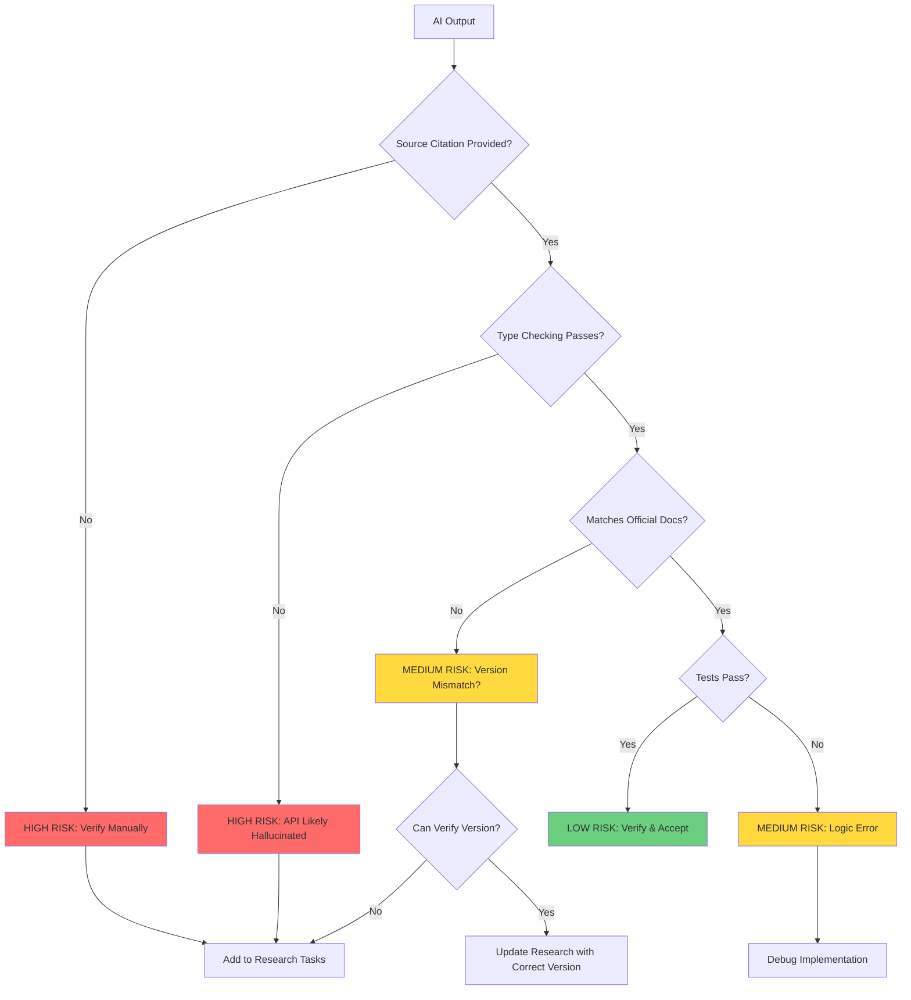

Even with good research and planning, hallucinations can slip through. This section equips you with patterns to recognize, detect, and recover from hallucinations when they occur.

AI hallucination follows predictable patterns. Learning to recognize these patterns equips you to detect and contain hallucinations before they propagate through your codebase. This section provides detection techniques for each RPI phase and recovery workflows when hallucinations slip through.

## Common hallucination patterns

Understanding why AI hallucinates helps you recognize the warning signs. Here are four patterns you'll encounter repeatedly.

### Pattern 1: Invented APIs

AI combines patterns from multiple libraries and invents parameters that sound plausible but don't exist.

**Example:**

```typescript
// AI suggests (HALLUCINATION):
passport.use('azure-ad-oauth2', new AzureADStrategy({
  clientID: process.env.CLIENT_ID,
  returnURL: '/auth/callback',
  realm: process.env.TENANT_ID  // "realm" doesn't exist
}));
```

**Why it happens**: AI learns authentication patterns across multiple libraries. Some libraries use `realm` for multi-tenant authentication. AI incorrectly applies this pattern to passport-azure-ad, which uses different parameters.

If you've ever chased down a "method not found" error from AI-generated code, you've encountered this pattern. Now you know what to look for.

**RPI prevention**: Research phase documents actual `AzureADStrategy` parameters from official documentation. Plan phase specifies exact parameter names verified in research. Implementation phase catches the error through TypeScript type checking.

### Pattern 2: Wrong versions

AI suggests features from future versions or combines APIs from incompatible versions.

**Example:**

```typescript
// AI suggests using features from future or non-existent versions:
import { verifyToken } from 'passport-azure-ad'; // Method doesn't exist

// Correct approach - use documented API:
import { BearerStrategy } from 'passport-azure-ad';
const strategy = new BearerStrategy(options, verifyCallback);
```

**Why it happens**: AI training data includes multiple versions of libraries. It doesn't reliably track which features belong to which versions.

**RPI prevention**: Research phase verifies current version in `package.json` and documents available methods from version-specific documentation. Plan phase includes version numbers in all technical references.

### Pattern 3: Plausible but non-existent configuration

AI invents configuration options that follow naming conventions but don't actually exist.

**Example:**

```yaml
# AI suggests (HALLUCINATION):
azure:
  authentication:
    strategy: oauth2
    autoRedirect: true  # Looks real, but this option doesn't exist
    validateIssuer: true
```

**Why it happens**: AI learns configuration patterns across multiple frameworks. It generates plausible-sounding option names based on common patterns, but these options aren't implemented in the actual library.

**RPI prevention**: Research phase includes working configuration examples from official documentation or verified codebases. Plan phase specifies exact configuration structure with source citations.

### Pattern 4: Mixing incompatible patterns

AI combines patterns from different frameworks or libraries that don't work together.

**Example:**

```typescript
// AI mixes Express and Koa patterns:
app.use(async (ctx, next) => {  // Koa style (ctx parameter)
  await authenticate(ctx);
}, (req, res, next) => {  // Express style (req, res, next parameters)
  // This won't work - can't mix callback signatures
});
```

**Why it happens**: AI doesn't maintain consistent framework context across a code generation session. It sees middleware patterns in training data and combines them without understanding incompatibility.

**RPI prevention**: Research phase establishes framework conventions through codebase analysis. Plan phase explicitly states framework choice and references established patterns from research.

Now that you can recognize these four patterns, how do you systematically detect them in practice? The following techniques apply to each RPI phase.

## Detection techniques

Each RPI phase provides opportunities to catch hallucinations before they cause problems.

### During research phase

Apply these verification checks to every AI-provided claim:

* ✅ Require source citations for all technical claims
* ✅ Verify version numbers in official package repositories (npm, PyPI, etc.)
* ✅ Cross-reference claims across multiple independent sources
* ✅ Test code examples in isolated environment before trusting them
* ✅ Check that API names appear in official documentation search
* ✅ Verify configuration options exist in JSON schemas or TypeScript types

### During planning phase

Validate plan steps against research findings:

* ✅ Check that every plan step references specific research findings
* ✅ Verify file paths exist in current codebase or follow established patterns
* ✅ Ensure proposed approaches match patterns documented in research
* ✅ Validate that all dependencies are installable at specified versions
* ✅ Confirm that implementation steps use only APIs verified in research

### During implementation phase

Run verification continuously as you write code:

* ✅ Run linters and type checkers immediately after writing code
* ✅ Execute tests after each implementation step
* ✅ Verify actual behavior matches plan expectations
* ✅ Check IDE autocomplete suggestions for API names
* ✅ Confirm import statements resolve successfully
* ✅ Test edge cases documented in research findings

> [!TIP]
> **Red flags for hallucination:**
>
> * AI suggests something but can't cite a specific source when asked
> * Configuration looks "too convenient" (matches what you want, not documented reality)
> * Code suggestion fails type checking or linting immediately
> * API names follow naming patterns but don't appear in IDE autocomplete
> * Method signatures differ from official documentation examples

### Hallucination detection flowchart



## Recovery strategies

Discovering a hallucination can feel frustrating, especially after you've already implemented the code. The good news: you caught it. That's exactly what RPI is designed to do.

Detecting hallucination is only half the battle. You need systematic workflows to recover and prevent recurrence.

### If you detect hallucination during research

Follow this recovery sequence:

1. **Request specific source**: Ask AI, "What documentation supports this claim? Provide a URL and version number."
2. **Evaluate response**: If AI can't provide a verifiable source, discard the claim entirely.
3. **Research manually**: Use official documentation, GitHub repositories, or verified examples.
4. **Document correction**: Add corrected information to research document with source citations.
5. **Note the pattern**: Record what hallucination pattern occurred to improve future detection.

### If you detect hallucination during planning

Hallucinations in plans corrupt all downstream work:

1. **Stop plan execution**: Don't implement remaining steps until you resolve the issue.
2. **Return to research phase**: Add a research task to verify the specific claim from the plan.
3. **Update research**: Document verified information with source citations.
4. **Regenerate affected plan sections**: Rewrite plan steps based on corrected research.
5. **Verify plan consistency**: Check that other plan steps don't depend on the hallucinated information.

### If you detect hallucination during implementation

Hallucinations discovered during implementation indicate research or planning gaps:

1. **Stop implementing immediately**: Don't continue with flawed code.
2. **Document what doesn't work**: Capture error messages, type checking failures, or unexpected behavior.
3. **Trace back to root cause**: Identify whether the hallucination originated in research or planning.
4. **Return to appropriate phase**: Update research for missing information or planning for incorrect steps.
5. **Re-implement with corrected information**: Start implementation again using verified details.
6. **Add prevention checklist**: Update research or planning checklist to catch similar issues in future.

### Example recovery workflow

Here's how recovery looks in practice:

```markdown
## Hallucination Detected During Implementation

**Problem**: Step 3 of plan suggests using `passport.validateToken()` method. TypeScript compiler shows error: "Property 'validateToken' does not exist on type 'typeof import("passport-azure-ad")'."

**Recovery Actions**:

1. ✅ Stopped implementing Step 3
2. ✅ Returned to research document
3. ✅ Added research task: "Verify token validation methods in passport-azure-ad@4.3.5"
4. ✅ Research finding: Correct method is `bearerStrategy.jwtVerify()` per official documentation at https://github.com/AzureAD/passport-azure-ad
5. ✅ Updated plan Step 3: "Use bearerStrategy.jwtVerify() for token validation (research section 'Token Validation Methods')"
6. ✅ Re-implemented Step 3 using verified method
7. ✅ Tests pass, type checking succeeds

**Root Cause**: Original research didn't thoroughly document token validation API surface area. We verified `BearerStrategy` constructor but didn't document validation methods.

**Prevention**: Added "API surface area review" checklist item to research phase template. Now we document constructor, primary methods, and validation functions for all authentication libraries.
```

This recovery workflow turns hallucination detection into process improvement.

## Mini-exercise: Spot the hallucination

Practice detecting hallucinations in these code examples. Identify what's wrong and how you'd verify the correct approach.

### Example 1: Express middleware configuration

```typescript
// AI-suggested code:
import express from 'express';
import { rateLimit } from 'express-rate-limit';

const app = express();

app.use(rateLimit({
  windowMs: 15 * 60 * 1000,
  max: 100,
  skipSuccessfulRequests: true,  // Skip counting successful requests
  trustProxy: true
}));
```

**Question**: What hallucination warning signs do you notice? How would you verify this configuration?

### Example 2: Database connection pooling

```typescript
// AI-suggested code:
import { Pool } from 'pg';

const pool = new Pool({
  host: 'localhost',
  database: 'myapp',
  maxConnections: 20,        // Set maximum pool size
  idleTimeout: 30000,        // Close idle connections after 30s
  retryAttempts: 3          // Retry failed connections
});
```

**Question**: Which configuration options might be hallucinated? How would you verify against official documentation?

> [!NOTE]
> **Answers**:
>
> **Example 1**: The `skipSuccessfulRequests` option is real in `express-rate-limit` v6.x+, but verify it exists in your installed version by checking the official documentation at [express-rate-limit GitHub](https://github.com/nfriedly/express-rate-limit). Type checking with TypeScript would confirm the option exists. The hallucination risk here is version assumptions—this option didn't exist in earlier versions.
>
> **Example 2**: The `pg` Pool constructor uses `max` (not `maxConnections`), `idleTimeoutMillis` (not `idleTimeout`), and doesn't have a `retryAttempts` option. Verify by checking the pg documentation at [node-postgres Pool API](https://node-postgres.com/apis/pool) or using TypeScript autocomplete. These are plausible-sounding names that follow patterns from other database libraries but don't match pg's actual API.

## Pattern spotter ✅

You can now recognize the four most common hallucination patterns: invented APIs, wrong versions, plausible configuration, and mixed patterns. When AI suggests a non-existent method or incorrectly configures a library, you'll catch it before it costs you hours of debugging.

Understanding these patterns prepares you to catch hallucinations before they cause problems. The next section helps you optimize time investment across RPI phases based on task novelty.

---

**Previous:** [Section 4: Evidence-based decision making](./04-evidence-based-decision-making.md)

**Next:** [Section 6: When to invest time in each phase](./06-when-to-invest-time.md)

<!-- markdownlint-disable MD036 -->
*🤖 Crafted with precision by ✨Copilot following brilliant human instruction,
then carefully refined by our team of discerning human reviewers.*
<!-- markdownlint-enable MD036 -->
