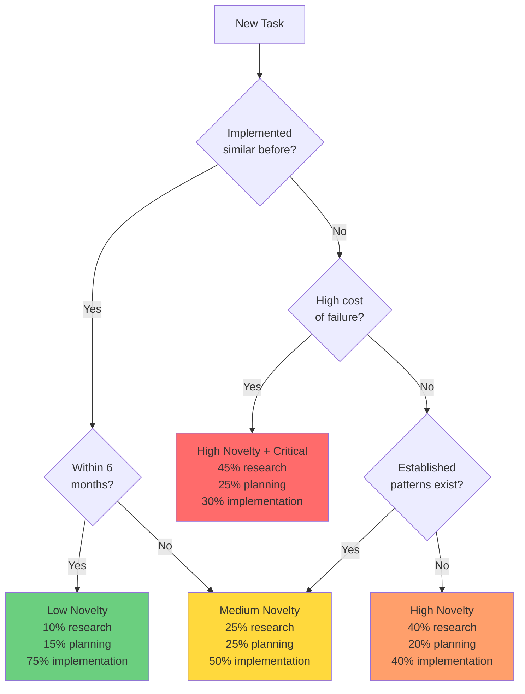

Deciding how much research to do can feel like guesswork at first. The guidance in this section will help you develop intuition.

RPI phases don't require equal time investment. The optimal allocation depends on task novelty—how familiar you are with the technology, patterns, and codebase area. This section provides a decision framework for calibrating your effort across research, planning, and implementation.

## The novelty-time tradeoff

Task novelty determines where you invest time. High-novelty tasks demand thorough research to build foundational understanding. Low-novelty tasks benefit from faster research and longer implementation.

### High novelty → More time in research

**When this applies:**

* Working with new technology or framework you've never used
* Implementing in unfamiliar codebase area without established patterns
* Integrating complex third-party systems with limited documentation
* Security-critical functionality requiring deep understanding

**Time allocation example:**

* **Research**: 40% (thorough investigation, multiple sources, working examples)
* **Planning**: 20% (careful strategy considering alternatives)
* **Implementation**: 40% (deliberate execution with validation)

**Why this works:** Research investment helps avoid costly hallucinations. When you don't know the technology, AI doesn't either—it will confidently suggest plausible-but-wrong approaches. Deep research builds the evidence foundation needed for accurate planning.

### Medium novelty → Balanced phases

**When this applies:**

* Some familiarity with technology but applying it in new ways
* Standard patterns exist but require variations for your context
* Routine integration with well-documented APIs
* Refactoring using established design patterns

**Time allocation example:**

* **Research**: 25% (verify current approach, explore variations)
* **Planning**: 25% (structured breakdown with verification points)
* **Implementation**: 50% (confident execution following plan)

**Why this works:** Balanced investment captures what's unique about this task without over-researching familiar territory. Research confirms assumptions and documents specific variations. Planning provides structure for implementation.

### Low novelty → Minimal research

**When this applies:**

* Implementing patterns you've used multiple times
* Routine refactoring in familiar codebase areas
* Similar to recent work with known constraints
* Well-established patterns with no special considerations

**Time allocation example:**

* **Research**: 10% (quick verification of versions, confirm no breaking changes)
* **Planning**: 15% (brief outline ensuring you haven't missed steps)
* **Implementation**: 75% (efficient execution of known patterns)

**Why this works:** You already have the mental model. Research catches unexpected changes (new library versions, breaking API updates). Light planning prevents overlooking edge cases. Most time goes to actually writing code.

> [!NOTE]
> When in doubt, err on the side of more research. Hallucination caught during research takes minutes to fix. Hallucination caught in production takes days.

## Decision framework

Use these four questions to assess novelty and calibrate time investment.

### Question 1: Have I implemented something like this before?

* **Yes, recently (within 6 months)** → Low novelty
  * Quick research: Verify no major changes since last implementation
  * Brief planning: Adapt previous approach to current context
  * Focus on implementation using familiar patterns

* **Yes, but a while ago (6-24 months)** → Medium novelty
  * Moderate research: Technologies evolve; verify current best practices
  * Standard planning: Document any changed patterns or new considerations
  * Implementation with validation at each step

* **No, this is new to me** → High novelty
  * Deep research: Build understanding from authoritative sources
  * Careful planning: Consider multiple approaches, document rationale
  * Deliberate implementation with frequent validation

### Question 2: Do I understand how this works in the codebase?

* **Yes, I work in this area regularly** → Low novelty
  * Minimal research: Confirm approach aligns with existing patterns
  * Use established patterns documented in codebase
  * Efficient implementation following conventions

* **Somewhat, I've touched this area before** → Medium novelty
  * Codebase analysis: Document current patterns and conventions
  * Planning accounts for integration with existing code
  * Implementation references established patterns

* **No, this is unfamiliar codebase territory** → High novelty
  * Extensive codebase research: Understand architecture and conventions
  * Planning includes integration strategy and touch points
  * Implementation follows discovered patterns precisely

### Question 3: Are there established patterns to follow?

* **Yes, clear patterns exist and are documented** → Low novelty
  * Research: Review pattern documentation and examples
  * Planning: Apply pattern to current context
  * Implementation: Follow pattern with confidence

* **Patterns exist but need adaptation** → Medium novelty
  * Research: Document pattern and understand why it exists
  * Planning: Explain adaptations with rationale
  * Implementation: Maintain pattern principles while adapting

* **No patterns exist, exploring new approaches** → High novelty
  * Research: Investigate multiple alternatives thoroughly
  * Planning: Document approach selection rationale
  * Implementation: Create reference implementation for future patterns

### Question 4: What's the cost of getting it wrong?

* **High cost (security, data integrity, payments, authentication)** → Invest heavily in research and planning regardless of novelty
  * Research: Multiple authoritative sources, security best practices
  * Planning: Include security review, edge case analysis
  * Implementation: Extensive validation, security testing

* **Medium cost (user-facing features, performance-critical paths)** → Standard RPI investment
  * Research: Verify approach quality and performance characteristics
  * Planning: Include performance testing and rollback strategy
  * Implementation: Validate functionality and performance

* **Low cost (internal tools, UI refinements, styling)** → Lighter research, faster iteration
  * Research: Quick verification of approach viability
  * Planning: High-level outline sufficient
  * Implementation: Rapid iteration with manual validation

These questions help you assess novelty. Once you've answered them, use the following criteria to recognize when your research is complete.

## Recognizing "good enough" research

Research completeness is more important than research duration. Use these criteria to know when research is sufficient.

### Research is sufficient when you can answer

* ✅ Do I have at least two authoritative sources for key technical claims?
* ✅ Are version numbers verified and recent (not "latest" references)?
* ✅ Have I found working examples in reputable codebases or official repositories?
* ✅ Do I understand trade-offs between alternative approaches?
* ✅ Do I have clear criteria for selecting the best approach?
* ✅ Have I documented enough technical detail to create a concrete plan?

If you answered yes to all questions, proceed to planning phase.

### Research is insufficient when

* ❌ Technical claims lack source citations or version context
* ❌ Examples look plausible but remain unverified against documentation
* ❌ You feel uncertain which approach to choose
* ❌ Key technical questions remain unanswered
* ❌ You couldn't explain the approach clearly to a colleague

If you answered yes to any question, continue research with targeted investigation.

### Time-boxing research

Set a maximum research duration based on task size, but allow extension if critical gaps remain:

* **Small tasks (1-2 hours total)**: brief research sufficient for familiar patterns
* **Medium tasks (half-day to full day)**: moderate research covering key unknowns
* **Large tasks (multi-day)**: comprehensive research exploring alternatives and trade-offs

If you hit the time limit but critical gaps remain, extend by one time-box increment and narrow your research scope to specific unanswered questions.

## When full RPI is overkill

Not every change needs the complete Research → Plan → Implement cycle. Consider a lighter approach for:

* **Simple one-line changes** with obvious implementation (renaming a variable, fixing a typo)
* **Familiar patterns** you've used many times in this codebase
* **Low-risk internal tooling** where bugs are quickly caught and fixed
* **Exploratory prototyping** where you're intentionally throwing code away

For these scenarios, a mental "quick RPI" suffices: 30-second verification that your mental model is correct before implementing.

> [!NOTE]
> When in doubt, err toward more research. The time cost of unnecessary research is measured in minutes. The time cost of debugging hallucinations is measured in hours.

## Decision tree for time investment

This framework guides you toward appropriate time investment. The next section summarizes key concepts and provides a complete exercise for practicing the full RPI workflow.

---

**Previous:** [Section 5: Anti-hallucination strategies](./05-anti-hallucination-strategies.md)

**Next:** [Chapter 3 summary](./07-summary.md)

<!-- markdownlint-disable MD036 -->
*🤖 Crafted with precision by ✨Copilot following brilliant human instruction,
then carefully refined by our team of discerning human reviewers.*
<!-- markdownlint-enable MD036 -->
