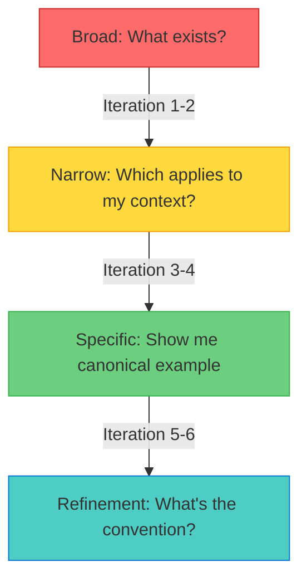

Discovery sessions are iterative conversations, not single queries. Effective question formulation follows a funnel pattern: start broad to establish landscape, then narrow progressively until you reach actionable specificity.

This section teaches you the iteration pattern and 5 question patterns that transform vague uncertainty into precise understanding.

## The Iteration Pattern: Broad → Narrow → Specific

Effective Ask Mode sessions follow a deliberate progression:



**Example session demonstrating the pattern:**

```text
Iteration 1 (Broad): @workspace What authentication patterns exist in this codebase?
Response: Three approaches - managed identity (edge), service principal (cloud), 
          API keys (legacy, deprecated)

Iteration 2 (Narrow): @workspace Which is used for edge components?
Response: Edge components use managed identity from 010-security-identity component

Iteration 3 (Specific): @workspace Show me an example edge component using this
Response: 110-iot-ops references managed identity via variables.dep.tf pattern, 
          see lines 45-67 in main.tf

Iteration 4 (Refinement): @workspace What's the convention for consuming managed 
                          identity outputs?
Response: Components define dependency variables in variables.dep.tf, 
          blueprints wire outputs from 010-security-identity to consuming components

Output: Precise understanding, ready for implementation or research
```

The key: each iteration builds on the previous answer, narrowing focus until you reach actionable specificity. This pattern prevents two common mistakes: (1) asking too broad initially and getting overwhelmed, (2) asking too specific without context and getting wrong answer.

## 5 Question Patterns That Work

### Pattern 1: Existence Questions (Starting Point)

**Format:** "What [pattern/approach/structure] exists for [capability]?"

**Examples:**

* `@workspace What authentication patterns exist in this codebase?`
* `@workspace What testing strategies are used for async operations?`
* `@workspace What deployment configurations exist for containerized apps?`

**When to use:** Beginning of discovery, establishing the landscape

**Why it works:** Non-committal exploration that surfaces all options without forcing premature decisions

### Pattern 2: Contextual Filtering (Narrowing)

**Format:** "Which [pattern] is used for [specific context]?"

**Examples:**

* `@workspace Which authentication pattern is used for edge components?`
* `@workspace Which testing approach is standard for REST APIs?`
* `@workspace Which deployment pattern applies to microservices?`

**When to use:** After landscape established, narrowing to your specific context

**Why it works:** Filters irrelevant patterns, focuses on what applies to your current task

### Pattern 3: Exemplar Discovery (Concrete Examples)

**Format:** "Show me an example of [pattern] in [context]"

**Examples:**

* `@workspace Show me an edge component that uses managed identity`
* `@workspace Show me a REST API with comprehensive error handling`
* `@workspace Show me a microservice with health check endpoints`

**When to use:** Need concrete reference implementation to follow

**Why it works:** Seeing actual code beats abstract explanation; provides canonical exemplar

### Pattern 4: Convention Identification (Understanding Rules)

**Format:** "What's the convention for [integration/naming/structure]?"

**Examples:**

* `@workspace What's the convention for naming test files?`
* `@workspace What's the pattern for passing configuration between services?`
* `@workspace What's the standard for structuring API route handlers?`

**When to use:** Understanding the "rules" that govern implementations

**Why it works:** Surfaces implicit team conventions that aren't always documented

### Pattern 5: Disambiguation (When Multiple Approaches Exist)

**Format:** "Which [approach] is current/recommended/canonical?"

**Examples:**

* `@workspace Which error handling approach is current standard?`
* `@workspace I see three configuration patterns—which is recommended for new features?`
* `@workspace Multiple logging approaches exist—which should new code use?`

**When to use:** Multiple patterns discovered, need to know which to follow

**Why it works:** Forces clarity between current and legacy, prevents implementing deprecated patterns

## Providing Context in Questions

Context transforms generic questions into precise, actionable queries. Compare:

**Generic question (less effective):**

```text
@workspace How do I add authentication?
```

**Contextual question (more effective):**

```text
@workspace I need to add authentication to the user service API endpoints. 
How are other REST APIs in this codebase handling authentication?
```

**Why context matters:**

* AI can filter patterns relevant to your context (REST API vs. background job)
* Reduces noise from irrelevant patterns
* Gets more precise answers faster

### Context to Include

**What you're building:**

* Component type (API, background job, UI component, CLI tool)
* Integration points (existing services, external APIs)
* Location in codebase (specific directory or component)

**What you've already tried or discovered:**

* Prior attempts that didn't work
* Patterns you've seen but aren't sure about
* Specific files or approaches you're evaluating

**Example with rich context:**

```text
@workspace I'm adding a new microservice in src/services/ that needs to 
communicate with the existing AuthService. I see that ProductService uses 
HTTP with bearer tokens. Is this the standard inter-service communication 
pattern, or is there a different approach for new services?
```

This question surfaces:

* What you're building (new microservice)
* Where it lives (src/services/)
* Integration requirement (AuthService)
* What you've discovered (ProductService pattern)
* Your specific question (is this standard?)

The AI can now validate your discovery, confirm the pattern, or redirect to a better approach.

## Follow-Up Strategies

### Strategy 1: Ladder Questioning

Start high-level, use each answer to inform the next more specific question.

**Example sequence:**

```text
Q1: @workspace What exists?
Q2: @workspace Which applies to my context?
Q3: @workspace Show me an example
Q4: @workspace What's the convention?
```

Each question builds on prior answer, climbing ladder from broad to specific.

### Strategy 2: Confirmation Loop

Ask question, get answer, confirm understanding by rephrasing back.

**Example:**

```text
You: @workspace How do edge components consume managed identity?
Copilot: Components define dependency variables in variables.dep.tf, 
         blueprints wire outputs from 010-security-identity

You: So if I understand correctly, edge components consume managed identity 
     from 010-security-identity via variables.dep.tf pattern, and blueprints 
     wire the connections?
Copilot: Correct. See 110-iot-ops for canonical example.
```

Rephrasing confirms understanding and catches misinterpretations early.

### Strategy 3: Alternative Exploration

Ask about pattern A, then explicitly ask about alternatives.

**Example:**

```text
You: @workspace How does ProductService handle errors?
Copilot: Uses Result<T,E> pattern

You: @workspace Are there alternative error handling approaches in this codebase?
Copilot: Yes, some older services use try-catch with logging. Result<T,E> is 
         newer standard.
```

Surfaces edge cases and ensures you're not missing better options.

### Strategy 4: Negative Discovery

Ask what to avoid, not just what to do.

**Example:**

```text
You: @workspace Are there authentication patterns I should avoid?
Copilot: API keys (deprecated), service principals for edge (prefer managed identity)

You: @workspace Why were API keys deprecated?
Copilot: Security concerns, rotation complexity. See ADR-005 in docs/decisions/
```

Prevents implementing legacy approaches that look active but aren't recommended.

## Codebase-Specific Queries with @workspace

The `@workspace` context tag uses embeddings-based search to find statistically similar patterns across your codebase. It surfaces related code and documentation, though it doesn't truly "understand" your system's intent—it matches semantic patterns, not meaning. Use it liberally during discovery.

**File discovery:**

```text
@workspace Where is the database connection configuration?
@workspace Find all files that import the Logger class
@workspace Which files define REST API routes?
```

**Pattern searching:**

```text
@workspace Show me how other services handle database transactions
@workspace Find examples of async error handling in this codebase
@workspace What's the pattern for structuring integration tests?
```

**Convention discovery:**

```text
@workspace What naming convention is used for interface definitions?
@workspace How are environment variables typically accessed?
@workspace What's the standard way to initialize dependencies?
```

> [!IMPORTANT]
> **Scope management:** `@workspace` searches the entire workspace. For large monorepos, narrow the scope by including directory names in your question: `@workspace In src/services/ directory, what authentication patterns exist?`

## Example: Complete Question Sequence

**Scenario:** Add caching to user profile API

**Effective discovery session (7 minutes):**

```text
Q1: @workspace What caching approaches exist in this codebase?
A1: Redis (infrastructure-cache component), in-memory (LRU cache), HTTP headers

Q2: @workspace Which is used for API response caching?
A2: Redis via infrastructure-cache component, consumed by services

Q3: @workspace Show me a service using Redis cache
A3: ProductService caches product catalog, see src/services/product/cache.ts

Q4: @workspace What's the pattern for consuming infrastructure-cache outputs?
A4: Services reference cache connection via dependency injection, 
    infrastructure-cache provides connection string as output

Q5: @workspace Are there cache invalidation patterns I should follow?
A5: Yes, event-driven invalidation on data updates. See EventBus integration 
    in ProductService lines 89-103

Result: Clear understanding of caching pattern, ready to implement
```

Notice the progression: existence → context filtering → exemplar discovery → convention identification → negative discovery. Seven minutes, complete understanding.

---

**Previous**: [Section 2: When to Use Ask Mode](./02-when-to-use-ask-mode.md) | **Next**: [Section 4: Recognizing Incomplete Answers](./04-recognizing-incomplete-answers.md) | **Up**: [Chapter 5 README](./README.md)

---

<!-- markdownlint-disable MD036 -->
*🤖 Crafted with precision by ✨Copilot following brilliant human instruction,
then carefully refined by our team of discerning human reviewers.*
<!-- markdownlint-enable MD036 -->
