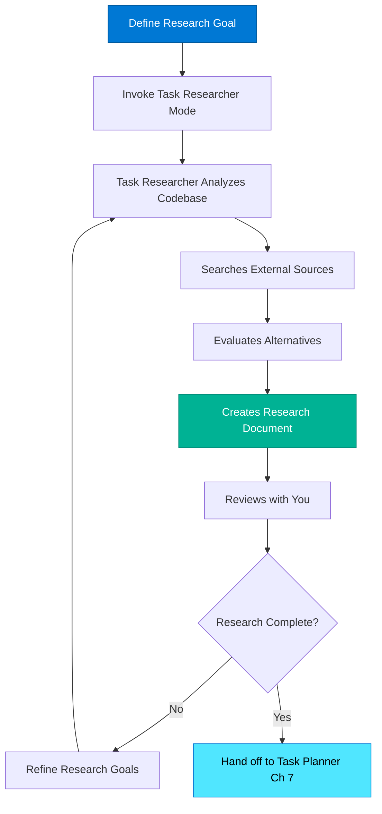

## What Task Researcher actually does

Task Researcher is a specialized chat mode optimized for **systematic evidence-based investigation**. Unlike Ask Mode (conversational exploration), Task Researcher operates as a **research agent** that:

1. **Creates artifacts**: Produces markdown research documents in `.copilot-tracking/research/`
2. **Requires evidence**: Every finding must cite sources (files + lines, or URLs + dates)
3. **Analyzes alternatives**: Evaluates multiple approaches with objective criteria
4. **Works autonomously**: You provide research goals, it executes investigation and produces document
5. **Integrates tools**: Uses MCP (Model Context Protocol) for authoritative external sources

### Typical Task Researcher session flow



## Deep analysis vs surface discovery

**Key differences:**

| Aspect              | Ask Mode (Ch 5)            | Task Researcher (Ch 6)                    |
|---------------------|----------------------------|-------------------------------------------|
| **Time investment** | 5-10 minutes               | 20-60 minutes                             |
| **Output**          | Chat conversation          | Markdown research document                |
| **Evidence**        | Optional/implicit          | Required/explicit with citations          |
| **Scope**           | Single question or concept | Complex feature or system                 |
| **Alternatives**    | May mention options        | Systematically evaluates options          |
| **Persistence**     | Chat history only          | Document in `.copilot-tracking/research/` |
| **Collaboration**   | Individual use             | Team reference artifact                   |

### When to use each mode

**Use Ask Mode (5-10 minutes) when:**

* Locating existing code or configuration
* Understanding a single concept or pattern
* Quick feasibility checks
* Exploring unfamiliar terminology
* Pre-seeding context before deeper work

**Use Task Researcher (20-60 minutes) when:**

* Implementing new feature with multiple approaches
* Integrating unfamiliar third-party libraries
* Refactoring complex interconnected systems
* Making architectural decisions with long-term implications
* Creating team reference for shared understanding

## Research artifacts Task Researcher creates

Task Researcher produces **dated research documents** following standardized template:

**Filename convention:**

```text
.copilot-tracking/research/YYYYMMDD-<feature-description>-research.md
```

**Examples:**

* `20251115-user-authentication-2fa-research.md`
* `20251118-email-notification-system-research.md`
* `20251120-api-rate-limiting-strategy-research.md`

**Document sections** (covered in detail in Section 3):

* **Task Implementation Requests**: What needs to be built
* **Scope and Success Criteria**: Boundaries and definition of "done"
* **Evidence Log**: All findings with sources, line numbers, URLs, access dates
* **Key Discoveries**: Project structure, implementation patterns, examples
* **Technical Scenarios**: Evaluated approaches with recommendation

## Time investment: 20-60 minutes typical

**Research duration varies by:**

1. **Novelty**: New technology = longer research
2. **Complexity**: More integration points = more investigation
3. **Existing patterns**: Established patterns = quicker research
4. **External dependencies**: Third-party APIs = more time for docs

**Time breakdown examples:**

### Quick research (20-30 minutes)

* **Feature**: Add email validation to existing form
* **Known patterns**: Project already uses validator.js elsewhere
* **Research focus**: Find existing validation patterns, confirm approach

### Medium research (30-45 minutes)

* **Feature**: Add 2FA to existing authentication
* **Some patterns**: Auth system exists (Passport.js), need 2FA library research
* **Research focus**: Evaluate 2FA libraries, analyze integration points, review security best practices

### Deep research (45-60 minutes)

* **Feature**: Implement real-time notifications (WebSockets)
* **Novel territory**: No existing WebSocket code, unfamiliar with Socket.io vs alternatives
* **Research focus**: Evaluate WebSocket libraries, research architecture patterns, investigate scaling considerations

> [!TIP]
> If research exceeds 60 minutes, you're likely trying to solve multiple problems. Break into smaller research tasks.

## MCP tools integration

Task Researcher integrates **Model Context Protocol (MCP)** tools for authoritative external research:

### MCP Context7 - SDK and framework documentation

```typescript
// Task Researcher automatically invokes Context7 when researching libraries
// Example: Researching Passport.js Azure AD strategy

mcp_context7_resolve-library-id:
  query: "passport-azure-ad npm package"
  → Returns: "npm:passport-azure-ad"

mcp_context7_get-library-docs:
  libraryId: "npm:passport-azure-ad"
  topics: ["authentication", "configuration", "typescript"]
  → Returns: Official docs, type definitions, examples from authoritative sources
```

### MCP web fetch - official documentation

```typescript
// Task Researcher fetches content from authoritative URLs
fetch_webpage:
  urls: ["https://learn.microsoft.com/azure/active-directory/develop/quickstart-v2-nodejs-webapp"]
  query: "Azure AD authentication Node.js configuration"
  → Returns: Page content with sections on configuration, code examples
```

**Why MCP matters:**

* **Authoritative sources**: Official documentation, not blog posts or Stack Overflow guesses
* **Version-specific**: Matches your specified library versions
* **Structured retrieval**: Extracts relevant sections, not entire pages
* **Evidence trail**: Captures URLs and access dates for research document

You don't invoke MCP tools directly: Task Researcher handles them automatically when researching external libraries and APIs.

---

## Navigation

* **Previous:** [Section 1 - Introduction](./01-introduction-why-task-researcher.md)
* **Next:** [Section 3 - Research Document Structure](./03-research-document-structure.md)
* **Up:** [Chapter 6 README](./README.md)

---

<!-- markdownlint-disable MD036 -->
*🤖 Crafted with precision by ✨Copilot following brilliant human instruction,
then carefully refined by our team of discerning human reviewers.*
<!-- markdownlint-enable MD036 -->
