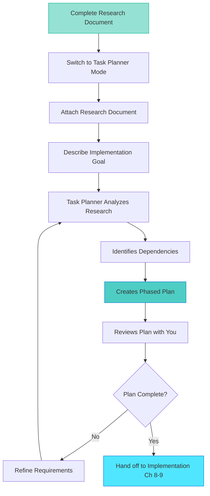

## Task Planner Capabilities

Task Planner mode transforms research documents into structured implementation plans. Where Task Researcher gathered evidence and documented findings, Task Planner sequences that knowledge into actionable work with explicit dependencies and verification criteria.

This section explains what Task Planner does, how it processes research documents, and what plan artifacts it creates.

## What Task Planner Actually Does

Task Planner is a specialized chat mode optimized for structured implementation planning. It bridges the gap between research findings and executable work.

**Task Planner's core capabilities:**

* **Creates plan documents**: Produces markdown implementation plans in `.copilot-tracking/plans/`
* **Analyzes dependencies**: Identifies what must be implemented first (database before API, API before UI)
* **Sequences implementation**: Organizes work into logical phases based on dependencies
* **Provides verification criteria**: Each step includes concrete "done when" conditions
* **References research**: Every implementation decision traces back to research findings
* **Estimates complexity**: Flags high-risk or intricate steps requiring extra attention

**Typical Task Planner workflow:**



Each phase in this workflow has a specific purpose:

1. **Complete research**: You finished Chapter 6's research process with documented findings
2. **Switch modes**: Change from Task Researcher to Task Planner in chat settings
3. **Attach research**: Reference the research document as input context
4. **Describe goal**: State what you want to implement based on research
5. **Analysis**: Task Planner extracts patterns, constraints, and integration points
6. **Dependencies**: Mode identifies prerequisite relationships between steps
7. **Phased plan**: Steps organized into implementable phases
8. **Review**: You verify plan completeness and accuracy
9. **Decision point**: Plan is ready or needs refinement
10. **Handoff**: Plan becomes input for implementation modes (Chapters 8-9)

## Research Document as Input

Task Planner in HVE workflows requires a research document as input. This requirement prevents hallucination by grounding the plan in evidence rather than AI imagination.

**What Task Planner extracts from research:**

* **Discovered patterns**: How existing code solves similar problems (copy these patterns)
* **Technology constraints**: Library versions, API compatibility, language features (respect these limits)
* **Architectural decisions**: Approach selected and why alternatives were rejected (follow this direction)
* **Integration points**: Where new code connects to existing systems (modify these locations)
* **File references**: Specific file paths and line numbers (target these precisely)

Without research grounding, Task Planner would guess at these details. With research, it references concrete findings.

### Research to Plan Mapping

Consider how research findings transform into implementation steps:

**From Research Document (Chapter 6 output):**

```markdown
## Key Discoveries

### Existing Auth Pattern
- Authentication uses Passport.js local strategy
- Location: `src/auth/passportConfig.ts`, lines 15-45
- User sessions stored in Redis with 24-hour expiration
- Login endpoint: `src/auth/loginController.ts`, lines 78-120
- Error handling: Custom AuthError class (src/errors/AuthError.ts)

### Selected 2FA Approach: speakeasy + TOTP
- Library: speakeasy@2.0.0 (TypeScript definitions included)
- Rationale: TypeScript support, TOTP standard compliance, built-in QR code generation
- Integration pattern: Post-password verification step, before session creation
- QR code library: qrcode@1.5.3 (generates data URLs for frontend rendering)
```

**Task Planner Transforms Into:**

```markdown
## Phase 2: 2FA Verification Integration

### Step 2.3: Modify login controller for 2FA check
- **Location**: `src/auth/loginController.ts`, lines 78-120
- **Research basis**: Existing auth pattern documented in Research Section 3.1
- **Dependencies**: Phase 1 complete (database and model changes)
- **Approach**: Insert 2FA check after password verification, before session creation
- **Implementation**:
  1. After successful password check (line 95 in existing code)
  2. Check if `user.twoFactorEnabled === true`
  3. If true, require `req.body.totpToken` field (add to login validator)
  4. Verify token using `speakeasy.totp.verify()` method (Research Section 4.2)
  5. If invalid token, throw new AuthError('Invalid authentication code')
  6. If valid token, continue to session creation (line 105)
- **Verification**: 
  - Unit test: 2FA-enabled user with valid token succeeds
  - Unit test: 2FA-enabled user without token fails with 401
  - Unit test: 2FA-enabled user with invalid token fails with 401
  - Integration test: Full login flow with 2FA succeeds
- **Files modified**:
  - `src/auth/loginController.ts` (add 2FA verification logic)
  - `src/auth/loginValidator.ts` (add optional totpToken field validation)
```

**Transformation details:**

* Research finding "Location: `src/auth/loginController.ts`, lines 78-120" → Plan specifies exact file and line range
* Research finding "Integration pattern: Post-password verification" → Plan places step after line 95 (password check)
* Research finding "Error handling: Custom AuthError class" → Plan uses same error pattern
* Research finding "speakeasy@2.0.0" → Plan references specific verification method
* Research section reference → Plan cites "Research Section 4.2" for context

This mapping ensures implementation stays grounded in discovered facts rather than invented assumptions.

## Plan Artifacts and Structure

Task Planner creates structured plan documents following standardized conventions. This consistency makes plans predictable and easier to follow.

**Standard Plan Document Sections:**

1. **Plan Metadata**: Feature description, research document reference, estimated complexity
2. **Prerequisites**: What must exist before implementation starts (dependencies, tools, permissions)
3. **Implementation Phases**: Grouped steps organized by dependency relationships
4. **Implementation Steps**: Specific, actionable tasks with verification criteria
5. **Testing Strategy**: How to verify each step and overall feature correctness
6. **Risk Analysis**: High-complexity steps requiring extra attention or pairing
7. **Rollback Plan**: How to undo changes if implementation fails or needs reversal

**Plan Document Naming Convention:**

* Format: `YYYYMMDD-feature-name-plan.md`
* Location: `.copilot-tracking/plans/`
* Example: `20240115-add-2fa-authentication-plan.md`

This naming pattern enables:

* Chronological sorting (date prefix)
* Feature identification (descriptive name)
* Tool automation (consistent location and extension)

**Companion artifacts:**

* **Details document**: `YYYYMMDD-feature-name-details.md` (expanded specifications for each step)
* **Research document**: Referenced by plan (input to planning process)
* **Changes log**: Created during implementation to track modifications

## Time Investment Expectations

Task Planner sessions require focused attention after research completion. This investment prevents implementation rework.

**Planning scope by feature complexity:**

| Feature Complexity | Phases | Steps per Phase | Total Steps |
|--------------------|--------|-----------------|-------------|
| Simple feature     | 1-2    | 3-5             | 5-10        |
| Medium feature     | 2-4    | 4-8             | 15-30       |
| Complex feature    | 4-6    | 6-12            | 30-60       |

**The value of upfront planning:**

Research and Planning investments pay off during implementation. Well-structured plans reduce:

* Rework from wrong assumptions
* Backtracking from missed dependencies
* Integration issues from skipped discovery

**Compare alternative approaches:**

* Manual research + planning: Takes longer but you control every step
* Skip R+P and code directly: Fast initially, but leads to rework and backtracking
* Over-plan with excessive detail: Diminishing returns on additional precision

The sweet spot: Plan until you can confidently answer "what's the next step?" at each decision point.

> [!NOTE]
> Task Planner sessions feel slower than jumping straight into coding. This intentional pause prevents the costly mistakes that come from insufficient planning. The time you invest here returns multiplied during implementation.

---

**Previous:** [Section 1: Introduction](./01-introduction-why-planning-matters.md)  
**Next:** [Section 3: Plan Document Structure](./03-plan-document-structure.md)  
**Up:** [Chapter 7: Task Planner](./README.md)

<!-- markdownlint-disable MD036 -->
*🤖 Crafted with precision by ✨Copilot following brilliant human instruction,
then carefully refined by our team of discerning human reviewers.*
<!-- markdownlint-enable MD036 -->
