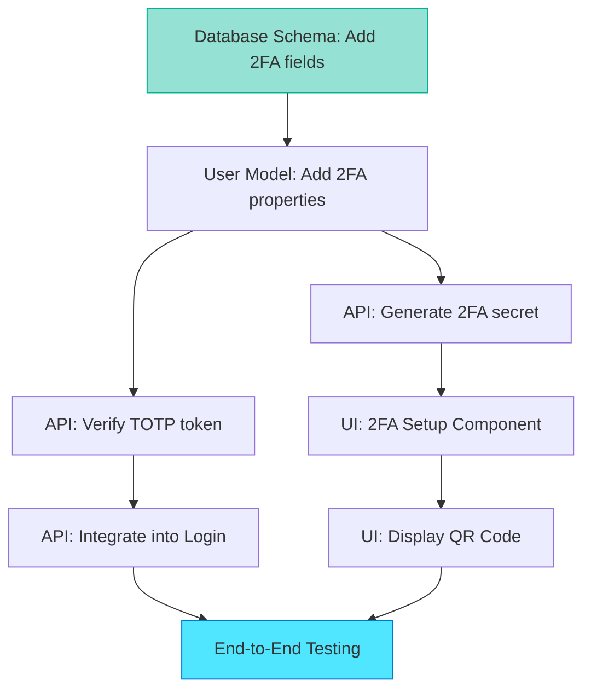

## Dependency Analysis and Phase Organization

Task Planner excels at organizing work by dependencies. This section explains how dependencies shape implementation phases and how to choose the right phase organization strategy for your feature.

## Understanding Implementation Dependencies

Dependencies determine what must happen before something else can work. Task Planner identifies four dependency types:

**1. Data dependencies**  
Step B needs data structures created by Step A.

**Example:** API endpoints (Step B) need database tables (Step A) to store retrieved data.

**2. Interface dependencies**  
Step B calls functions or APIs defined in Step A.

**Example:** UI component (Step B) calls service methods (Step A) to fetch user data.

**3. Configuration dependencies**  
Step B requires configuration changes made in Step A.

**Example:** Authentication middleware (Step B) needs environment variables (Step A) for JWT secret.

**4. Sequential logic dependencies**  
Step B logically follows Step A based on workflow order.

**Example:** Verification tests (Step B) run after implementation (Step A) completes.

## Visualizing Dependencies

Task Planner often includes dependency diagrams in plans. These reveal implementation order.

### Example: 2FA Feature Dependencies



**Reading the diagram:**

* **Green nodes** (A): No dependencies, so start here
* **Blue nodes** (H): Dependent on all paths, so finish here
* **Arrows**: "This must complete before that can start"

Database schema (A) has no dependencies, so it's Phase 1. End-to-end testing (H) depends on everything, so it's the final phase.

## Phase Organization Strategies

Task Planner uses three strategies based on your situation. Understanding them helps you refine plans effectively.

### Strategy 1: Bottom-Up (Data Layer First)

Implement foundation layers before dependent layers.

**Phase structure:**

```markdown
### Phase 1: Data Layer (no dependencies)
- Database migration
- Model updates

### Phase 2: Business Logic Layer (depends on: Phase 1)
- API endpoints
- Service functions

### Phase 3: Presentation Layer (depends on: Phase 2)
- UI components
- User flows

### Phase 4: Integration and Testing (depends on: Phase 1-3)
- End-to-end scenarios
- Manual verification
```

**When to use:**

* Familiar codebase with clear requirements
* Team collaboration requiring parallel work streams
* Stability is priority (verify each layer before proceeding)

**Benefits:**

* ✅ Each phase is fully functional before starting the next
* ✅ Easy to verify correctness incrementally
* ✅ Natural checkpoint boundaries for code reviews

**Drawbacks:**

* ⚠️ Can't demonstrate the feature until Phase 3 completes
* ⚠️ Late discovery of UI/UX issues (not visible until Phase 3)

### Strategy 2: Vertical Slice (One Flow End-to-End)

Implement one complete user flow across all layers before adding variations.

**Phase structure:**

```markdown
### Phase 1: Happy Path (Setup Flow)
- Database migration (only 2FA fields needed for setup)
- API endpoint for secret generation
- UI component for QR display
- Basic verification
  
### Phase 2: Login Integration
- API endpoint for TOTP verification
- Login flow modification
- Testing
  
### Phase 3: Edge Cases and Hardening
- Backup codes
- Recovery flows
- Error handling
```

**When to use:**

* Need early stakeholder feedback on feature value
* UX is uncertain and requires validation
* Want demonstrable progress after first phase

**Benefits:**

* ✅ Demonstrable feature after Phase 1 (end-to-end setup flow works)
* ✅ Early feedback on user experience
* ✅ Easier to test incrementally (one flow at a time)

**Drawbacks:**

* ⚠️ More files touched per phase (database, API, UI all in Phase 1)
* ⚠️ Harder to parallelize work (frontend and backend coupled)

### Strategy 3: Risk-Based (Complex First)

Tackle high-uncertainty steps early when energy and focus are highest.

**Phase structure:**

```markdown
### Phase 1: High-Risk Integration (Passport.js Modification)
- Research exact integration point
- Prototype TOTP verification
- Validate approach works

### Phase 2: Standard CRUD Operations
- Database schema (well-understood patterns)
- API endpoints (standard REST conventions)

### Phase 3: UI (Low Risk)
- Components (standard patterns)
- Styling (existing design system)
```

**When to use:**

* Significant technical uncertainty exists
* Integration point is unclear from research
* Risk of approach failure is high

**Benefits:**

* ✅ Discovers blockers early (before investing in full implementation)
* ✅ Can pivot if initial approach doesn't work
* ✅ Reduces late-stage surprises (risky work done first)

**Drawbacks:**

* ⚠️ Complex work happens when you're least familiar with the feature
* ⚠️ May require rework if foundation assumptions change

## Choosing the Right Strategy

**Decision matrix:**

| Your Situation                        | Recommended Strategy            |
|---------------------------------------|---------------------------------|
| Familiar codebase, clear requirements | Bottom-Up (Data First)          |
| Need early stakeholder feedback       | Vertical Slice                  |
| Significant technical uncertainty     | Risk-Based (Complex First)      |
| Team collaboration (parallel work)    | Bottom-Up with clear interfaces |

You can combine strategies. For example: Risk-Based Phase 1 (validate complex integration), then Bottom-Up Phases 2-4 (implement stable layers systematically).

## Identifying Hidden Dependencies

Dependencies aren't always obvious. Task Planner helps uncover them, but you should verify plans carefully.

**Common hidden dependencies:**

1. **Shared configuration**: Feature requires config change affecting multiple components
2. **Schema migrations**: Database changes require downtime coordination with ops team
3. **API versioning**: Backend changes may break existing clients (mobile apps, external integrations)
4. **External services**: Third-party API availability, rate limits, or authentication requirements
5. **Team dependencies**: Another team controls required code, service, or infrastructure

### Example: Uncovering Hidden Configuration Dependency

**Initial plan (missing dependency):**

```markdown
### Phase 2: API Endpoints
- Step 2.1: Create /api/auth/2fa/setup endpoint
- Step 2.2: Create /api/auth/2fa/verify endpoint
```

This plan assumes encryption keys for 2FA secrets already exist. They don't.

**After dependency analysis (dependency surfaced):**

```markdown
### Prerequisites
- [ ] Encryption key for 2FA secrets must be added to environment config
      (Security team approval required, 2-3 day lead time)

### Phase 1: Configuration and Secrets Management
- Step 1.1: Request encryption key from Security team (ticket #XXX)
- Step 1.2: Add TOTP_SECRET_KEY to .env and deployment configs
- Step 1.3: Update secrets management documentation

### Phase 2: API Endpoints (depends on: Phase 1)
- Step 2.1: Create /api/auth/2fa/setup endpoint (uses TOTP_SECRET_KEY)
- Step 2.2: Create /api/auth/2fa/verify endpoint
```

Now the plan acknowledges the hidden dependency and adds a prerequisite phase. Implementation won't stall waiting for Security team approval.

## Exercise: Analyze Dependencies

Review this feature plan and identify missing dependencies:

**Feature:** Add real-time notifications using WebSockets

**Initial plan:**

```markdown
### Phase 1: WebSocket Server
- Implement WebSocket connection handling
- Add authentication middleware

### Phase 2: Notification Service
- Create notification queueing system
- Implement delivery logic

### Phase 3: Frontend Integration
- Add WebSocket client connection
- Display incoming notifications
```

**Questions to consider:**

1. Does the WebSocket server need infrastructure changes (ports, load balancer config)?
2. Does the notification queue need a database table or external service (Redis)?
3. Does authentication middleware depend on existing auth tokens/sessions?
4. Does the frontend need environment config for WebSocket URL?
5. Are there team dependencies (DevOps for infrastructure, Security for auth review)?

**Improved plan** would surface these dependencies as prerequisites or as explicit steps in Phase 1 before dependent phases can proceed.

---

**Previous:** [Section 4: Creating Plans with Task Planner](./04-creating-plans-task-planner.md)  
**Next:** [Section 6: When Planning is Complete](./06-when-planning-complete.md)  
**Up:** [Chapter 7: Task Planner](./README.md)

<!-- markdownlint-disable MD036 -->
*🤖 Crafted with precision by ✨Copilot following brilliant human instruction,
then carefully refined by our team of discerning human reviewers.*
<!-- markdownlint-enable MD036 -->
