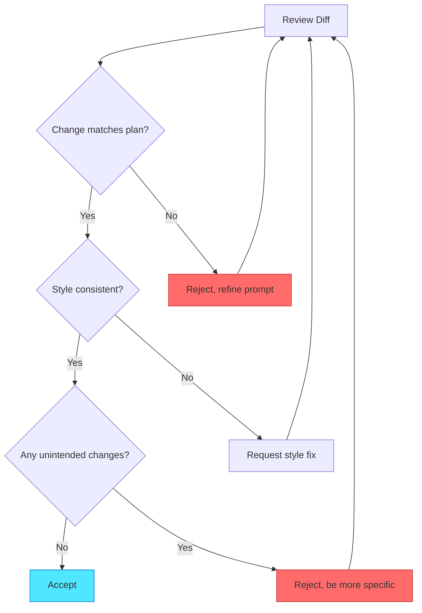

## Edit Mode: Controlled File Modification

Edit Mode transforms how you modify existing code. Instead of typing changes yourself, you describe what needs to change and review the proposed modifications before they're applied. This section teaches you to use Edit Mode for precise, reviewable code modifications that follow your implementation plans.

## What Edit Mode Actually Does

Edit Mode is GitHub Copilot's **precision file modification tool**. It shows you exactly what will change before applying modifications. This transparency gives you control and confidence that changes match your intentions.

**Edit Mode characteristics:**

* **File-targeted**: You specify which file to modify, keeping changes focused
* **Context-aware**: Uses existing code patterns as templates for consistency
* **Diff-based review**: Shows before/after for every change, no surprises
* **Iterative refinement**: You can refine suggestions before accepting to get it right
* **Undo-friendly**: Changes are easy to revert if results aren't right

**Typical Edit Mode session:**

1. Open file to modify (or specify path in prompt)
2. Describe desired changes with context from plan
3. Review proposed changes in diff view
4. Accept, refine, or reject
5. Verify change with tests
6. Move to next step

This workflow ensures every change is intentional and verified. No accidental modifications slip through.

## Invoking Edit Mode

Three methods let you start Edit Mode. Choose based on your current workflow and the type of change you're making.

### Method 1: Inline Edit Command (Recommended)

1. Open file in editor
2. Select code section to modify (optional but helpful)
3. Press `Ctrl+I` (Windows/Linux) or `Cmd+I` (Mac)
4. Describe changes in prompt
5. Review diff, accept or refine

**When to use:** You're already viewing the file and know what needs changing. This is the fastest method for most modifications.

### Method 2: Edit via Chat Sidebar

1. Open Copilot Chat sidebar (`Ctrl+Alt+I` or `Cmd+Alt+I`)
2. Click the **agent picker dropdown** and select **Edit**
3. Reference the file: `#file:src/auth/authRoutes.ts`
4. Describe changes
5. Review diff, accept or refine

**When to use:** Working from an implementation plan when you haven't opened the target file yet. Good for batch modifications across multiple files.

### Method 3: Context Menu

1. Right-click in file
2. Select "Copilot > Edit Selection" (or "Copilot > Edit File")
3. Describe changes
4. Review diff, accept or refine

**When to use:** You prefer mouse-driven workflows or are discovering Edit Mode's capabilities.

> [!TIP]
> Selecting code before `Ctrl+I` focuses Edit Mode on that section, reducing unnecessary changes to other parts of the file.

## Writing Effective Edit Mode Prompts

Prompt quality determines result quality. Strong prompts specify exactly what to change and how, leveraging implementation plan details for precision.

**Prompt structure for Edit Mode:**

1. **What to modify**: Specific function, class, or section with line numbers if available
2. **How to modify**: Clear instruction (add, update, refactor, remove)
3. **Context from plan**: Reference implementation plan details
4. **Patterns to follow**: Reference existing code patterns for consistency

### Example: Weak vs Strong Prompts

**Weak Edit prompt:**

```text
Add 2FA verification
```

**Problems:** Where should it go? How should it work? What approach?

**Strong Edit prompt:**

```text
In the login function (lines 78-95), add 2FA verification after password check:
1. Check if user.twoFactorEnabled is true
2. If true, require req.body.totpToken
3. Verify token using speakeasy.totp.verify()
4. Return 401 if verification fails
Follow the pattern from existing validation checks at lines 85-90.
```

**Why this works:** Specifies location, steps, libraries, error handling, and existing pattern to follow. Copilot has everything needed for correct implementation.

### Real Example: Adding Validation Logic

**Plan Step:**

```markdown
Step 1.3: Add email validation to userValidator.ts
- Location: src/validators/userValidator.ts, after line 25
- Implementation: Use validator.isEmail() library (already imported)
- Pattern: Follow existing validation structure at lines 15-20
- Verification: Test with valid/invalid email formats
```

**Edit Mode Prompt:**

```text
After the username validation (line 25), add email validation:

1. Check if email field exists and is non-empty
2. Use validator.isEmail(email) to validate format
3. Add error message: "Invalid email format"
4. Follow the same structure as username validation above

Keep the existing validation chain pattern.
```

**Expected Result (diff view):**

```diff
  // Username validation
  if (!username || username.length < 3) {
    errors.push('Username must be at least 3 characters');
  }
  
+ // Email validation
+ if (!email) {
+   errors.push('Email is required');
+ } else if (!validator.isEmail(email)) {
+   errors.push('Invalid email format');
+ }
+
  // Password validation
  if (!password || password.length < 8) {
    errors.push('Password must be at least 8 characters');
  }
```

The diff shows exactly what changes. Green lines are added. Existing code remains intact. Review confirms the change matches plan specifications.

## Reviewing Edit Mode Changes

The diff view is your quality gate. Every change passes through review before affecting your code. Learn to review efficiently and catch issues early.

**The diff view shows:**

* **Red lines (-)**: Code being removed
* **Green lines (+)**: Code being added
* **Gray lines**: Unchanged context

**Review checklist:**

✅ **Correctness**: Does change match plan specifications?  
✅ **Completeness**: Are all required modifications present?  
✅ **Side effects**: Did it change anything unintended?  
✅ **Style consistency**: Does new code match existing patterns?  
✅ **Safety**: Are there any risky changes (deleting critical code)?

### Review Decision Flow



This decision tree guides your review. Most changes follow the happy path to acceptance. When issues appear, refinement is quick and targeted.

## Refining Edit Mode Suggestions

Initial suggestions won't always be perfect. Refinement lets you correct course without starting over. Follow-up prompts adjust the proposal until it's right.

**Refinement Prompt Patterns:**

### 1. More Specific Location

```text
The validation is correct, but move it above password validation 
(line 30) instead of after.
```

### 2. Style Adjustment

```text
Good, but use our project's error handling pattern:
throw new ValidationError(message) instead of errors.push()
```

### 3. Missing Details

```text
Add the email validation, but also add:
- Trim whitespace before validation
- Convert to lowercase
- Check against disposable email domain list (use isDisposable() helper)
```

### 4. Reduce Scope

```text
Only add the email validation. Don't modify the password validation 
that you changed - revert that part.
```

Refinement is iterative. Each prompt gets you closer to the desired result. Don't hesitate to refine multiple times until the change is correct.

## Edit Mode Best Practices

**DO:**

* ✅ Open file before invoking Edit Mode (provides context)
* ✅ Select specific section for focused changes
* ✅ Reference line numbers from implementation plan
* ✅ Mention existing patterns to follow
* ✅ Review every diff before accepting
* ✅ Test immediately after accepting changes

**DON'T:**

* ❌ Accept changes blindly without reviewing diff
* ❌ Make multiple unrelated changes in one prompt
* ❌ Use Edit Mode for creating new files (use Insert Mode)
* ❌ Continue if changes seem off (refine or reject)
* ❌ Skip testing after accepting changes

These practices ensure Edit Mode enhances your workflow rather than introducing risks. The review step is never optional.

## Common Edit Mode Scenarios

These real-world scenarios show Edit Mode in action. Each demonstrates prompt structure and expected results.

### Scenario 1: Adding Function to Existing File

**Plan Step:** Add generateQRCode function to authService.ts

**Edit Prompt:**

```text
Add new function generateQRCode after generateSecret function (line 42):

async function generateQRCode(secret: string, accountName: string): Promise<string> {
  // Use qrcode library to generate data URL
  // Format: otpauth://totp/AppName:account?secret=XXX&issuer=AppName
  // Return data URL string
}

Follow async/await pattern like other functions in this file.
```

**Result:** Function added with correct signature, matching file's async patterns, positioned after line 42.

### Scenario 2: Modifying Existing Function Logic

**Plan Step:** Update login function to check 2FA

**Edit Prompt:**

```text
In the login function (lines 78-95), add 2FA check after password verification:

1. After successful password check (line 90)
2. Check if user.twoFactorEnabled === true
3. If true, verify req.body.totpToken using speakeasy.totp.verify()
4. If verification fails, return 401: "Invalid authentication code"
5. If verification succeeds, continue to session creation (line 93)

Keep all existing error handling and logging.
```

**Result:** 2FA verification added at correct location. Existing flow preserved. Error handling follows established patterns.

### Scenario 3: Refactoring for Consistency

**Plan Step:** Refactor error handling to use custom error classes

**Edit Prompt:**

```text
Refactor all throw new Error() calls in this file to use custom error classes:

- Authentication failures → throw new AuthenticationError(message)
- Validation failures → throw new ValidationError(message)  
- Not found errors → throw new NotFoundError(message)

Keep all error messages exactly the same.
Import error classes from 'src/errors' (add import at top).
```

**Result:** All error instantiations updated. Import statement added. Messages unchanged. Type safety improved.

### Scenario 4: Removing Deprecated Code

**Plan Step:** Remove old authentication method

**Edit Prompt:**

```text
Remove the legacyLogin function (lines 105-130) and its route handler.

Also remove:
- Import of crypto-js (line 8)
- LEGACY_AUTH_ENABLED config check (line 15)

Keep all other authentication methods unchanged.
```

**Result:** Legacy code cleanly removed. Unused imports eliminated. Modern authentication methods untouched.

These scenarios demonstrate Edit Mode's versatility. From additions to deletions, from small tweaks to significant refactoring, Edit Mode handles it all with reviewable precision.

> [!IMPORTANT]
> Always test after accepting Edit Mode changes. Even perfect-looking diffs can have subtle integration issues. Testing catches them immediately.

---

**Previous:** [Section 1: Introduction - From Plan to Code](./01-introduction-plan-to-code.md)  
**Next:** [Section 3: Insert Mode - Creating New Files and Scaffolding](./03-insert-mode-new-files-scaffolding.md)

<!-- markdownlint-disable MD036 -->
*🤖 Crafted with precision by ✨Copilot following brilliant human instruction,
then carefully refined by our team of discerning human reviewers.*
<!-- markdownlint-enable MD036 -->
