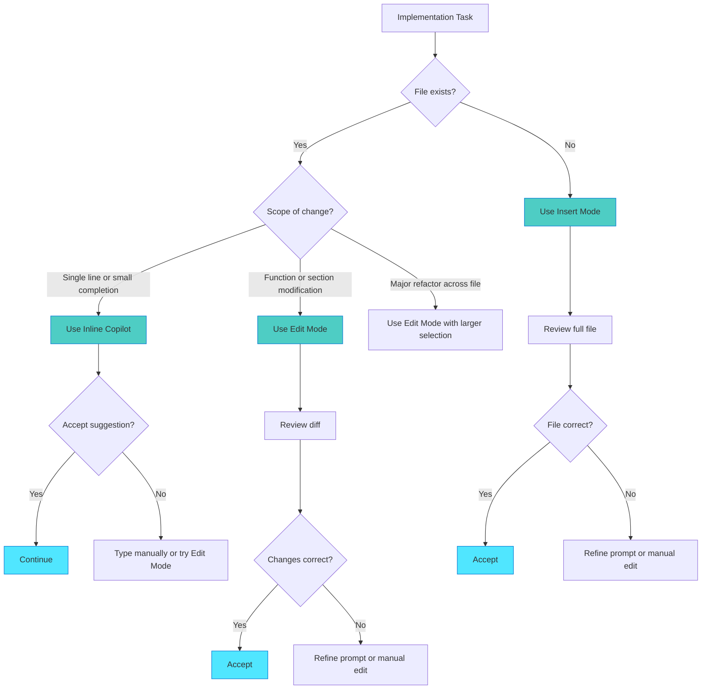

## Choosing the Right Mode

Welcome to the decision point. You understand Edit, Insert, and Inline modes. Now the question becomes: which mode for which task?

This section provides a practical framework for mode selection. You'll learn decision patterns, common task mappings, and how to build confidence in your choices.

## The Decision Framework

Every implementation task has an optimal mode. The right choice improves your speed, code quality, and confidence.

Here's the mental model:



The first question is always: does this file exist? If not, Insert Mode is your tool. If yes, scope determines your choice.

## Mode Selection by Task Type

Different tasks have natural mode fits. This table provides quick reference:

| Task Type                      | Recommended Mode                                        | Why                                            |
|--------------------------------|---------------------------------------------------------|------------------------------------------------|
| Create new service or class    | Insert Mode                                             | Full file generation from template             |
| Add function to existing file  | Edit Mode                                               | Precise placement with diff review             |
| Modify existing function logic | Edit Mode                                               | Controlled changes with clear before and after |
| Write test cases               | Insert Mode (first file) then Inline (additional tests) | Pattern-based generation                       |
| Add imports or boilerplate     | Inline Copilot                                          | Fast, low-risk completions                     |
| Refactor function internals    | Edit Mode                                               | Structural changes need review                 |
| Create configuration file      | Insert Mode                                             | Complete file from specification               |
| Add validation checks          | Edit Mode or Inline                                     | Depends on complexity                          |
| Implement algorithm            | Manual with Inline assist                               | Need to think through logic                    |
| Update API routes              | Edit Mode                                               | Precise modifications to routing               |

> **TIP**: When uncertain, start with Edit Mode. It provides the most visibility and control while you build confidence.

## Real Example: Chapter 7 Plan Implementation

Let's walk through mode selection for actual plan steps from Chapter 7's 2FA implementation.

### Phase 1: Data Layer

### Step 1.1: Create migration file

- **Mode**: Insert Mode
- **Why**: New file following standard migration template
- **Prompt**: "Create migration 20240115_add_2fa_fields.ts following pattern from migrations/20231201_add_user_fields.ts. Add twoFactorSecret, twoFactorEnabled, twoFactorBackupCodes fields to users table."

### Step 1.2: Update User model

- **Mode**: Edit Mode
- **Why**: Adding fields to existing model requires precise placement
- **Prompt**: "Add to User interface after line 24: twoFactorSecret (string, optional), twoFactorEnabled (boolean, default false), twoFactorBackupCodes (string array, optional). Follow existing field patterns."

### Step 1.3: Add TypeScript types

- **Mode**: Inline Copilot
- **Why**: Simple type definitions follow patterns
- **Approach**: Write first type definition manually, let Copilot suggest remaining types following the established pattern.

### Phase 2: Business Logic

### Step 2.1: Create TwoFactorService

- **Mode**: Insert Mode
- **Why**: New service file following template
- **Prompt**: "Create TwoFactorService class following authService.ts patterns. Include methods: generateSecret(), verifyToken(), generateBackupCodes(). Use speakeasy for TOTP, qrcode for QR generation. Export as singleton."

### Step 2.2: Add 2FA setup endpoint

- **Mode**: Edit Mode
- **Why**: Adding route to existing file needs placement control
- **Prompt**: "Add POST /auth/2fa/setup route after the login route (line 45). Protected with authMiddleware. Call twoFactorService.generateSecret(), store encrypted secret, return QR code and backup codes."

### Step 2.3: Implement verification logic

- **Mode**: Edit Mode with Inline assist
- **Why**: Modifying existing login function with some boilerplate
- **Approach**: Use Edit Mode to add 2FA check structure after password verification. Let Inline Copilot suggest error messages and logging statements. Use Edit Mode again for response handling.

### Phase 3: UI Components

### Step 3.1: Create setup component

- **Mode**: Insert Mode
- **Why**: New React component file
- **Prompt**: "Create TwoFactorSetup component following UserProfile.tsx patterns. Display QR code, backup codes list, enable button. Use existing API hooks for data fetching. Include loading and error states."

### Step 3.2: Add QR code display

- **Mode**: Edit Mode or Inline (context-dependent)
- **Why**: Depends on current development stage
- **Decision**: If component structure exists, use Edit Mode for surgical addition. If building component incrementally, use Inline Copilot as you write.

The pattern emerges: new files use Insert, structural changes use Edit, incremental details use Inline.

## Mixing Modes Within Single Step

Sometimes one step benefits from multiple modes. This is natural and efficient.

### Example: Add 2FA verification to login endpoint

Here's how modes work together:

```typescript
// 1. Use Edit Mode to add structure
// Prompt: "After password verification (line 90), add 2FA check block"
if (user.twoFactorEnabled) {
  // 2FA verification logic will go here
}

// 2. Use Inline Copilot to fill in details
if (user.twoFactorEnabled) {
  // Verify TOTP token
  const token = req.body.totpToken;
  // Inline suggests: if (!token) { return res.status(400).json... }
  
  if (!token) {
    return res.status(400).json({ error: 'TOTP token required' });
  }
  
  const isValid = twoFactorService.verifyToken(user.twoFactorSecret, token);
  // Inline suggests: if (!isValid) { return res.status(401).json... }
}

// 3. Use Edit Mode for response handling
// Prompt: "Update success response to include twoFactorVerified field"
```

The workflow becomes: Edit for structure → Inline for mechanical details → Edit for final integration.

This isn't mode confusion. It's efficient mode switching based on the immediate task.

## Mode Selection Anti-Patterns

Certain mode choices create unnecessary friction. Recognizing these patterns helps you course-correct.

### Wrong Mode Choices

### ❌ Using Inline for large changes

- **Problem**: Attempting to write 50+ lines manually with Inline suggestions
- **Better**: Use Insert Mode to generate complete function or class
- **Example**: Creating entire service class line-by-line versus generating from specification

### ❌ Using Edit Mode for new files

- **Problem**: Opening blank file and trying to use Edit Mode
- **Better**: Use Insert Mode to generate from template or pattern
- **Example**: Starting with empty file versus specifying complete file structure

### ❌ Using Insert Mode for small additions

- **Problem**: Regenerating entire file just to add one method
- **Better**: Use Edit Mode to add method to existing file
- **Example**: Regenerating 200-line service versus editing specific location

### ❌ Mixing modes chaotically

- **Problem**: Switching modes mid-task without clear reason
- **Better**: Plan mode per step, complete with one mode before switching
- **Example**: Edit, then Inline, then Edit, then Insert, then Edit in rapid succession without completing any operation

> **IMPORTANT**: When mode selection feels awkward, you've probably chosen wrong. The right mode creates smooth workflow.

## Building Confidence in Mode Selection

Your mode selection improves with practice. Start conservative, increase automation as trust builds.

### Week 1: High Control

When you're starting:

- **Use Edit Mode for everything** (except new files)
- **Review every diff carefully** before accepting
- **Build trust** in AI suggestions through repetition
- **Note patterns** in what works well

You'll feel slow. This is investment time. You're calibrating your mental model.

### Week 2-3: Selective Automation

As patterns emerge:

- **Insert Mode for new files** (with well-specified prompts)
- **Inline Copilot for boilerplate** (imports, simple methods)
- **Edit Mode for critical logic** (business rules, complex algorithms)
- **Quick review cycles** (you recognize good suggestions faster)

You'll start feeling the rhythm. Some choices become automatic.

### Week 4+: Efficient Workflow

When confidence is high:

- **Quick mode selection** based on task type (table above)
- **Inline Copilot for mechanical code** (boilerplate, patterns)
- **Edit and Insert for structural changes** (architecture decisions)
- **High confidence, fast review** (you know what to watch for)

You'll rarely think about mode selection consciously. It becomes intuitive.

### Confidence Indicators

You're gaining confidence when:

- ✅ Mode selection takes seconds, not minutes
- ✅ Review cycles feel efficient, not laborious
- ✅ You catch issues during review, not after testing
- ✅ Code from AI modes matches code you'd write manually
- ✅ Implementation speed increases without quality decrease

You need more practice when:

- ⚠️ Frequently refining prompts three or more times
- ⚠️ Reviewing same code section multiple times
- ⚠️ Accepting changes that need immediate manual fixes
- ⚠️ Feeling uncertain about which mode to choose
- ⚠️ Testing reveals issues you should have caught in review

There's no shame in week one behaviors in month three. Some codebases are complex. Some tasks are unfamiliar. Adjust control level to match confidence level.

---

**Previous:** [Inline Copilot - Real-Time Suggestions](./04-inline-copilot-line-level-suggestions.md)  
**Next:** [Test-Driven Implementation Workflow](./06-test-driven-implementation-workflow.md)  
**Up:** [Chapter 8: Implementation Modes](./README.md)

---

*This guide was created using GitHub Copilot and human expertise. Last updated: November 2025.*
