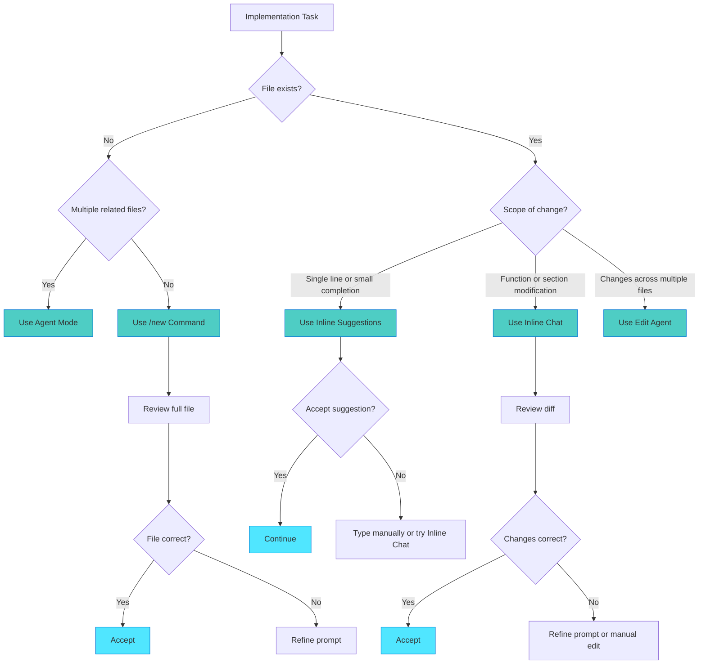

## Choosing the Right Tool

Welcome to the decision point. You understand Inline Chat, Edit Agent, `/new` command, Agent mode, and Inline Suggestions. Now the question becomes: which tool for which task?

This section provides a practical framework for tool selection. You'll learn decision patterns, common task mappings, and how to build confidence in your choices.

## The Decision Framework

Every implementation task has an optimal tool. The right choice improves your speed, code quality, and confidence.

Here's the mental model:



The first question is always: does this file exist? If not, determine if you need one file (`/new`) or multiple related files (Agent mode). If the file exists, scope determines your choice.

## Tool Selection by Task Type

Different tasks have natural tool fits. This table provides quick reference:

| Task Type                      | Recommended Tool                                        | Why                                            |
|--------------------------------|---------------------------------------------------------|------------------------------------------------|
| Create new service or class    | `/new` command                                          | Full file generation from specification        |
| Create multiple related files  | Agent mode                                              | Coordinated multi-file generation              |
| Add function to existing file  | Inline Chat (`Ctrl+I`)                                  | Precise placement with diff review             |
| Modify existing function logic | Inline Chat (`Ctrl+I`)                                  | Controlled changes with clear before and after |
| Write test cases               | `/new` (first file) then Inline Suggestions (more tests)| Pattern-based generation                       |
| Add imports or boilerplate     | Inline Suggestions                                      | Fast, low-risk completions                     |
| Refactor function internals    | Inline Chat (`Ctrl+I`)                                  | Structural changes need review                 |
| Refactor across multiple files | Edit Agent                                              | Coordinated changes across codebase            |
| Create configuration file      | `/new` command                                          | Complete file from specification               |
| Add validation checks          | Inline Chat or Inline Suggestions                       | Depends on complexity                          |
| Implement algorithm            | Manual with Inline Suggestions assist                   | Need to think through logic                    |
| Update API routes              | Inline Chat (`Ctrl+I`)                                  | Precise modifications to routing               |

> **TIP**: When uncertain, start with Inline Chat (`Ctrl+I`). It provides the most visibility and control while you build confidence.

## Real Example: Chapter 7 Plan Implementation

Let's walk through tool selection for actual plan steps from Chapter 7's 2FA implementation.

### Phase 1: Data Layer

### Step 1.1: Create migration file

- **Tool**: `/new` command
- **Why**: New file following standard migration template
- **Prompt**: `/new src/migrations/20240115_add_2fa_fields.ts` then describe the migration following pattern from existing migrations. Add twoFactorSecret, twoFactorEnabled, twoFactorBackupCodes fields to users table.

### Step 1.2: Update User model

- **Tool**: Inline Chat (`Ctrl+I`)
- **Why**: Adding fields to existing model requires precise placement
- **Prompt**: "Add to User interface after line 24: twoFactorSecret (string, optional), twoFactorEnabled (boolean, default false), twoFactorBackupCodes (string array, optional). Follow existing field patterns."

### Step 1.3: Add TypeScript types

- **Tool**: Inline Suggestions
- **Why**: Simple type definitions follow patterns
- **Approach**: Write first type definition manually, let Copilot suggest remaining types following the established pattern.

### Phase 2: Business Logic

### Step 2.1: Create TwoFactorService

- **Tool**: `/new` command
- **Why**: New service file following template
- **Prompt**: `/new src/services/TwoFactorService.ts` then describe class following authService.ts patterns. Include methods: generateSecret(), verifyToken(), generateBackupCodes(). Use speakeasy for TOTP, qrcode for QR generation. Export as singleton.

### Step 2.2: Add 2FA setup endpoint

- **Tool**: Inline Chat (`Ctrl+I`)
- **Why**: Adding route to existing file needs placement control
- **Prompt**: "Add POST /auth/2fa/setup route after the login route (line 45). Protected with authMiddleware. Call twoFactorService.generateSecret(), store encrypted secret, return QR code and backup codes."

### Step 2.3: Implement verification logic

- **Tool**: Inline Chat with Inline Suggestions assist
- **Why**: Modifying existing login function with some boilerplate
- **Approach**: Use Inline Chat to add 2FA check structure after password verification. Let Inline Suggestions complete error messages and logging statements. Use Inline Chat again for response handling.

### Phase 3: UI Components

### Step 3.1: Create setup component

- **Tool**: `/new` command
- **Why**: New React component file
- **Prompt**: `/new src/components/TwoFactorSetup.tsx` then describe component following UserProfile.tsx patterns. Display QR code, backup codes list, enable button. Use existing API hooks for data fetching. Include loading and error states.

### Step 3.2: Add QR code display

- **Tool**: Inline Chat or Inline Suggestions (context-dependent)
- **Why**: Depends on current development stage
- **Decision**: If component structure exists, use Inline Chat for surgical addition. If building component incrementally, use Inline Suggestions as you write.

The pattern emerges: new files use `/new` command, structural changes use Inline Chat or Edit Agent, incremental details use Inline Suggestions.

## Mixing Tools Within Single Step

Sometimes one step benefits from multiple tools. This is natural and efficient.

### Example: Add 2FA verification to login endpoint

Here's how tools work together:

```typescript
// 1. Use Inline Chat to add structure
// Prompt: "After password verification (line 90), add 2FA check block"
if (user.twoFactorEnabled) {
  // 2FA verification logic will go here
}

// 2. Use Inline Suggestions to fill in details
if (user.twoFactorEnabled) {
  // Verify TOTP token
  const token = req.body.totpToken;
  // Inline suggests: if (!token) { return res.status(400).json... }
  
  if (!token) {
    return res.status(400).json({ error: 'TOTP token required' });
  }
  
  const isValid = twoFactorService.verifyToken(user.twoFactorSecret, token);
  // Inline suggests: if (!isValid) { return res.status(401).json... }
}

// 3. Use Inline Chat for response handling
// Prompt: "Update success response to include twoFactorVerified field"
```

The workflow becomes: Inline Chat for structure → Inline Suggestions for mechanical details → Inline Chat for final integration.

This isn't confusion. It's efficient tool switching based on the immediate task.

## Tool Selection Anti-Patterns

Certain tool choices create unnecessary friction. Recognizing these patterns helps you course-correct.

### Wrong Tool Choices

### ❌ Using Inline Suggestions for large changes

- **Problem**: Attempting to write 50+ lines manually with Inline Suggestions
- **Better**: Use `/new` command to generate complete function or class
- **Example**: Creating entire service class line-by-line versus generating from specification

### ❌ Using Inline Chat for new files

- **Problem**: Opening blank file and trying to use Inline Chat
- **Better**: Use `/new` command to generate from template or pattern
- **Example**: Starting with empty file versus specifying complete file structure

### ❌ Using `/new` command for small additions

- **Problem**: Regenerating entire file just to add one method
- **Better**: Use Inline Chat to add method to existing file
- **Example**: Regenerating 200-line service versus editing specific location

### ❌ Mixing tools chaotically

- **Problem**: Switching tools mid-task without clear reason
- **Better**: Plan tool per step, complete with one tool before switching
- **Example**: Inline Chat, then Inline Suggestions, then Inline Chat, then Agent mode, then Inline Chat in rapid succession without completing any operation

> **IMPORTANT**: When tool selection feels awkward, you've probably chosen wrong. The right tool creates smooth workflow.

## Building Confidence in Tool Selection

Your tool selection improves with practice. Start conservative, increase automation as trust builds.

### Week 1: High Control

When you're starting:

- **Use Inline Chat for everything** (except new files)
- **Review every diff carefully** before accepting
- **Build trust** in AI suggestions through repetition
- **Note patterns** in what works well

You'll feel slow. This is investment time. You're calibrating your mental model.

### Week 2-3: Selective Automation

As patterns emerge:

- **`/new` command for new files** (with well-specified prompts)
- **Inline Suggestions for boilerplate** (imports, simple methods)
- **Inline Chat for critical logic** (business rules, complex algorithms)
- **Quick review cycles** (you recognize good suggestions faster)

You'll start feeling the rhythm. Some choices become automatic.

### Week 4+: Efficient Workflow

When confidence is high:

- **Quick tool selection** based on task type (table above)
- **Inline Suggestions for mechanical code** (boilerplate, patterns)
- **Inline Chat and Agent mode for structural changes** (architecture decisions)
- **High confidence, fast review** (you know what to watch for)

You'll rarely think about tool selection consciously. It becomes intuitive.

### Confidence Indicators

You're gaining confidence when:

- ✅ Tool selection takes seconds, not minutes
- ✅ Review cycles feel efficient, not laborious
- ✅ You catch issues during review, not after testing
- ✅ Code from Copilot matches code you'd write manually
- ✅ Implementation speed increases without quality decrease

You need more practice when:

- ⚠️ Frequently refining prompts three or more times
- ⚠️ Reviewing same code section multiple times
- ⚠️ Accepting changes that need immediate manual fixes
- ⚠️ Feeling uncertain about which tool to choose
- ⚠️ Testing reveals issues you should have caught in review

There's no shame in week one behaviors in month three. Some codebases are complex. Some tasks are unfamiliar. Adjust control level to match confidence level.

---

**Previous:** [Inline Suggestions - Real-Time Completions](./04-inline-copilot-line-level-suggestions.md)  
**Next:** [Test-Driven Implementation Workflow](./06-test-driven-implementation-workflow.md)  
**Up:** [Chapter 8: Implementation Tools](./README.md)

---

*This guide was created using GitHub Copilot and human expertise. Last updated: November 2025.*
