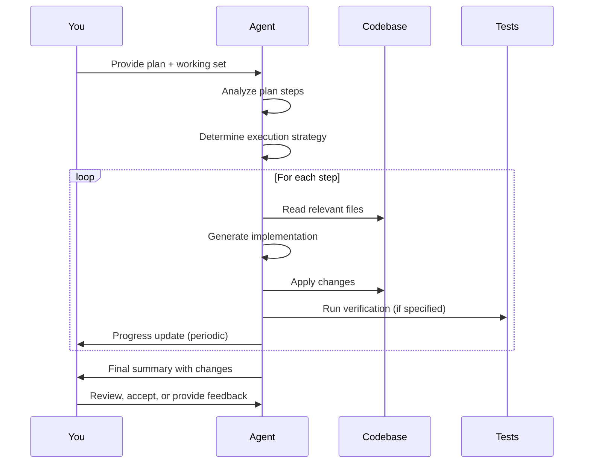

## Agent Mode Architecture

Agent Mode operates differently from the Edit and Insert modes you learned in Chapter 8. Understanding its architecture helps you use it effectively.

### What Happens When You Invoke Agent Mode

When you provide a prompt to Agent Mode, here's the conceptual execution flow. Note that this diagram represents our mental model for understanding Agent behavior—the actual internal implementation may differ:



**The process:**

1. **Plan analysis**: Agent reads your plan and identifies discrete steps
2. **Strategy determination**: Agent decides execution order and dependencies
3. **Step execution loop**: For each step, Agent reads context, generates code, applies changes, and verifies
4. **Progress reporting**: Agent sends updates periodically, not after every operation
5. **Final review**: When complete, Agent presents all changes for your review

This multi-step loop is what makes Agent Mode powerful. Traditional modes execute one operation and wait. Agent Mode executes multiple operations before returning control.

### Key Differences from Edit/Insert Modes

Let's compare Agent Mode with the modes you already know:

| Aspect        | Edit/Insert/Inline       | Agent Mode                  |
|---------------|--------------------------|-----------------------------|
| **Scope**     | Single operation         | Multiple steps (often 3-10+)|
| **Feedback**  | Immediate (diff review)  | Periodic (progress updates) |
| **Control**   | Per-operation acceptance | Strategic checkpoints       |
| **Execution** | Synchronous (you wait)   | Asynchronous (you monitor)  |
| **Rollback**  | Single change undo       | Multi-step revert           |
| **Context**   | Current file focus       | Multi-file awareness        |

**Scope**: Edit Mode modifies one section of one file. Agent Mode can create files, modify multiple files, run tests, and verify results—all in one invocation.

**Feedback**: Edit Mode shows you a diff immediately. You approve or reject it. Agent Mode works for several minutes before reporting progress. You see updates, not diffs.

**Control**: With Edit Mode, you control each change individually. With Agent Mode, you control the overall direction through stopping conditions and checkpoints.

**Execution**: Edit Mode blocks until you accept or reject. Agent Mode runs asynchronously. You can observe progress and intervene if needed.

**Rollback**: Edit Mode changes are easy to undo—just reject the suggestion. Agent Mode changes span multiple files and steps. You typically review the full changeset and either accept all or none.

**Context**: Edit Mode focuses on the current file and your selection. Agent Mode maintains awareness of multiple files simultaneously and coordinates changes across them.

> [!NOTE]
> Agent Mode isn't "better" than Edit Mode—it's different. Use Agent Mode when you need multi-step coordination. Use Edit Mode when you need granular control.

## Task Handoff Protocol

Agent Mode succeeds when you provide the right information upfront. Think of it as delegating to a capable team member. You need to set clear expectations.

### What Agent Mode Needs to Succeed

Agent Mode requires four key inputs for effective execution.

#### 1. Clear Implementation Plan

A well-structured plan from Chapter 7 provides the foundation. Agent needs discrete steps with specifications.

**Good plan structure:**

```markdown
Phase 2: Business Logic (20 min)

Step 2.1: Create TwoFactorService
- Location: src/services/TwoFactorService.ts (new file)
- Implementation: 
  - generateSecret() method
  - verifyToken() method
  - encryptSecret() method
- Dependencies: speakeasy, crypto modules
- Verification: Unit tests pass

Step 2.2: Create /api/auth/2fa/setup endpoint
- Location: src/auth/authRoutes.ts (lines 78-95, after login)
- Implementation: POST endpoint, authenticated, returns QR + backup codes
- Dependencies: TwoFactorService.generateSecret()
- Verification: Integration tests pass, returns 200 with QR code

Step 2.3: Update login to verify 2FA token
- Location: src/auth/authRoutes.ts, login handler (lines 78-95)
- Implementation: Check user.twoFactorEnabled, verify token if needed
- Dependencies: TwoFactorService.verifyToken()
- Verification: Login tests pass, 401 if invalid token
```

Each step specifies location, implementation details, dependencies, and verification criteria. This gives Agent everything it needs.

#### 2. Curated Working Set

Agent needs access to relevant files. The working set includes:

* **Files to modify**: The targets of the implementation
* **Pattern files**: Examples showing conventions and style
* **Type definitions**: For TypeScript projects, necessary for type-safe code
* **Test files**: For verification during execution
* **Configuration files**: When changes affect build or runtime config

**Example working set:**

```markdown
Working set:
- src/services/TwoFactorService.ts (create)
- src/auth/authRoutes.ts (modify)
- src/services/authService.ts (reference for patterns)
- src/models/User.ts (type definitions)
- tests/services/twoFactor.test.ts (verification)
```

> [!TIP]
> Include pattern files even if they won't be modified. Agent uses them to understand conventions and maintain consistency.

#### 3. Clear Success Criteria

Agent needs to know when it's done and how to verify correctness.

**Success criteria examples:**

* "All tests pass"
* "Endpoint returns QR code with 200 status"
* "Login flow requires 2FA token when user.twoFactorEnabled is true"
* "Type checking passes with no errors"
* "Integration tests demonstrate end-to-end flow"

Success criteria should be specific and verifiable. Avoid vague criteria like "works correctly" or "is production-ready."

#### 4. Stopping Conditions

Stopping conditions tell Agent when to pause and ask for guidance. They act as circuit breakers for autonomous execution.

**Example stopping conditions:**

```markdown
Stop if:
- Any tests fail after implementation
- Type errors prevent compilation
- You're unsure about security implementation
- You need to modify authentication logic
```

Stopping conditions protect you from Agent making decisions beyond its mandate. They're especially important for security-sensitive or unfamiliar code.

## Agent Mode Prompt Structure

Effective prompts combine all four inputs into a clear, actionable instruction.

### Complete Prompt Example

```markdown
Prompt: Implement Phase 2 of the 2FA plan (attached: 2fa-plan.md).

Execute steps 2.1, 2.2, and 2.3 in sequence.

For each step:
1. Write tests first based on verification criteria
2. Run tests (should fail)
3. Implement according to specification
4. Run tests (should pass)
5. Move to next step

Stop if:
- Any tests fail after implementation
- Type errors prevent compilation
- You're unsure about security implementation

Working set:
- src/services/TwoFactorService.ts (create)
- src/auth/authRoutes.ts (modify)
- src/services/authService.ts (reference patterns)
- src/models/User.ts (type definitions)

Verification: All tests pass, endpoint returns QR code, login verifies tokens.
```

### Key Components

**Clear scope**: "Implement Phase 2" sets boundaries. Agent knows what's in scope and what isn't.

**Step sequence**: "Execute steps 2.1, 2.2, 2.3" provides order. Agent follows the sequence.

**Workflow specification**: "Write tests first, then implement" defines the process. Agent knows the methodology.

**Stopping conditions**: "Stop if tests fail" provides circuit breakers. Agent knows when to pause.

**Working set**: Explicit file list gives Agent context. Agent knows what files matter.

**Success criteria**: "All tests pass, endpoint works" defines done. Agent knows the target.

### Anti-Patterns to Avoid

These prompt patterns lead to poor Agent Mode performance:

**Vague**: "Implement 2FA" - No specificity, no guidance, no verification criteria.

**Overly broad**: "Implement everything in the plan" - Agent might attempt too much and lose focus.

**No verification**: "Add 2FA, make it work" - Agent has no way to know if it succeeded.

**No working set**: Not providing file context forces Agent to search blindly.

**No stopping conditions**: Agent decides when to stop, potentially overreaching its mandate.

> [!IMPORTANT]
> A good Agent Mode prompt takes 3-5 minutes to write. This upfront investment pays off in execution quality and reduces supervision burden.

## Progress Monitoring

Agent Mode provides periodic updates during execution. These updates help you track progress and decide when to intervene.

### Update Format

Agent Mode reports progress periodically or after completing significant steps. The exact timing varies based on task complexity and step duration.

**Example progress updates (illustrative format):**

> [!NOTE]
> The `[X min]` timestamps in this example are illustrative to show typical progression. Actual Agent output format and timing will vary based on VS Code version and task complexity.

```markdown
Agent: Starting Phase 2 implementation...

[2 min] Step 2.1: Creating TwoFactorService...
- Generated src/services/TwoFactorService.ts (156 lines)
- Added dependencies: speakeasy, crypto
- Created test file with 8 test cases
- Tests: 8 failed (expected - red phase)

[5 min] Step 2.1: Implementing TwoFactorService methods...
- Implemented generateSecret() with QR code generation
- Implemented verifyToken() with time window validation
- Implemented encryptSecret() using AES-256-GCM
- Tests: 8 passed ✓

[7 min] Step 2.2: Creating /api/auth/2fa/setup endpoint...
- Added POST /api/auth/2fa/setup to authRoutes.ts
- Integrated TwoFactorService.generateSecret()
- Created integration tests (5 test cases)
- Tests: 5 passed ✓

[10 min] Step 2.3: Updating login handler...
- Modified login to check user.twoFactorEnabled
- Integrated TwoFactorService.verifyToken()
- Updated tests to cover 2FA flow
- Tests: 12 passed ✓

Phase 2 complete. All verification criteria met.
```

### What Updates Tell You

**Current step**: You know where Agent is in the plan. This helps you anticipate what's coming next.

**Files modified**: You see which files are being touched. This alerts you if Agent strays from the working set.

**Tests run and results**: You see verification happening in real-time. Test failures signal problems immediately.

**Progress toward completion**: You can estimate remaining time and decide if intervention is needed.

**Issues encountered**: Agent reports problems as they arise, giving you a chance to intervene early.

### When to Intervene

You'll learn intervention techniques in Section 3. For now, recognize these warning signs:

* **Tests failing unexpectedly**: Agent implemented something that breaks existing functionality
* **Agent deviating from plan**: Agent modifies files outside the working set or skips steps
* **Security-sensitive code being modified**: Agent is touching authentication, authorization, or encryption logic
* **Agent appears stuck or uncertain**: Progress updates show Agent repeatedly trying the same approach

> [!NOTE]
> Most Agent Mode executions complete without intervention. Updates let you monitor confidence, not micromanage execution.

---

## Hands-On Exercise 9.1: Your First Agent Task

**Goal:** Execute a simple Agent Mode task with proper handoff protocol.

**Scenario:** You need to add a utility function to your codebase with tests. This exercise lets you practice the complete Agent Mode handoff.

**Steps:**

1. **Prepare your prompt** with these four components:
   * **Plan:** Create a `formatCurrency()` utility function that takes a number and returns a formatted currency string (for example, `1234.56` → `$1,234.56`)
   * **Working set:** Identify the target file location and a pattern file if available
   * **Success criteria:** Function works for positive, negative, and zero values; tests pass
   * **Stopping conditions:** Stop if type errors occur or tests fail unexpectedly

2. **Submit the prompt** to Agent Mode

3. **Monitor the progress updates** as Agent executes

4. **Review the final output** before accepting changes

**Expected Result:**

* Agent creates the utility function with proper TypeScript types
* Agent creates corresponding test file
* All tests pass on first run

> [!TIP]
> If Agent asks for clarification (locale, decimal places, currency symbol), provide a specific answer. This is Agent working correctly—surfacing ambiguity rather than assuming.

**What You Learned:**

* How to structure the four components of an Agent Mode handoff
* What progress updates look like during execution
* The difference between monitoring and micromanaging

---

**Previous:** [Introduction to Autonomous Implementation](./01-introduction-autonomous-implementation.md) | **Next:** [Agent+Ask Pattern](./03-agent-ask-pattern.md)

<!-- markdownlint-disable MD036 -->
*🤖 Crafted with precision by ✨Copilot following brilliant human instruction,
then carefully refined by our team of discerning human reviewers.*
<!-- markdownlint-enable MD036 -->
